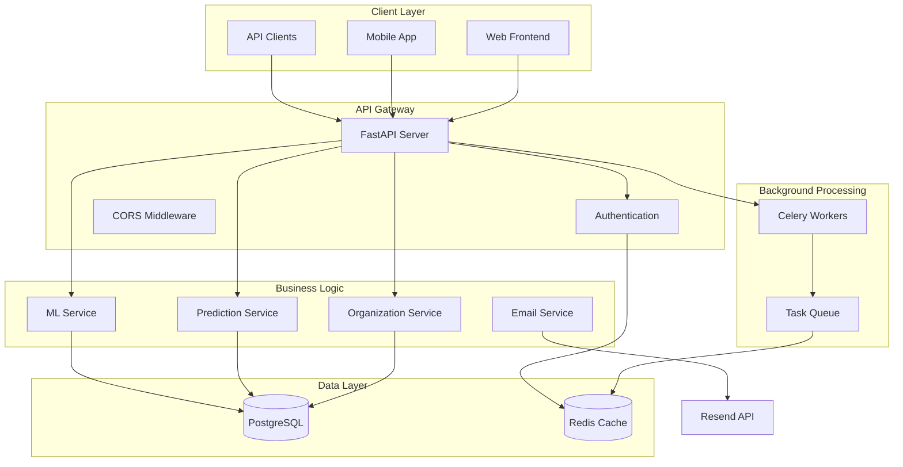
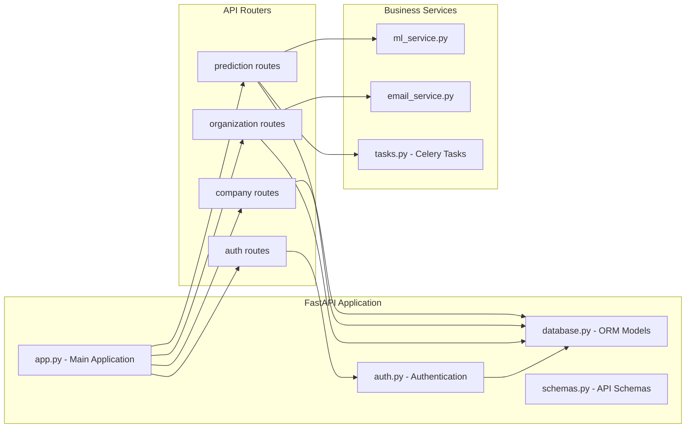
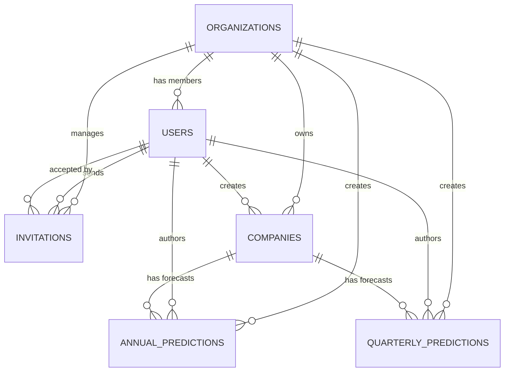
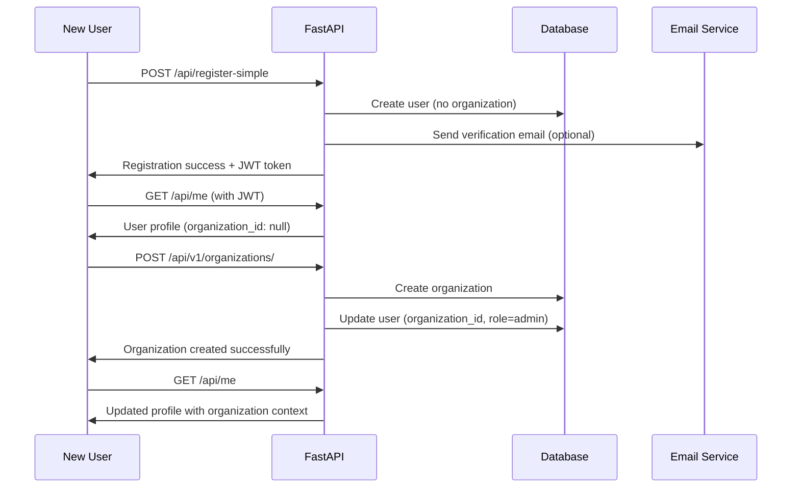
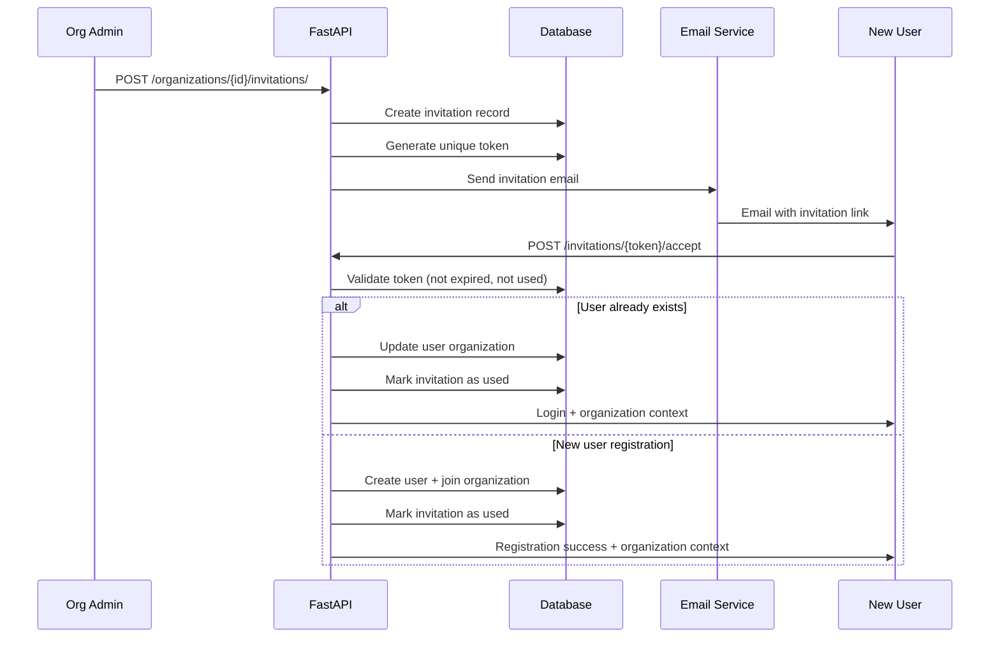
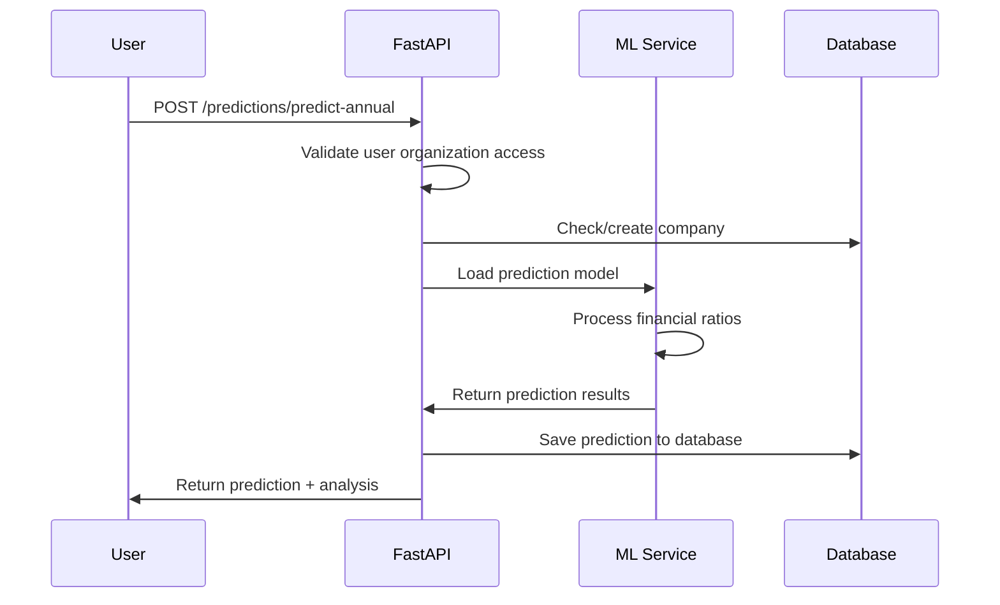
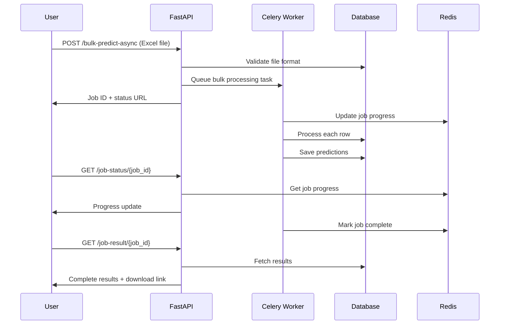
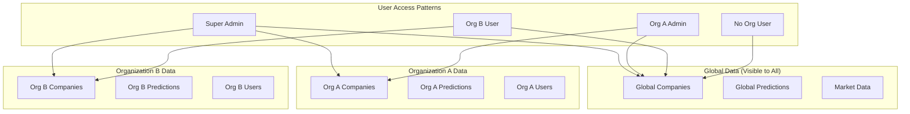
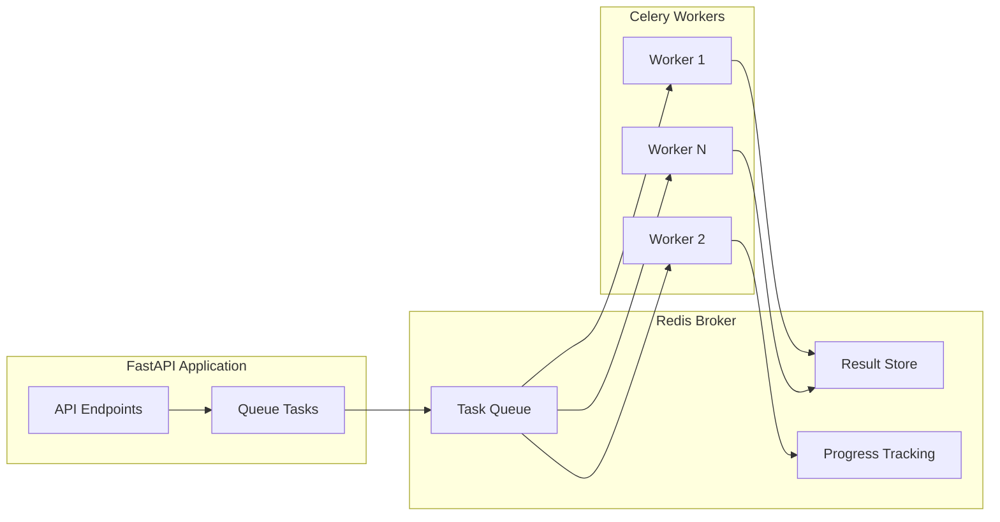

# 🏗️ Complete Application Design - Financial Default Risk Prediction Platform

## 📋 Table of Contents
1. [Application Overview](#-application-overview)
2. [System Architecture](#-system-architecture)
3. [Database Schema Design](#-database-schema-design)
4. [Complete API Reference](#-complete-api-reference)
5. [User Flow Workflows](#-user-flow-workflows)
6. [Authentication & Authorization](#-authentication--authorization)
7. [Multi-Tenant Architecture](#-multi-tenant-architecture)
8. [Background Processing](#-background-processing)

---

## 🎯 Application Overview

### **What We're Building**
A **Multi-Tenant Financial Default Risk Prediction Platform** that enables organizations to:
- Predict corporate default risk using machine learning
- Manage financial data for multiple companies
- Create annual and quarterly financial forecasts
- Collaborate within organizations with role-based access
- Process bulk financial data via Excel uploads

### **Core Technology Stack**
```
Backend Framework: FastAPI (Python)
Database: PostgreSQL with SQLAlchemy ORM
Caching: Redis for sessions and background jobs
Background Processing: Celery with Redis broker
Authentication: JWT tokens with custom auth system
Email Service: Resend API for transactional emails
Machine Learning: Custom models for default prediction
```

### **Key Features**
- 🏢 **Multi-Tenant Organizations** - Complete data isolation
- 🤖 **ML-Powered Predictions** - Annual & quarterly default risk analysis
- 👥 **Team Collaboration** - Invitation system with role management
- 📊 **Bulk Processing** - Excel file uploads with async processing
- 🔒 **Enterprise Security** - Role-based access with organization context
- 📈 **Global Data Sharing** - Public company data visible across organizations

---

## 🏗️ System Architecture

### **High-Level Architecture**



### **Component Architecture**



---

## 🗃️ Database Schema Design

### **Core Tables Overview**



### **📋 Table Schemas**

#### **🏢 Organizations Table**
```
organizations
├── id: UUID (Primary Key)
├── name: String(255) - "HDFC Bank", "ICICI Bank"
├── slug: String(100, Unique) - "hdfc-bank", "icici-bank"
├── domain: String(255, Optional) - "hdfc.com"
├── description: Text
├── logo_url: String(500)
├── is_active: Boolean (Default: true)
├── max_users: Integer (Default: 100)
├── created_by: UUID → users.id
├── created_at: DateTime
└── updated_at: DateTime

Relationships:
├── users: One-to-Many → User
├── companies: One-to-Many → Company
├── invitations: One-to-Many → Invitation
└── creator: Many-to-One → User
```

#### **👤 Users Table**
```
users
├── id: UUID (Primary Key)
├── email: String(255, Unique, Indexed)
├── username: String(100, Unique, Indexed)
├── hashed_password: String(255)
├── full_name: String(255)
├── organization_id: UUID → organizations.id (Optional, Indexed)
├── organization_role: Enum("admin", "user")
├── global_role: Enum("super_admin", "user")
├── is_active: Boolean (Default: true)
├── is_verified: Boolean (Default: false)
├── invited_by: UUID → users.id (Optional)
├── invitation_accepted_at: DateTime (Optional)
├── created_at: DateTime
├── updated_at: DateTime
└── last_login: DateTime

Relationships:
├── organization: Many-to-One → Organization
└── inviter: Self-referential → User
```

#### **📧 Invitations Table**
```
invitations
├── id: UUID (Primary Key)
├── organization_id: UUID → organizations.id
├── email: String(255, Indexed)
├── role: Enum("admin", "user")
├── token: String(255, Unique, Indexed)
├── is_used: Boolean (Default: false)
├── expires_at: DateTime
├── accepted_at: DateTime (Optional)
├── invited_by: UUID → users.id
├── accepted_by: UUID → users.id (Optional)
└── created_at: DateTime

Relationships:
├── organization: Many-to-One → Organization
├── inviter: Many-to-One → User
└── accepter: Many-to-One → User
```

#### **🏢 Companies Table**
```
companies
├── id: UUID (Primary Key)
├── symbol: String(20, Unique, Indexed) - "RELIANCE", "TCS"
├── name: String(255) - "Reliance Industries"
├── market_cap: Decimal(20,2)
├── sector: String(100) - "Energy", "Technology"
├── organization_id: UUID → organizations.id (Optional, Indexed)
├── is_global: Boolean (Default: false, Indexed)
├── created_by: UUID → users.id
├── created_at: DateTime
└── updated_at: DateTime

Data Access Rules:
├── is_global=true: Visible to all organizations
├── organization_id=specific: Only visible to that organization
└── organization_id=null: Personal companies (creator only)

Relationships:
├── organization: Many-to-One → Organization
├── annual_predictions: One-to-Many → AnnualPrediction
└── quarterly_predictions: One-to-Many → QuarterlyPrediction
```

#### **📈 Annual Predictions Table**
```
annual_predictions
├── id: UUID (Primary Key)
├── company_id: UUID → companies.id
├── organization_id: UUID → organizations.id (Optional, Indexed)
├── reporting_year: String(4) - "2024"
├── reporting_quarter: String(2) - "Q1"
├── Financial Ratios:
│   ├── long_term_debt_to_total_capital: Decimal(10,4)
│   ├── total_debt_to_ebitda: Decimal(10,4)
│   ├── net_income_margin: Decimal(10,4)
│   ├── ebit_to_interest_expense: Decimal(10,4)
│   └── return_on_assets: Decimal(10,4)
├── ML Results:
│   ├── probability: Decimal(5,4) - 0.0 to 1.0
│   ├── risk_level: String(20) - "Low", "Medium", "High"
│   ├── confidence: Decimal(5,4) - 0.0 to 1.0
│   └── predicted_at: DateTime
├── created_by: UUID → users.id
├── created_at: DateTime
└── updated_at: DateTime

Indexes:
├── (company_id, reporting_year, reporting_quarter) - Unique
└── organization_id - Performance

Relationships:
└── company: Many-to-One → Company
```

#### **📊 Quarterly Predictions Table**
```
quarterly_predictions
├── id: UUID (Primary Key)
├── company_id: UUID → companies.id
├── organization_id: UUID → organizations.id (Optional, Indexed)
├── reporting_year: String(4) - "2024"
├── reporting_quarter: String(2) - "Q1", "Q2", "Q3", "Q4"
├── Financial Ratios:
│   ├── total_debt_to_ebitda: Decimal(10,4)
│   ├── sga_margin: Decimal(10,4)
│   ├── long_term_debt_to_total_capital: Decimal(10,4)
│   └── return_on_capital: Decimal(10,4)
├── ML Results:
│   ├── logistic_probability: Decimal(5,4)
│   ├── gbm_probability: Decimal(5,4)
│   ├── ensemble_probability: Decimal(5,4)
│   ├── risk_level: String(20)
│   ├── confidence: Decimal(5,4)
│   └── predicted_at: DateTime
├── created_by: UUID → users.id
├── created_at: DateTime
└── updated_at: DateTime

Indexes:
├── (company_id, reporting_year, reporting_quarter) - Unique
└── organization_id - Performance

Relationships:
└── company: Many-to-One → Company
```

### **🔐 Authentication Tables**

#### **📧 OTP Tokens Table**
```
otp_tokens
├── id: UUID (Primary Key)
├── user_id: UUID → users.id
├── token: String(10) - 6-digit OTP
├── token_type: String(50) - "email_verification"
├── expires_at: DateTime
├── is_used: Boolean (Default: false)
└── created_at: DateTime

Purpose: Email verification only (simplified)
```

---

## 🛠️ Complete API Reference

### **🔒 Authentication APIs**

#### **Registration & Login**
```http
POST /api/register-simple
Content-Type: application/json
{
  "email": "user@company.com",
  "username": "userhandle",
  "password": "SecurePass123",
  "full_name": "John Doe"
}

Response:
{
  "success": true,
  "message": "Registration successful",
  "access_token": "eyJ0eXAiOiJKV1Q...",
  "token_type": "bearer",
  "user": {
    "id": "uuid",
    "email": "user@company.com",
    "username": "userhandle",
    "full_name": "John Doe",
    "organization_id": null,
    "global_role": "user"
  }
}
```

```http
POST /api/login
Content-Type: application/json
{
  "email": "user@company.com",
  "password": "SecurePass123"
}

Response:
{
  "success": true,
  "message": "Login successful",
  "access_token": "eyJ0eXAiOiJKV1Q...",
  "token_type": "bearer",
  "user": {
    "id": "uuid",
    "email": "user@company.com",
    "organization": {
      "id": "org-uuid",
      "name": "HDFC Bank",
      "role": "admin"
    }
  }
}
```

#### **User Profile**
```http
GET /api/me
Authorization: Bearer eyJ0eXAiOiJKV1Q...

Response:
{
  "id": "uuid",
  "email": "user@company.com",
  "username": "userhandle",
  "full_name": "John Doe",
  "organization": {
    "id": "org-uuid",
    "name": "HDFC Bank",
    "slug": "hdfc-bank",
    "role": "admin"
  },
  "global_role": "user",
  "is_verified": true,
  "created_at": "2024-01-15T10:30:00Z"
}
```

### **🏢 Organization Management APIs**

#### **Create Organization**
```http
POST /api/v1/organizations/
Authorization: Bearer eyJ0eXAiOiJKV1Q...
Content-Type: application/json
{
  "name": "HDFC Bank",
  "slug": "hdfc-bank",
  "domain": "hdfc.com",
  "description": "Leading private bank in India"
}

Response:
{
  "id": "org-uuid",
  "name": "HDFC Bank",
  "slug": "hdfc-bank",
  "domain": "hdfc.com",
  "description": "Leading private bank in India",
  "is_active": true,
  "max_users": 100,
  "created_by": "user-uuid",
  "created_at": "2024-01-15T10:30:00Z"
}
```

#### **Get My Organization**
```http
GET /api/v1/organizations/me
Authorization: Bearer eyJ0eXAiOiJKV1Q...

Response:
{
  "organization": {
    "id": "org-uuid",
    "name": "HDFC Bank",
    "slug": "hdfc-bank",
    "member_count": 15,
    "pending_invitations": 3
  },
  "user_role": "admin",
  "permissions": ["manage_users", "delete_organization", "send_invitations"]
}
```

#### **Organization Team Management**
```http
GET /api/v1/organizations/{org_id}/members
Authorization: Bearer eyJ0eXAiOiJKV1Q...

Response:
{
  "members": [
    {
      "id": "user-uuid",
      "email": "admin@hdfc.com",
      "full_name": "HDFC Admin",
      "role": "admin",
      "joined_at": "2024-01-15T10:30:00Z"
    },
    {
      "id": "user-uuid-2",
      "email": "analyst@hdfc.com",
      "full_name": "Risk Analyst",
      "role": "user",
      "joined_at": "2024-02-01T14:20:00Z"
    }
  ],
  "total_members": 2,
  "max_users": 100
}
```

### **📧 Invitation System APIs**

#### **Send Invitation**
```http
POST /api/v1/organizations/{org_id}/invitations/
Authorization: Bearer eyJ0eXAiOiJKV1Q...
Content-Type: application/json
{
  "email": "newuser@company.com",
  "role": "user"
}

Response:
{
  "id": "invitation-uuid",
  "email": "newuser@company.com",
  "role": "user",
  "expires_at": "2024-01-22T10:30:00Z",
  "invitation_link": "https://app.com/invitations/token123",
  "status": "sent"
}
```

#### **List Invitations**
```http
GET /api/v1/organizations/{org_id}/invitations/
Authorization: Bearer eyJ0eXAiOiJKV1Q...

Response:
{
  "invitations": [
    {
      "id": "inv-uuid",
      "email": "pending@company.com",
      "role": "user",
      "is_used": false,
      "expires_at": "2024-01-22T10:30:00Z",
      "invited_by": "admin@hdfc.com",
      "created_at": "2024-01-15T10:30:00Z"
    }
  ],
  "total": 1,
  "pending": 1,
  "expired": 0
}
```

#### **Accept Invitation**
```http
POST /api/invitations/{token}/accept
Content-Type: application/json
{
  "user_info": {
    "username": "newuser",
    "password": "SecurePass123",
    "full_name": "New User"
  }
}

Response:
{
  "success": true,
  "message": "Successfully joined HDFC Bank",
  "access_token": "eyJ0eXAiOiJKV1Q...",
  "organization": {
    "id": "org-uuid",
    "name": "HDFC Bank",
    "role": "user"
  }
}
```

### **🏢 Company Management APIs**

#### **List Companies (Global + Organization)**
```http
GET /api/v1/companies/?limit=50&offset=0&search=reliance
Authorization: Bearer eyJ0eXAiOiJKV1Q...

Response:
{
  "companies": [
    {
      "id": "company-uuid",
      "symbol": "RELIANCE",
      "name": "Reliance Industries",
      "market_cap": 15000000000,
      "sector": "Energy",
      "is_global": true,
      "prediction_count": 24,
      "latest_prediction": {
        "probability": 0.1250,
        "risk_level": "Low",
        "predicted_at": "2024-01-15T10:30:00Z"
      }
    }
  ],
  "total": 1,
  "limit": 50,
  "offset": 0,
  "has_more": false
}
```

#### **Create Company**
```http
POST /api/v1/companies/
Authorization: Bearer eyJ0eXAiOiJKV1Q...
Content-Type: application/json
{
  "symbol": "HDFC",
  "name": "HDFC Bank Limited",
  "market_cap": 8500000000,
  "sector": "Financial Services",
  "is_global": false
}

Response:
{
  "id": "company-uuid",
  "symbol": "HDFC",
  "name": "HDFC Bank Limited",
  "market_cap": 8500000000,
  "sector": "Financial Services",
  "is_global": false,
  "organization_id": "org-uuid",
  "created_by": "user-uuid",
  "created_at": "2024-01-15T10:30:00Z"
}
```

### **📈 Prediction APIs**

#### **Create Annual Prediction**
```http
POST /api/v1/predictions/predict-annual
Authorization: Bearer eyJ0eXAiOiJKV1Q...
Content-Type: application/json
{
  "company_symbol": "RELIANCE",
  "reporting_year": "2024",
  "reporting_quarter": "Q4",
  "financial_ratios": {
    "long_term_debt_to_total_capital": 45.50,
    "total_debt_to_ebitda": 3.20,
    "net_income_margin": 8.75,
    "ebit_to_interest_expense": 4.10,
    "return_on_assets": 6.25
  }
}

Response:
{
  "prediction_id": "pred-uuid",
  "company": {
    "symbol": "RELIANCE",
    "name": "Reliance Industries"
  },
  "reporting_period": {
    "year": "2024",
    "quarter": "Q4"
  },
  "input_ratios": {
    "long_term_debt_to_total_capital": 45.50,
    "total_debt_to_ebitda": 3.20,
    "net_income_margin": 8.75,
    "ebit_to_interest_expense": 4.10,
    "return_on_assets": 6.25
  },
  "prediction_result": {
    "probability": 0.1250,
    "risk_level": "Low",
    "confidence": 0.8750,
    "predicted_at": "2024-01-15T10:30:00Z"
  },
  "risk_analysis": {
    "primary_risk_factors": ["debt_levels"],
    "recommendations": ["Monitor debt-to-EBITDA ratio"],
    "benchmark_comparison": "Below industry average"
  }
}
```

#### **Create Quarterly Prediction**
```http
POST /api/v1/predictions/predict-quarterly
Authorization: Bearer eyJ0eXAiOiJKV1Q...
Content-Type: application/json
{
  "company_symbol": "TCS",
  "reporting_year": "2024",
  "reporting_quarter": "Q1",
  "financial_ratios": {
    "total_debt_to_ebitda": 2.50,
    "sga_margin": 25.30,
    "long_term_debt_to_total_capital": 15.20,
    "return_on_capital": 18.75
  }
}

Response:
{
  "prediction_id": "pred-uuid",
  "company": {
    "symbol": "TCS",
    "name": "Tata Consultancy Services"
  },
  "reporting_period": {
    "year": "2024",
    "quarter": "Q1"
  },
  "input_ratios": {
    "total_debt_to_ebitda": 2.50,
    "sga_margin": 25.30,
    "long_term_debt_to_total_capital": 15.20,
    "return_on_capital": 18.75
  },
  "prediction_results": {
    "logistic_probability": 0.0850,
    "gbm_probability": 0.0920,
    "ensemble_probability": 0.0885,
    "risk_level": "Very Low",
    "confidence": 0.9200,
    "predicted_at": "2024-01-15T10:30:00Z"
  },
  "model_breakdown": {
    "logistic_model": {
      "probability": 0.0850,
      "key_factors": ["return_on_capital", "debt_levels"]
    },
    "gbm_model": {
      "probability": 0.0920,
      "feature_importance": ["sga_margin", "return_on_capital"]
    },
    "ensemble_decision": "Models agree - Very Low Risk"
  }
}
```

#### **Bulk Prediction Processing**
```http
POST /api/v1/predictions/bulk-predict-async
Authorization: Bearer eyJ0eXAiOiJKV1Q...
Content-Type: multipart/form-data
file: [Excel file with financial data]
prediction_type: "annual"

Response:
{
  "job_id": "job-uuid",
  "status": "queued",
  "message": "Bulk prediction job started",
  "estimated_completion": "2024-01-15T10:35:00Z",
  "total_records": 150,
  "status_check_url": "/api/v1/predictions/job-status/job-uuid"
}
```

#### **Check Job Status**
```http
GET /api/v1/predictions/job-status/{job_id}
Authorization: Bearer eyJ0eXAiOiJKV1Q...

Response:
{
  "job_id": "job-uuid",
  "status": "processing",
  "progress": {
    "processed": 75,
    "total": 150,
    "percentage": 50.0,
    "estimated_completion": "2024-01-15T10:33:00Z"
  },
  "current_step": "Running ML predictions",
  "results_preview": {
    "successful_predictions": 70,
    "failed_predictions": 5,
    "validation_errors": 0
  }
}
```

### **📊 Analytics & Summary APIs**

#### **Get Prediction Summary**
```http
GET /api/v1/predictions/summary
Authorization: Bearer eyJ0eXAiOiJKV1Q...

Response:
{
  "summary": {
    "total_predictions": 1250,
    "annual_predictions": 800,
    "quarterly_predictions": 450,
    "companies_analyzed": 125,
    "avg_risk_score": 0.2150
  },
  "risk_distribution": {
    "very_low": 450,
    "low": 380,
    "medium": 285,
    "high": 105,
    "very_high": 30
  },
  "recent_activity": {
    "predictions_this_week": 45,
    "new_companies_added": 8,
    "bulk_jobs_completed": 3
  },
  "top_companies": [
    {
      "symbol": "RELIANCE",
      "name": "Reliance Industries",
      "prediction_count": 24,
      "avg_risk": 0.1250
    }
  ]
}
```

---

## 🔄 User Flow Workflows

### **🆕 Flow 1: New User Organization Setup**



### **👥 Flow 2: Team Member Invitation Workflow**



### **📈 Flow 3: Prediction Creation Workflow**



### **📊 Flow 4: Bulk Processing Workflow**



---

## 🔐 Authentication & Authorization

### **JWT Token Structure**
```json
{
  "sub": "user-uuid",
  "email": "user@company.com",
  "organization_id": "org-uuid",
  "organization_role": "admin",
  "global_role": "user",
  "exp": 1704117000,
  "iat": 1704113400
}
```

### **Permission Matrix**

| Action | Super Admin | Org Admin | Org User | No Org User |
|--------|-------------|-----------|----------|-------------|
| **Organizations** |
| Create Organization | ✅ | ✅ | ✅ | ✅ |
| View All Organizations | ✅ | ❌ | ❌ | ❌ |
| Delete Any Organization | ✅ | ❌ | ❌ | ❌ |
| Delete Own Organization | ✅ | ✅ | ❌ | ❌ |
| **Team Management** |
| Send Invitations | ✅ | ✅ | ❌ | ❌ |
| Remove Team Members | ✅ | ✅ | ❌ | ❌ |
| **Companies** |
| View Global Companies | ✅ | ✅ | ✅ | ✅ |
| View Org Companies | ✅ | ✅ | ✅ | ❌ |
| Create Global Companies | ✅ | ❌ | ❌ | ❌ |
| Create Org Companies | ✅ | ✅ | ✅ | ❌ |
| **Predictions** |
| View Global Predictions | ✅ | ✅ | ✅ | ✅ |
| View Org Predictions | ✅ | ✅ | ✅ | ❌ |
| Create Predictions | ✅ | ✅ | ✅ | ❌ |
| Bulk Processing | ✅ | ✅ | ✅ | ❌ |

### **Data Access Filtering**
```python
def get_accessible_companies(user: User, db: Session):
    """Get companies based on user's organization context"""
    if user.global_role == "super_admin":
        # Super admin sees everything
        return db.query(Company).all()
    elif user.organization_id:
        # Organization members see global + own org
        return db.query(Company).filter(
            or_(
                Company.is_global == True,
                Company.organization_id == user.organization_id
            )
        ).all()
    else:
        # Users without organization see global only
        return db.query(Company).filter(
            Company.is_global == True
        ).all()
```

---

## 🏢 Multi-Tenant Architecture

### **Data Isolation Strategy**



### **Organization Context Resolution**
```python
async def get_user_organization_context(current_user: User):
    """Resolve user's organization context for data access"""
    return {
        "user_id": current_user.id,
        "organization_id": current_user.organization_id,
        "organization_role": current_user.organization_role,
        "global_role": current_user.global_role,
        "can_see_global": True,
        "can_see_org": current_user.organization_id is not None,
        "can_create_org_data": current_user.organization_id is not None,
        "can_admin_org": (
            current_user.organization_role == "admin" or 
            current_user.global_role == "super_admin"
        )
    }
```

---

## ⚙️ Background Processing

### **Celery Task Architecture**



### **Available Background Tasks**

#### **Bulk Prediction Processing**
```python
@celery_app.task(bind=True)
def process_bulk_excel_task(self, file_path: str, filename: str, user_id: str, organization_id: str):
    """Process Excel file with financial data for bulk predictions"""
    
    # Update progress
    self.update_state(
        state='PROCESSING',
        meta={'current': 0, 'total': 100, 'status': 'Reading Excel file...'}
    )
    
    # Process file
    predictions = []
    for i, row in enumerate(excel_data):
        # Update progress
        self.update_state(
            state='PROCESSING', 
            meta={'current': i, 'total': len(excel_data), 'status': f'Processing row {i}...'}
        )
        
        # Create prediction
        prediction = create_prediction(row, user_id, organization_id)
        predictions.append(prediction)
    
    return {
        'status': 'SUCCESS',
        'predictions_created': len(predictions),
        'file': filename
    }
```

#### **Email Notification Tasks**
```python
@celery_app.task
def send_invitation_email(email: str, organization_name: str, invitation_token: str):
    """Send invitation email asynchronously"""
    
    email_service = EmailService()
    
    result = email_service.send_invitation_email(
        to_email=email,
        organization_name=organization_name,
        invitation_link=f"https://app.com/invitations/{invitation_token}"
    )
    
    return {
        'email': email,
        'status': 'sent' if result else 'failed',
        'organization': organization_name
    }
```

### **Job Status Tracking**
```python
def get_job_status(job_id: str):
    """Get status of background job"""
    
    result = celery_app.AsyncResult(job_id)
    
    if result.state == 'PENDING':
        return {'status': 'pending', 'progress': 0}
    elif result.state == 'PROCESSING':
        return {
            'status': 'processing',
            'progress': result.info.get('current', 0),
            'total': result.info.get('total', 1),
            'message': result.info.get('status', '')
        }
    elif result.state == 'SUCCESS':
        return {'status': 'completed', 'result': result.info}
    else:
        return {'status': 'failed', 'error': str(result.info)}
```

---

## 📈 System Performance & Scalability

### **Database Optimization**
- **Strategic Indexing**: organization_id, is_global, user access patterns
- **Connection Pooling**: 20 base connections, 30 overflow
- **Query Optimization**: Eager loading, filtered queries
- **Pagination**: All list endpoints support limit/offset

### **Caching Strategy**
- **Redis Sessions**: JWT token blacklisting
- **Result Caching**: Job status and progress tracking
- **Model Caching**: Pre-loaded ML models in memory

### **Security Features**
- **JWT Tokens**: Secure authentication with expiry
- **Password Hashing**: Bcrypt with configurable rounds
- **Input Validation**: Pydantic schemas for all inputs
- **SQL Injection Prevention**: SQLAlchemy ORM queries
- **CORS Protection**: Configurable origin restrictions

This comprehensive application design provides a robust foundation for a multi-tenant financial prediction platform with enterprise-grade security, scalability, and user experience.
