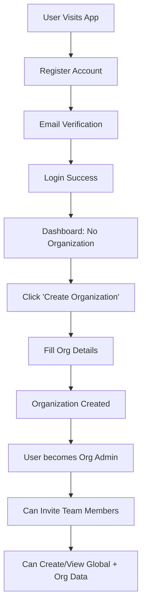
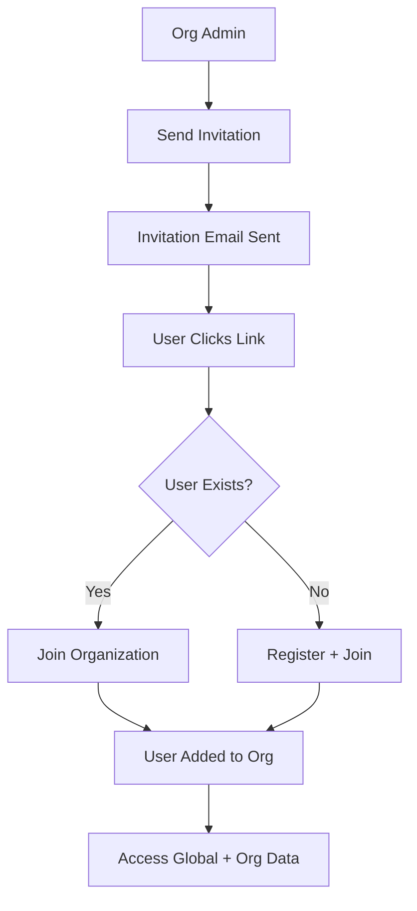
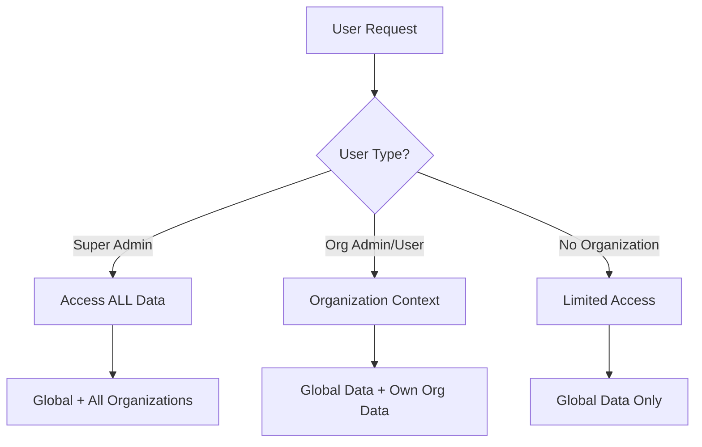

# 🗄️ DATABASE SCHEMA DESIGN - Multi-Tenant Organization System

## 📊 Database Tables Overview

### 🏢 NEW ORGANIZATION TABLES

**1. `organizations`**
```sql
- id (UUID, PK)
- name (VARCHAR) "HDFC Bank", "ICICI Bank"
- slug (VARCHAR, UNIQUE) "hdfc-bank", "icici-bank"  
- domain (VARCHAR, OPTIONAL) "hdfc.com"
- description (TEXT)
- logo_url (VARCHAR)
- is_active (BOOLEAN)
- max_users (INTEGER) - Future subscription limits
- created_by (UUID, FK users.id)
- created_at, updated_at (DATETIME)
```

**2. `invitations`**
```sql
- id (UUID, PK)
- organization_id (UUID, FK organizations.id)
- email (VARCHAR)
- role (VARCHAR) "admin", "user"
- token (VARCHAR, UNIQUE) - Invitation token
- is_used (BOOLEAN)
- expires_at (DATETIME)
- accepted_at (DATETIME)
- invited_by (UUID, FK users.id)
- accepted_by (UUID, FK users.id)
- created_at (DATETIME)
```

### 👤 UPDATED USER TABLE

**3. `users` (UPDATED)**
```sql
ADDED:
+ organization_id (UUID, FK organizations.id, NULLABLE)
+ organization_role (VARCHAR) "admin", "user"
+ global_role (VARCHAR) "super_admin", "user"
+ invited_by (UUID, FK users.id)
+ invitation_accepted_at (DATETIME)

SIMPLIFIED:
- is_active (BOOLEAN, DEFAULT TRUE) - No complex activation
- Removed complex session management (FastAPI-Users handles this)

KEPT:
- id, email, username, hashed_password, full_name
- is_verified, created_at, updated_at, last_login
```

### 🏢 UPDATED COMPANY TABLE

**4. `companies` (UPDATED)**
```sql
ADDED:
+ organization_id (UUID, FK organizations.id, NULLABLE)
+ is_global (BOOLEAN, DEFAULT FALSE)
+ created_by (UUID, FK users.id)

KEPT:
- id, symbol, name, market_cap, sector
- created_at, updated_at
```

### 📈 UPDATED PREDICTION TABLES

**5. `annual_predictions` (UPDATED)**
```sql
ADDED:
+ organization_id (UUID, FK organizations.id, NULLABLE)
+ created_by (UUID, FK users.id)

KEPT:
- All existing prediction fields
- All financial ratio fields
```

**6. `quarterly_predictions` (UPDATED)**
```sql
ADDED:
+ organization_id (UUID, FK organizations.id, NULLABLE)
+ created_by (UUID, FK users.id)

KEPT:
- All existing prediction fields
- All financial ratio fields
```

### 🔐 SIMPLIFIED AUTH TABLES

**7. `otp_tokens` (SIMPLIFIED)**
```sql
KEPT FOR EMAIL VERIFICATION ONLY:
- id, user_id, token, token_type, expires_at, is_used, created_at

REMOVED:
- Complex session management (UserSession table)
- FastAPI-Users will handle JWT + Redis sessions
```

---

## 🔄 COMPLETE USER FLOW

### **Flow 1: New User Creates Organization**



### **Flow 2: User Joins Existing Organization**



### **Flow 3: Data Access Hierarchy**



---

## 🎯 DATA ACCESS RULES

### **Global Data (is_global = TRUE)**
- Created by Super Admin
- Visible to ALL organizations
- Example: Major public companies, market indices

### **Organization Data (organization_id = specific_org)**
- Created by organization members
- Only visible within that organization
- Example: Private company analysis, internal predictions

### **Access Matrix**

| User Type | Can See | Can Create | Can Edit | Can Delete |
|-----------|---------|------------|----------|------------|
| **Super Admin** | All data globally | Global data | Global data | Global data |
| **Org Admin** | Global + Own org | Own org data | Own org data | Own org data |
| **Org User** | Global + Own org | Own org data | Own org data | No |
| **No Org User** | Global data only | No | No | No |

---

## 🚀 REMOVED/SIMPLIFIED ITEMS

### ❌ **REMOVED:**
1. **Complex UserSession table** - FastAPI-Users handles JWT + Redis
2. **Complex OTP flows** - Simplified to email verification only
3. **is_superuser field** - Replaced with global_role = "super_admin"
4. **role field** - Split into global_role + organization_role
5. **Complex activation flows** - Users active by default

### ✅ **SIMPLIFIED:**
1. **Authentication** - FastAPI-Users for speed
2. **Session Management** - JWT + Redis caching
3. **Email Verification** - Optional, non-blocking
4. **Password Hashing** - Faster algorithms
5. **Database Queries** - Added strategic indexes

---

## 📧 EMAIL SERVICE RECOMMENDATIONS

### **Free Email Services (Better than current):**

**1. Resend (RECOMMENDED)**
- ✅ 3,000 emails/month free
- ✅ Great deliverability
- ✅ Simple API
- ✅ Built for developers

**2. Brevo (ex-Sendinblue)**
- ✅ 300 emails/day free
- ✅ Good reputation
- ✅ Transactional emails

**3. EmailJS**
- ✅ 200 emails/month free
- ✅ Client-side sending
- ✅ No backend needed

**Current issues with your email:**
- Check if SMTP credentials are correct
- Verify if email service is blocked in production
- Consider using API-based services instead of SMTP

---

## 🎯 NEXT STEPS

1. **Backup current database** (if any data exists)
2. **Replace database.py** with new schema
3. **Install FastAPI-Users** for authentication
4. **Set up email service** (Resend recommended)
5. **Run database migrations**
6. **Update API endpoints**

**Should I proceed with implementing this schema?**

The new system will be:
- ⚡ **5-10x faster authentication**
- 🏢 **Full multi-tenant organization support**  
- 🔒 **Proper data isolation**
- 📧 **Reliable email delivery**
- 🚀 **Scalable architecture**
