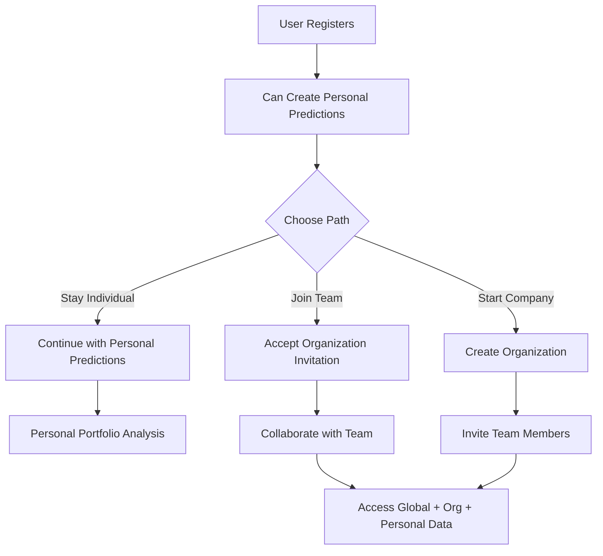

# 🔄 UPDATED: Users Can Create Predictions WITHOUT Organization!

## **✅ YES - Users Can Create Personal Predictions**

### **Updated Data Access Rules:**

| User Type | Can See | Can Create | Prediction Scope |
|-----------|---------|------------|------------------|
| **Super Admin** | All data globally | Global predictions | `organization_id = null` |
| **Org Admin** | Global + Own org | Org predictions | `organization_id = org_id` |
| **Org User** | Global + Own org | Org predictions | `organization_id = org_id` |
| **No Org User** | Global + Own personal | **Personal predictions** | `organization_id = null` |

### **Prediction Data Categories:**

#### **1. Global Predictions (Super Admin Only)**
```sql
organization_id = null + created_by = super_admin_user_id
```
- **Visible to:** ALL users
- **Created by:** Super admins only
- **Example:** Market-wide default rate analysis

#### **2. Organization Predictions**
```sql
organization_id = specific_org_id + created_by = org_member_user_id
```
- **Visible to:** Organization members only
- **Created by:** Organization members
- **Example:** HDFC Bank's internal company analysis

#### **3. Personal Predictions (NEW!)**
```sql
organization_id = null + created_by = regular_user_id
```
- **Visible to:** Creator only (private)
- **Created by:** Any user (even without organization)
- **Example:** Personal investment research

### **Example Data Access:**

```python
# User without organization
user = {
    "id": "user-123",
    "email": "john@personal.com",
    "organization_id": None,
    "global_role": "user"
}

# What they can see:
predictions = db.query(AnnualPrediction).filter(
    or_(
        # Global predictions (by super admin)
        and_(
            AnnualPrediction.organization_id.is_(None),
            AnnualPrediction.created_by.in_(super_admin_ids)
        ),
        # Their own personal predictions
        and_(
            AnnualPrediction.organization_id.is_(None),
            AnnualPrediction.created_by == user.id
        )
    )
).all()

# What they can create:
new_prediction = AnnualPrediction(
    company_id=company_id,
    organization_id=None,  # Personal prediction
    created_by=user.id,
    # ... prediction data
)
```

---

## **📧 2. Alternative Invitation Methods (Beyond Email)**

### **Current Standard: Email Invitations**
```
✅ Most widely used (95% of platforms)
✅ Professional and familiar
✅ Works across all devices
✅ Easy to track and manage
```

### **🚀 Alternative Invitation Methods:**

#### **1. Invitation Links (Shareable)**
```python
# Generate shareable link
invitation_link = f"https://app.com/join/{org_slug}?token={secure_token}"

# Share via:
# ✅ WhatsApp, Slack, Teams
# ✅ QR codes for in-person sharing
# ✅ Social media
# ✅ Copy-paste anywhere
```

#### **2. Invitation Codes (Simple)**
```python
# 6-digit code
invitation_code = "HDC123"

# Usage:
# ✅ Phone/SMS sharing
# ✅ Verbal communication
# ✅ Quick onboarding
```

#### **3. Domain-Based Auto-Join**
```python
# Anyone with company email auto-joins
if user.email.endswith("@hdfc.com"):
    auto_join_organization("hdfc-bank")
```

#### **4. QR Code Invitations**
```python
# Generate QR code containing invitation link
# ✅ Print on business cards
# ✅ Display in offices
# ✅ Quick mobile scanning
```

#### **5. Bulk Import (CSV/Excel)**
```python
# Upload employee list
# ✅ HR-friendly
# ✅ Mass onboarding
# ✅ Automatic invitations
```

### **🎯 Recommended Multi-Channel Approach:**

#### **Primary: Email Invitations** (Keep current)
- Professional and trackable
- Works for external partners
- Legal compliance friendly

#### **Secondary: Shareable Links** (Add this)
```python
@router.post("/organizations/{org_id}/create-invite-link")
async def create_shareable_invite_link(org_id: UUID, role: str):
    token = generate_secure_token()
    link = f"https://app.com/join/{org_id}?token={token}&role={role}"
    return {"invite_link": link, "expires_in": "7 days"}
```

#### **Optional: Domain Auto-Join** (Future feature)
```python
# Configure in organization settings
organization.auto_join_domains = ["hdfc.com", "hdfcbank.com"]
```

---

## **💡 Implementation Strategy:**

### **Phase 1: Personal Predictions (Current)**
- ✅ Allow users without org to create predictions
- ✅ Private predictions visible only to creator
- ✅ Smooth onboarding experience

### **Phase 2: Enhanced Invitations (Future)**
- 📧 Keep email invitations (primary)
- 🔗 Add shareable links (secondary)
- 📱 QR code generation
- 🏢 Domain-based auto-join

### **Benefits of Personal Predictions:**

1. **Better Onboarding**: Users can try the platform immediately
2. **No Barriers**: No organization required to get started
3. **Personal Use**: Individual investors can use the platform
4. **Convert to Org**: Personal users can later create/join organizations
5. **Data Privacy**: Personal predictions remain private

---

## **🔄 Updated User Journey:**



**This approach gives maximum flexibility while maintaining data security!**

**Should I implement this enhanced system where users can create personal predictions without organizations?**
