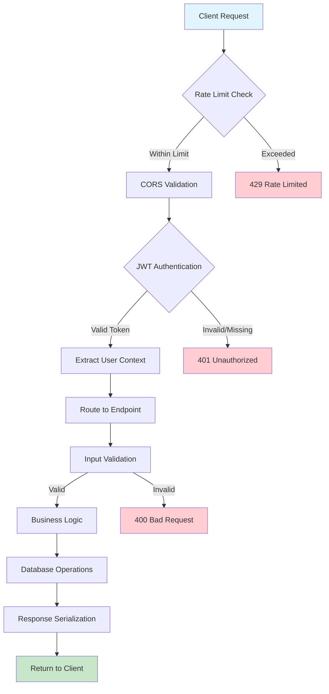
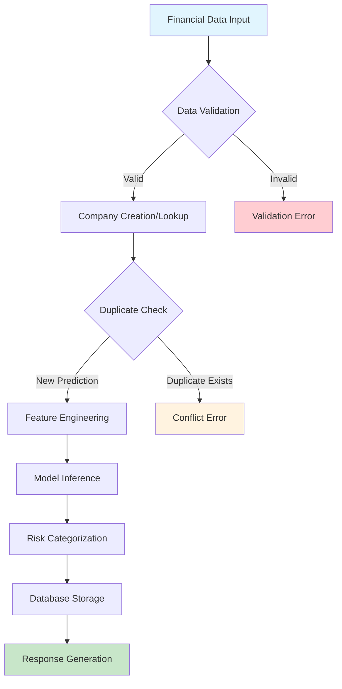
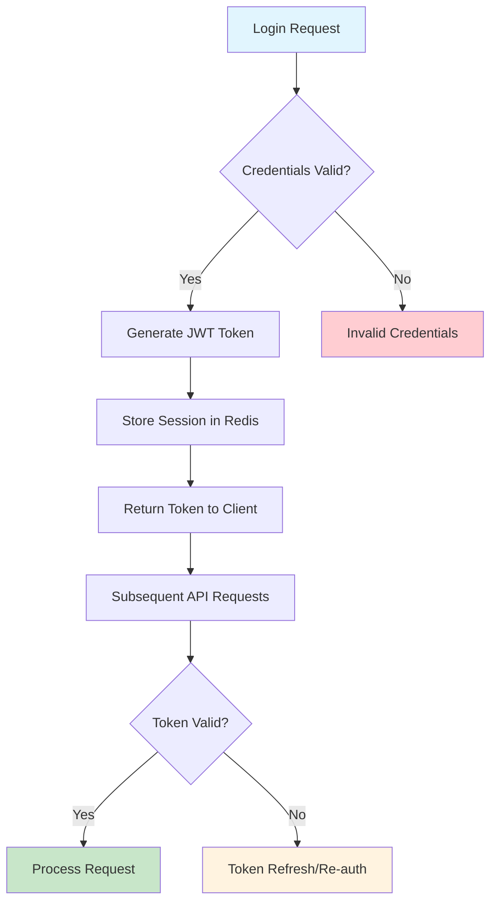

# 🎯 System Architecture Overview

## 📋 **Table of Contents**
1. [Architecture Overview](#architecture-overview)
2. [Technology Stack](#technology-stack)
3. [System Components](#system-components)
4. [Data Flow](#data-flow)
5. [Scalability Design](#scalability-design)

---

## 🎯 **Architecture Overview**

AccuNode is a **multi-tenant ML-based Default Rate Prediction API** built with FastAPI, utilizing machine learning models to predict corporate default probabilities based on financial ratios.

### **System Architecture Diagram**
```
┌─────────────────────────────────────────────────────────────────┐
│                    CLIENT APPLICATIONS                          │
│   Web Apps │ Mobile Apps │ CLI Tools │ Third-party APIs       │
└─────────────────────┬───────────────────────────────────────────┘
                      │ HTTPS/REST API
┌─────────────────────▼───────────────────────────────────────────┐
│                  APPLICATION LAYER                             │
│  ┌─────────────┐  ┌─────────────┐  ┌─────────────┐            │
│  │ Rate Limit  │  │ Auth/JWT    │  │ CORS/Security│            │
│  │ Middleware  │  │ Middleware  │  │ Headers      │            │
│  └─────────────┘  └─────────────┘  └─────────────┘            │
│                                                                │
│  ┌─────────────┐  ┌─────────────┐  ┌─────────────┐            │
│  │ Predictions │  │ Companies   │  │ Auth & User │            │
│  │ API         │  │ API         │  │ Management  │            │
│  └─────────────┘  └─────────────┘  └─────────────┘            │
└─────────────────────┬───────────────────────────────────────────┘
                      │
┌─────────────────────▼───────────────────────────────────────────┐
│                   SERVICE LAYER                                │
│  ┌─────────────┐  ┌─────────────┐  ┌─────────────┐            │
│  │ML Prediction│  │Company      │  │Bulk Upload  │            │
│  │Service      │  │Service      │  │Service      │            │
│  └─────────────┘  └─────────────┘  └─────────────┘            │
└─────────────────────┬───────────────────────────────────────────┘
                      │
┌─────────────────────▼───────────────────────────────────────────┐
│                    DATA LAYER                                  │
│  ┌─────────────┐  ┌─────────────┐  ┌─────────────┐            │
│  │PostgreSQL   │  │Redis Cache  │  │ML Models    │            │
│  │Database     │  │& Sessions   │  │(.pkl files) │            │
│  └─────────────┘  └─────────────┘  └─────────────┘            │
└─────────────────────────────────────────────────────────────────┘
```

### **AWS Infrastructure Architecture**
```
┌─────────────────────────────────────────────────────────────────┐
│                        INTERNET                                │
└─────────────────────┬───────────────────────────────────────────┘
                      │ HTTPS
┌─────────────────────▼───────────────────────────────────────────┐
│                  CLOUDFRONT CDN                                │
│                  (Optional Static Assets)                      │
└─────────────────────┬───────────────────────────────────────────┘
                      │
┌─────────────────────▼───────────────────────────────────────────┐
│              APPLICATION LOAD BALANCER                         │
│                    (Multi-AZ)                                  │
└─────────────────────┬───────────────────────────────────────────┘
                      │
┌─────────────────────▼───────────────────────────────────────────┐
│                 ECS FARGATE CLUSTER                            │
│  ┌─────────────┐  ┌─────────────┐  ┌─────────────┐            │
│  │   Service   │  │   Service   │  │   Service   │            │
│  │   Task 1    │  │   Task 2    │  │   Task N    │            │
│  │ (Auto-Scale)│  │ (Auto-Scale)│  │ (Auto-Scale)│            │
│  └─────────────┘  └─────────────┘  └─────────────┘            │
└─────────────────────┬───────────────────────────────────────────┘
                      │
┌─────────────────────▼───────────────────────────────────────────┐
│                    DATA SERVICES                               │
│  ┌─────────────┐  ┌─────────────┐  ┌─────────────┐            │
│  │    RDS      │  │ElastiCache  │  │ Parameter   │            │
│  │ PostgreSQL  │  │   Redis     │  │   Store     │            │
│  │ (Multi-AZ)  │  │ (Clustered) │  │  (Secrets)  │            │
│  └─────────────┘  └─────────────┘  └─────────────┘            │
└─────────────────────────────────────────────────────────────────┘
```

---

## 💻 **Technology Stack**

### **Backend & API**
| Component | Technology | Version | Purpose |
|-----------|------------|---------|---------|
| **API Framework** | FastAPI | 0.104+ | High-performance async REST API |
| **Python Runtime** | Python | 3.11+ | Application runtime environment |
| **ASGI Server** | Uvicorn | Latest | Production ASGI server |
| **Validation** | Pydantic | 2.0+ | Request/response data validation |

### **Database & Storage**
| Component | Technology | Version | Purpose |
|-----------|------------|---------|---------|
| **Primary Database** | PostgreSQL | 15+ | ACID-compliant relational database |
| **Cache & Sessions** | Redis | 7+ | In-memory cache and session store |
| **ORM** | SQLAlchemy | 2.0+ | Database abstraction and relationships |
| **Migrations** | Alembic | Latest | Database schema versioning |

### **Machine Learning**
| Component | Technology | Version | Purpose |
|-----------|------------|---------|---------|
| **ML Framework** | Scikit-learn | 1.3+ | Logistic regression models |
| **Gradient Boosting** | LightGBM | 4.0+ | Advanced ensemble models |
| **Data Processing** | Pandas | 2.0+ | Data manipulation and analysis |
| **Model Serialization** | Pickle | Built-in | Model persistence |

### **Security & Auth**
| Component | Technology | Version | Purpose |
|-----------|------------|---------|---------|
| **Authentication** | JWT | PyJWT 2.8+ | Stateless token-based auth |
| **Password Hashing** | bcrypt | 4.0+ | Secure password storage |
| **Rate Limiting** | slowapi | Latest | Request rate limiting |
| **CORS** | FastAPI-CORS | Latest | Cross-origin resource sharing |

### **Infrastructure & DevOps**
| Component | Technology | Version | Purpose |
|-----------|------------|---------|---------|
| **Containerization** | Docker | 24+ | Application containerization |
| **Container Orchestration** | AWS ECS Fargate | Latest | Serverless container management |
| **Load Balancer** | AWS ALB | Latest | Traffic distribution |
| **CI/CD** | GitHub Actions | Latest | Automated deployment pipeline |

---

## 🧩 **System Components**

### **1. Application Layer Components**

#### **API Gateway & Middleware Stack**
```python
# Middleware execution order (top to bottom)
├── CORS Middleware              # Cross-origin requests
├── Security Headers Middleware  # Security HTTP headers  
├── Rate Limiting Middleware     # Request throttling
├── Authentication Middleware    # JWT token validation
├── Request Logging Middleware   # Audit trail
└── Error Handler Middleware     # Global exception handling
```

#### **API Route Organization**
```
/api/v1/
├── /auth/                      # Authentication endpoints
│   ├── POST /login            # User authentication
│   ├── POST /register         # User registration  
│   ├── POST /verify-email     # Email verification
│   └── POST /refresh-token    # Token refresh
├── /predictions/              # ML prediction endpoints
│   ├── GET /annual            # List annual predictions
│   ├── POST /annual           # Create annual prediction
│   ├── GET /quarterly         # List quarterly predictions
│   ├── POST /quarterly        # Create quarterly prediction
│   └── POST /bulk-upload      # Bulk prediction upload
├── /companies/                # Company management
│   ├── GET /                  # List companies
│   ├── GET /{id}             # Get company details
│   └── POST /                 # Create company
└── /users/                    # User management
    ├── GET /profile           # User profile
    ├── PUT /profile           # Update profile  
    └── GET /organizations     # User organizations
```

### **2. Service Layer Components**

#### **ML Prediction Service**
```python
class MLPredictionService:
    """Core ML inference service"""
    
    def __init__(self):
        self.annual_models = self._load_annual_models()
        self.quarterly_models = self._load_quarterly_models()
        self.scalers = self._load_feature_scalers()
    
    async def predict_annual(self, financial_data: dict) -> dict:
        """Annual default prediction using dual model ensemble"""
        
    async def predict_quarterly(self, financial_data: dict) -> dict:
        """Quarterly prediction using triple model ensemble"""
```

#### **Company Management Service**
```python
class CompanyService:
    """Company entity management"""
    
    async def create_or_get_company(self, company_data: dict, user: User) -> Company:
        """Create new company or return existing with access control"""
        
    async def get_companies_for_user(self, user: User, filters: dict) -> List[Company]:
        """Get companies based on user access level"""
```

#### **Bulk Upload Service**
```python
class BulkUploadService:
    """Async bulk operations processing"""
    
    async def process_csv_upload(self, file_data: bytes, user: User) -> str:
        """Queue bulk CSV processing job"""
        
    async def get_bulk_job_status(self, job_id: str, user: User) -> dict:
        """Check bulk processing job status"""
```

### **3. Data Layer Components**

#### **Database Models Hierarchy**
```python
# Base model with common fields
BaseModel
├── created_at: DateTime
├── updated_at: DateTime  
└── id: UUID (Primary Key)

# Core entities inheriting from BaseModel
├── User (Authentication & Authorization)
├── Organization (Multi-tenancy)  
├── Company (Business entities)
├── AnnualPrediction (ML predictions)
└── QuarterlyPrediction (ML predictions)
```

---

## 🔄 **Data Flow**

### **1. Request Processing Flow**


### **2. ML Prediction Flow**


### **3. User Authentication Flow**


---

## 📈 **Scalability Design**

### **Horizontal Scaling Capabilities**

#### **API Layer Scaling**
```yaml
# ECS Service Auto Scaling Configuration
min_capacity: 2        # Minimum running tasks
max_capacity: 20       # Maximum tasks during peak
target_cpu: 70%        # CPU utilization trigger
target_memory: 80%     # Memory utilization trigger
scale_out_cooldown: 300s  # Scale up delay
scale_in_cooldown: 600s   # Scale down delay
```

#### **Database Scaling Strategy**
```
Primary Database (Write):
├── RDS PostgreSQL with Auto Scaling Storage
├── Connection pooling (max 100 connections)
└── Read replicas for read-heavy workloads

Cache Layer (Redis):
├── ElastiCache Redis Cluster Mode
├── Auto-failover for high availability  
├── Memory optimization for session storage
└── TTL-based cache eviction
```

### **Performance Optimization Patterns**

#### **Async Processing**
```python
# Non-blocking I/O operations
@router.post("/predictions/annual")
async def create_annual_prediction(request: AnnualPredictionRequest):
    # All database operations are async
    async with get_db_session() as db:
        company = await company_service.create_or_get_company(request.company_data, user)
        prediction = await ml_service.predict_annual(request.financial_data)
        result = await prediction_service.store_prediction(prediction, company, user)
    return result
```

#### **Caching Strategy**
```python
# Multi-layer caching approach
├── Application Cache (Redis)
│   ├── User sessions (30 min TTL)
│   ├── Rate limiting counters (1 min TTL)  
│   └── Frequently accessed predictions (1 hour TTL)
├── Database Query Cache
│   ├── Connection pooling
│   └── Query result caching
└── HTTP Response Cache
    ├── Static content caching
    └── Conditional HTTP headers (ETag)
```

### **Load Distribution**

#### **Traffic Routing**
```
Application Load Balancer
├── Health Check: /health (every 30s)
├── Sticky Sessions: Disabled (stateless design)
├── Connection Draining: 300s for graceful shutdown
└── Cross-AZ Distribution: Enabled

Target Groups:
├── API Service Targets (Port 8000)
├── Health Check Path: /api/v1/health
└── Deregistration Delay: 30s
```

#### **Resource Allocation**
```yaml
# ECS Task Definition Resource Limits
api_service:
  cpu: 1024      # 1 vCPU
  memory: 2048   # 2 GB RAM
  
worker_service:
  cpu: 2048      # 2 vCPU  
  memory: 4096   # 4 GB RAM (for ML processing)

# Auto-scaling triggers
cpu_utilization_high: 70%
memory_utilization_high: 80%
request_count_per_target: 1000
```

---

## 🔧 **Configuration Management**

### **Environment-based Configuration**
```python
# Settings hierarchy (highest priority first)
1. Environment Variables (AWS Parameter Store)
2. .env files (local development)
3. Default values (fallback)

# Example configuration structure
DATABASE_URL = get_secret("/accunode/database/url")
REDIS_URL = get_secret("/accunode/redis/url") 
JWT_SECRET_KEY = get_secret("/accunode/jwt/secret")
ML_MODEL_PATH = "/app/models/"
```

### **Feature Flags**
```python
# Runtime feature toggles
ENABLE_RATE_LIMITING = True
ENABLE_BULK_UPLOAD = True
ENABLE_QUARTERLY_PREDICTIONS = True
MAX_PREDICTIONS_PER_USER = 1000
BULK_UPLOAD_MAX_SIZE_MB = 50
```

---

**Last Updated**: October 5, 2025  
**Architecture Version**: 2.0.0
