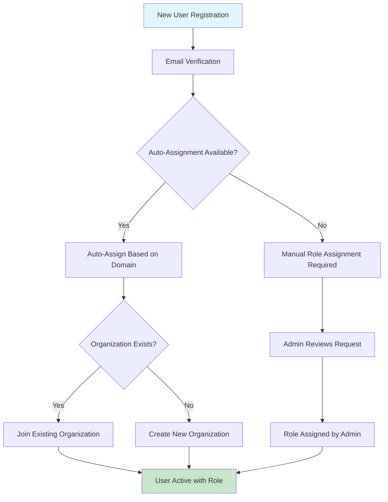

# 🔐 Multi-Tenant Authentication System

## 📋 **Table of Contents**
1. [Authentication Overview](#authentication-overview)
2. [User Role Hierarchy](#user-role-hierarchy)
3. [Multi-Tenant Access Control](#multi-tenant-access-control)
4. [JWT Token Management](#jwt-token-management)
5. [Session Management](#session-management)
6. [Security Implementation](#security-implementation)

---

## 🎯 **Authentication Overview**

AccuNode implements a **5-level hierarchical role-based authentication system** with multi-tenant support, enabling granular access control across organizations and data isolation.

### **Authentication Architecture**
```
┌─────────────────────────────────────────────────────────────────┐
│                    AUTHENTICATION FLOW                         │
└─────────────────────┬───────────────────────────────────────────┘
                      │
┌─────────────────────▼───────────────────────────────────────────┐
│  Registration → Verification → Role Assignment → Organization   │
│      │              │              │              │            │
│   [pending]    [verified]   [role_assigned]   [active]         │
└─────────────────────────────────────────────────────────────────┘
                      │
┌─────────────────────▼───────────────────────────────────────────┐
│                 ACCESS CONTROL MATRIX                          │
│  ┌─────────────┐  ┌─────────────┐  ┌─────────────┐            │
│  │Personal Data│  │   Org Data  │  │System Data  │            │
│  │    Access   │  │   Access    │  │   Access    │            │
│  └─────────────┘  └─────────────┘  └─────────────┘            │
└─────────────────────────────────────────────────────────────────┘
```

### **Core Authentication Components**
```python
# User Authentication Model
class User(BaseModel):
    id: UUID
    email: str
    password_hash: str
    role: UserRole
    organization_id: Optional[UUID]
    is_verified: bool = False
    created_at: datetime
    last_login: Optional[datetime]

# Organization Model  
class Organization(BaseModel):
    id: UUID
    name: str
    domain: str
    created_at: datetime
    is_active: bool = True
```

---

## 👥 **User Role Hierarchy**

### **5-Level Role System**

#### **1. Super Admin** (`super_admin`)
```python
UserRole.SUPER_ADMIN = "super_admin"

# Permissions:
✅ Platform-wide access to all data
✅ Cross-organization management
✅ System configuration and maintenance  
✅ User role management at all levels
✅ Analytics and reporting across all tenants
✅ Infrastructure and security settings

# Use Cases:
- Platform administrators
- Technical support staff
- System maintenance personnel
```

#### **2. Tenant Admin** (`tenant_admin`)
```python
UserRole.TENANT_ADMIN = "tenant_admin"

# Permissions:
✅ Cross-organization access within tenant
✅ Organization creation and management
✅ User management across organizations
✅ Billing and subscription management
✅ Cross-org analytics and reporting
❌ Platform configuration access

# Use Cases:
- Multi-organization account managers  
- Enterprise customer administrators
- Reseller account managers
```

#### **3. Organization Admin** (`org_admin`)
```python
UserRole.ORG_ADMIN = "org_admin"

# Permissions:
✅ Full access to own organization data
✅ Organization member management
✅ Organization settings and configuration
✅ Bulk operations within organization
✅ Organization-level analytics
❌ Cross-organization access

# Use Cases:
- Company administrators
- Department heads
- Organization IT managers
```

#### **4. Organization Member** (`org_member`)
```python
UserRole.ORG_MEMBER = "org_member"

# Permissions:
✅ Read/write access to organization data
✅ Own data creation and management
✅ Organization data viewing and analysis
✅ Limited bulk operations
❌ User management capabilities
❌ Organization configuration changes

# Use Cases:
- Team members
- Analysts
- Regular organization users
```

#### **5. User** (`user`)
```python
UserRole.USER = "user"

# Permissions:
✅ Own data creation and management
✅ System/public data access (read-only)
❌ Organization data access
❌ Other users' data access
❌ Any administrative functions

# Use Cases:
- Individual users
- Trial account users
- Basic API consumers
```

### **Role Assignment Flow**


---

## 🏢 **Multi-Tenant Access Control**

### **Data Access Levels**
```python
class AccessLevel(str, Enum):
    PERSONAL = "personal"        # User's own predictions/data
    ORGANIZATION = "organization" # Shared within organization
    SYSTEM = "system"            # Platform-wide public data
```

### **Access Control Matrix**

| User Role | Personal Data | Org Data | System Data | Cross-Org Data | User Management | Org Management |
|-----------|---------------|----------|-------------|----------------|-----------------|----------------|
| **super_admin** | ✅ All Users | ✅ All Orgs | ✅ Full Access | ✅ Full Access | ✅ All Levels | ✅ All Orgs |
| **tenant_admin** | ✅ Own + Tenant | ✅ Tenant Orgs | ✅ Full Access | ✅ Tenant Only | ✅ Tenant Users | ✅ Tenant Orgs |
| **org_admin** | ✅ Own + Org | ✅ Own Org | ✅ Read Only | ❌ None | ✅ Org Members | ✅ Own Org |
| **org_member** | ✅ Own | ✅ Own Org | ✅ Read Only | ❌ None | ❌ None | ❌ None |
| **user** | ✅ Own | ❌ None | ✅ Read Only | ❌ None | ❌ None | ❌ None |

### **Data Filtering Implementation**
```python
def get_data_access_filter(user: User, model_class, include_system: bool = True):
    """Generate SQLAlchemy filter based on user permissions"""
    
    if user.role == UserRole.SUPER_ADMIN:
        return None  # No restrictions - access all data
    
    elif user.role == UserRole.TENANT_ADMIN:
        # Access to all organizations within tenant (implement tenant logic)
        return None  # For now, implement tenant filtering later
    
    elif user.role in [UserRole.ORG_ADMIN, UserRole.ORG_MEMBER]:
        if not user.organization_id:
            # User must belong to an organization
            return model_class.created_by == str(user.id)
        
        filters = [
            model_class.created_by == str(user.id),  # Own data
            and_(
                model_class.organization_id == user.organization_id,
                model_class.access_level == AccessLevel.ORGANIZATION
            )  # Organization data
        ]
        
        if include_system:
            filters.append(model_class.access_level == AccessLevel.SYSTEM)
        
        return or_(*filters)
    
    else:  # Regular user
        filters = [model_class.created_by == str(user.id)]  # Only own data
        
        if include_system:
            filters.append(model_class.access_level == AccessLevel.SYSTEM)
        
        return or_(*filters)

# Usage in API endpoints
@router.get("/predictions/annual")
async def get_annual_predictions(
    current_user: User = Depends(get_current_user),
    db: AsyncSession = Depends(get_db)
):
    # Apply access control filter
    filter_condition = get_data_access_filter(
        current_user, 
        AnnualPrediction, 
        include_system=True
    )
    
    query = select(AnnualPrediction)
    if filter_condition is not None:
        query = query.where(filter_condition)
    
    result = await db.execute(query)
    return result.scalars().all()
```

### **Organization Management**
```python
class OrganizationService:
    """Organization lifecycle management"""
    
    async def create_organization(self, org_data: dict, creator: User) -> Organization:
        """Create new organization with creator as admin"""
        if creator.role not in [UserRole.SUPER_ADMIN, UserRole.TENANT_ADMIN]:
            raise PermissionError("Insufficient permissions to create organization")
        
        org = Organization(**org_data)
        await db.save(org)
        
        # Assign creator as org admin if not super admin
        if creator.role != UserRole.SUPER_ADMIN:
            creator.organization_id = org.id
            creator.role = UserRole.ORG_ADMIN
            await db.save(creator)
        
        return org
    
    async def join_organization(self, user: User, org_id: UUID, role: UserRole = UserRole.ORG_MEMBER):
        """Add user to organization with specified role"""
        # Validate permissions for role assignment
        if role in [UserRole.ORG_ADMIN] and user.role not in [UserRole.SUPER_ADMIN, UserRole.TENANT_ADMIN]:
            raise PermissionError("Cannot assign admin role")
        
        user.organization_id = org_id
        user.role = role
        await db.save(user)
```

---

## 🔑 **JWT Token Management**

### **Token Structure**
```python
# JWT Payload Structure
{
    "sub": "user_id",                    # Subject (User ID)
    "email": "user@example.com",         # User email
    "role": "org_admin",                 # User role
    "org_id": "org_uuid",                # Organization ID (if applicable)
    "iat": 1633024800,                   # Issued at timestamp
    "exp": 1633111200,                   # Expiration timestamp
    "jti": "token_id",                   # JWT ID for revocation
    "scope": ["predictions:read", "predictions:write"]  # Granular permissions
}

# Token Generation
def create_access_token(
    data: dict, 
    expires_delta: Optional[timedelta] = None
) -> str:
    to_encode = data.copy()
    
    if expires_delta:
        expire = datetime.utcnow() + expires_delta
    else:
        expire = datetime.utcnow() + timedelta(minutes=ACCESS_TOKEN_EXPIRE_MINUTES)
    
    to_encode.update({
        "exp": expire,
        "iat": datetime.utcnow(),
        "jti": str(uuid4())  # Unique token ID
    })
    
    encoded_jwt = jwt.encode(to_encode, SECRET_KEY, algorithm=ALGORITHM)
    return encoded_jwt
```

### **Token Validation & Security**
```python
async def get_current_user(
    token: str = Depends(oauth2_scheme),
    db: AsyncSession = Depends(get_db)
) -> User:
    """Extract and validate user from JWT token"""
    
    credentials_exception = HTTPException(
        status_code=status.HTTP_401_UNAUTHORIZED,
        detail="Could not validate credentials",
        headers={"WWW-Authenticate": "Bearer"},
    )
    
    try:
        # Decode JWT token
        payload = jwt.decode(token, SECRET_KEY, algorithms=[ALGORITHM])
        user_id: str = payload.get("sub")
        
        if user_id is None:
            raise credentials_exception
        
        # Check token blacklist (for logout/revocation)
        jti = payload.get("jti")
        if await is_token_blacklisted(jti):
            raise credentials_exception
            
    except JWTError:
        raise credentials_exception
    
    # Fetch user from database
    user = await get_user_by_id(db, user_id)
    if user is None:
        raise credentials_exception
    
    # Update last seen timestamp
    user.last_login = datetime.utcnow()
    await db.commit()
    
    return user

# Token Blacklist for Logout/Revocation
async def blacklist_token(jti: str, expire_time: int):
    """Add token to blacklist for security"""
    await redis_client.setex(
        f"blacklist:{jti}",
        expire_time - int(datetime.utcnow().timestamp()),
        "revoked"
    )

async def is_token_blacklisted(jti: str) -> bool:
    """Check if token is blacklisted"""
    return await redis_client.exists(f"blacklist:{jti}")
```

### **Token Refresh Strategy**
```python
@router.post("/auth/refresh")
async def refresh_token(
    refresh_token: str = Body(...),
    db: AsyncSession = Depends(get_db)
):
    """Generate new access token using refresh token"""
    
    try:
        # Validate refresh token (longer expiration)
        payload = jwt.decode(refresh_token, SECRET_KEY, algorithms=[ALGORITHM])
        user_id = payload.get("sub")
        token_type = payload.get("type")
        
        if token_type != "refresh":
            raise HTTPException(status_code=401, detail="Invalid token type")
        
        user = await get_user_by_id(db, user_id)
        if not user:
            raise HTTPException(status_code=401, detail="User not found")
        
        # Generate new access token
        access_token = create_access_token(
            data={
                "sub": str(user.id),
                "email": user.email,
                "role": user.role,
                "org_id": str(user.organization_id) if user.organization_id else None
            }
        )
        
        return {"access_token": access_token, "token_type": "bearer"}
        
    except JWTError:
        raise HTTPException(status_code=401, detail="Invalid refresh token")
```

---

## 🗄️ **Session Management**

### **Redis-based Session Store**
```python
class SessionManager:
    """Redis-based session management"""
    
    def __init__(self, redis_client):
        self.redis = redis_client
        self.session_timeout = 1800  # 30 minutes
    
    async def create_session(self, user: User) -> str:
        """Create new user session"""
        session_id = str(uuid4())
        session_data = {
            "user_id": str(user.id),
            "email": user.email,
            "role": user.role,
            "org_id": str(user.organization_id) if user.organization_id else None,
            "created_at": datetime.utcnow().isoformat(),
            "last_activity": datetime.utcnow().isoformat()
        }
        
        await self.redis.hset(
            f"session:{session_id}",
            mapping=session_data
        )
        await self.redis.expire(f"session:{session_id}", self.session_timeout)
        
        return session_id
    
    async def get_session(self, session_id: str) -> Optional[dict]:
        """Retrieve session data"""
        session_data = await self.redis.hgetall(f"session:{session_id}")
        
        if session_data:
            # Update last activity
            await self.redis.hset(
                f"session:{session_id}",
                "last_activity",
                datetime.utcnow().isoformat()
            )
            await self.redis.expire(f"session:{session_id}", self.session_timeout)
            
        return session_data if session_data else None
    
    async def delete_session(self, session_id: str):
        """Delete session (logout)"""
        await self.redis.delete(f"session:{session_id}")
    
    async def cleanup_expired_sessions(self):
        """Background task to clean up expired sessions"""
        # Redis TTL handles automatic cleanup
        pass
```

### **Session Security Features**
```python
# Session hijacking prevention
async def validate_session_security(request: Request, session_id: str):
    """Additional session security checks"""
    
    session_data = await session_manager.get_session(session_id)
    if not session_data:
        raise HTTPException(status_code=401, detail="Invalid session")
    
    # IP address validation (optional, can be restrictive)
    client_ip = request.client.host
    stored_ip = session_data.get("ip_address")
    
    if ENFORCE_IP_VALIDATION and stored_ip and client_ip != stored_ip:
        await session_manager.delete_session(session_id)
        raise HTTPException(status_code=401, detail="Session security violation")
    
    # User agent validation
    user_agent = request.headers.get("user-agent", "")
    stored_agent = session_data.get("user_agent")
    
    if stored_agent and user_agent != stored_agent:
        # Log suspicious activity
        logger.warning(f"User agent mismatch for session {session_id}")
    
    return session_data
```

---

## 🛡️ **Security Implementation**

### **Password Security**
```python
from passlib.context import CryptContext

pwd_context = CryptContext(schemes=["bcrypt"], deprecated="auto")

class PasswordSecurity:
    @staticmethod
    def hash_password(password: str) -> str:
        """Hash password using bcrypt"""
        return pwd_context.hash(password)
    
    @staticmethod
    def verify_password(plain_password: str, hashed_password: str) -> bool:
        """Verify password against hash"""
        return pwd_context.verify(plain_password, hashed_password)
    
    @staticmethod
    def validate_password_strength(password: str) -> bool:
        """Validate password meets security requirements"""
        if len(password) < 8:
            return False
        
        has_upper = any(c.isupper() for c in password)
        has_lower = any(c.islower() for c in password)
        has_digit = any(c.isdigit() for c in password)
        has_special = any(c in "!@#$%^&*()_+-=[]{}|;:,.<>?" for c in password)
        
        return all([has_upper, has_lower, has_digit, has_special])
```

### **Authentication Endpoints**
```python
@router.post("/auth/register")
async def register_user(
    user_data: UserRegistrationRequest,
    db: AsyncSession = Depends(get_db)
):
    """User registration with email verification"""
    
    # Check if user already exists
    if await get_user_by_email(db, user_data.email):
        raise HTTPException(status_code=400, detail="Email already registered")
    
    # Validate password strength
    if not PasswordSecurity.validate_password_strength(user_data.password):
        raise HTTPException(
            status_code=400,
            detail="Password must be at least 8 characters with uppercase, lowercase, digit, and special character"
        )
    
    # Create user
    user = User(
        email=user_data.email,
        password_hash=PasswordSecurity.hash_password(user_data.password),
        role=UserRole.USER,  # Default role
        is_verified=False
    )
    
    await db.save(user)
    
    # Send verification email
    await send_verification_email(user.email, user.id)
    
    return {"message": "Registration successful. Please check your email for verification."}

@router.post("/auth/login")
async def login_user(
    login_data: UserLoginRequest,
    db: AsyncSession = Depends(get_db)
):
    """User authentication and token generation"""
    
    user = await get_user_by_email(db, login_data.email)
    
    if not user or not PasswordSecurity.verify_password(login_data.password, user.password_hash):
        raise HTTPException(status_code=401, detail="Invalid credentials")
    
    if not user.is_verified:
        raise HTTPException(status_code=401, detail="Email not verified")
    
    # Generate tokens
    access_token = create_access_token(
        data={
            "sub": str(user.id),
            "email": user.email,
            "role": user.role,
            "org_id": str(user.organization_id) if user.organization_id else None
        }
    )
    
    refresh_token = create_refresh_token(data={"sub": str(user.id)})
    
    # Create session
    session_id = await session_manager.create_session(user)
    
    return {
        "access_token": access_token,
        "refresh_token": refresh_token,
        "token_type": "bearer",
        "session_id": session_id
    }
```

### **Role-based Endpoint Protection**
```python
def require_role(allowed_roles: List[UserRole]):
    """Decorator for role-based access control"""
    def decorator(func):
        async def wrapper(*args, **kwargs):
            current_user = kwargs.get('current_user')
            if not current_user or current_user.role not in allowed_roles:
                raise HTTPException(
                    status_code=403,
                    detail="Insufficient permissions"
                )
            return await func(*args, **kwargs)
        return wrapper
    return decorator

# Usage in endpoints
@router.post("/admin/users")
@require_role([UserRole.SUPER_ADMIN, UserRole.TENANT_ADMIN, UserRole.ORG_ADMIN])
async def create_user(
    user_data: UserCreationRequest,
    current_user: User = Depends(get_current_user),
    db: AsyncSession = Depends(get_db)
):
    """Admin endpoint for creating users"""
    # Implementation with role-specific logic
    pass
```

---

## 📊 **Authentication Monitoring**

### **Audit Logging**
```python
class AuthenticationAuditLog:
    """Security event logging"""
    
    @staticmethod
    async def log_login_attempt(email: str, success: bool, ip_address: str, user_agent: str):
        """Log authentication attempts"""
        log_data = {
            "event_type": "login_attempt",
            "email": email,
            "success": success,
            "ip_address": ip_address,
            "user_agent": user_agent,
            "timestamp": datetime.utcnow()
        }
        
        if success:
            logger.info(f"Successful login: {email} from {ip_address}")
        else:
            logger.warning(f"Failed login attempt: {email} from {ip_address}")
        
        # Store in audit table for compliance
        await store_audit_log(log_data)
    
    @staticmethod
    async def log_role_change(admin_user: User, target_user: User, old_role: str, new_role: str):
        """Log role modifications"""
        logger.info(f"Role change: {admin_user.email} changed {target_user.email} from {old_role} to {new_role}")
        
        audit_data = {
            "event_type": "role_change",
            "admin_user_id": str(admin_user.id),
            "target_user_id": str(target_user.id),
            "old_role": old_role,
            "new_role": new_role,
            "timestamp": datetime.utcnow()
        }
        
        await store_audit_log(audit_data)
```

### **Security Metrics**
```python
# Key authentication metrics to monitor
METRICS_TO_TRACK = {
    "login_attempts_per_hour": "Counter of authentication attempts",
    "failed_login_rate": "Percentage of failed vs successful logins",
    "token_refresh_frequency": "How often tokens are refreshed",
    "session_duration_avg": "Average user session length",
    "role_escalation_events": "Admin role assignments and changes",
    "organization_join_events": "Users joining organizations"
}

# Implementation with monitoring hooks
async def track_authentication_metric(metric_name: str, value: float, tags: dict = None):
    """Send authentication metrics to monitoring system"""
    # CloudWatch, Prometheus, or other monitoring integration
    await metrics_client.put_metric(metric_name, value, tags or {})
```

---

**Last Updated**: October 5, 2025  
**Authentication Version**: 2.0.0
