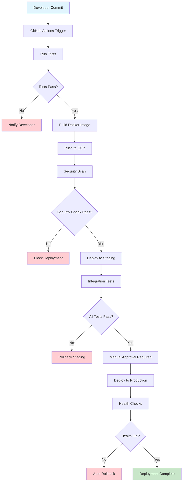

# 🚀 Production Deployment


## 📊 **Production Architecture**

### **High-Level Infrastructure**
```
┌─────────────────────────────────────────────────────────────────┐
│                      PRODUCTION ENVIRONMENT                     │
└─────────────────────┬───────────────────────────────────────────┘
                      │
┌─────────────────────▼───────────────────────────────────────────┐
│                    ROUTE 53 DNS                                │
│              api.accunode.com (Prod)                           │
│          staging-api.accunode.com (Staging)                    │
└─────────────────────┬───────────────────────────────────────────┘
                      │
┌─────────────────────▼───────────────────────────────────────────┐
│                   CLOUDFRONT CDN                               │
│           (Optional - Static Assets Only)                      │
└─────────────────────┬───────────────────────────────────────────┘
                      │
┌─────────────────────▼───────────────────────────────────────────┐
│              APPLICATION LOAD BALANCER                         │
│                    (Multi-AZ)                                  │
│  ┌─────────────┐  ┌─────────────┐  ┌─────────────┐            │
│  │   AZ-1a     │  │   AZ-1b     │  │   AZ-1c     │            │
│  │   Target    │  │   Target    │  │   Target    │            │
│  │   Group     │  │   Group     │  │   Group     │            │
│  └─────────────┘  └─────────────┘  └─────────────┘            │
└─────────────────────┬───────────────────────────────────────────┘
                      │
┌─────────────────────▼───────────────────────────────────────────┐
│                 ECS FARGATE CLUSTER                            │
│  ┌─────────────┐  ┌─────────────┐  ┌─────────────┐            │
│  │   Service   │  │   Service   │  │   Service   │            │
│  │   Tasks     │  │   Tasks     │  │   Tasks     │            │
│  │  (4-20)     │  │  (4-20)     │  │  (4-20)     │            │
│  │ Auto-Scale  │  │ Auto-Scale  │  │ Auto-Scale  │            │
│  └─────────────┘  └─────────────┘  └─────────────┘            │
└─────────────────────┬───────────────────────────────────────────┘
                      │
┌─────────────────────▼───────────────────────────────────────────┐
│                   DATA SERVICES                                │
│  ┌─────────────┐  ┌─────────────┐  ┌─────────────┐            │
│  │    RDS      │  │ElastiCache  │  │ Parameter   │            │
│  │ PostgreSQL  │  │   Redis     │  │   Store     │            │
│  │db.r5.xlarge │  │cache.r6g.xl │  │(Encrypted)  │            │
│  │  Multi-AZ   │  │  Clustered  │  │  Secrets    │            │
│  │Encrypted    │  │ Encrypted   │  │ Management  │            │
│  └─────────────┘  └─────────────┘  └─────────────┘            │
└─────────────────────────────────────────────────────────────────┘
```

### **Production Specifications**
| Component | Configuration | Scaling | Backup |
|-----------|---------------|---------|---------|
| **ECS Service** | 4-20 tasks, 2 vCPU, 4GB RAM | Auto-scale on CPU/Memory | N/A (stateless) |
| **RDS PostgreSQL** | db.r5.xlarge, Multi-AZ | Read replicas available | Daily + PITR |
| **ElastiCache Redis** | cache.r6g.xlarge, Clustered | Manual scaling | Daily snapshots |
| **ALB** | Multi-AZ, SSL termination | Auto-managed | N/A |

---

## 🔧 **Deployment Requirements**

### **Pre-deployment Checklist**
```yaml
Infrastructure:
  ✅ AWS Account with appropriate permissions
  ✅ VPC and subnets configured
  ✅ Security groups and NACLs set
  ✅ IAM roles and policies created
  ✅ Parameter Store secrets configured

Security:
  ✅ SSL certificates obtained and validated
  ✅ WAF rules configured and tested
  ✅ Security scanning completed
  ✅ Penetration testing passed
  ✅ Compliance requirements met

Application:
  ✅ All tests passing (unit, integration, e2e)
  ✅ Performance testing completed
  ✅ Load testing validated
  ✅ Security testing passed
  ✅ Documentation updated

Operations:
  ✅ Monitoring and alerting configured
  ✅ Log aggregation setup
  ✅ Backup procedures tested
  ✅ Runbooks created and validated
  ✅ On-call rotation established
```

### **Environment Variables (Production)**
```bash
# Core Application Settings
ENVIRONMENT=production
DEBUG=false
LOG_LEVEL=INFO
API_VERSION=v1

# Database Configuration
DATABASE_URL=postgresql://${DB_USER}:${DB_PASSWORD}@${DB_HOST}:5432/${DB_NAME}
DATABASE_POOL_SIZE=20
DATABASE_MAX_OVERFLOW=30
DATABASE_POOL_TIMEOUT=30

# Cache Configuration
REDIS_URL=redis://${REDIS_HOST}:6379/0
REDIS_MAX_CONNECTIONS=100
REDIS_TIMEOUT=5

# Security Configuration
JWT_SECRET_KEY=${JWT_SECRET}          # From Parameter Store
JWT_ALGORITHM=HS256
JWT_EXPIRE_MINUTES=60
REFRESH_TOKEN_EXPIRE_DAYS=30

# Rate Limiting
RATE_LIMIT_ENABLED=true
RATE_LIMIT_STORAGE_URL=${REDIS_URL}
DEFAULT_RATE_LIMIT=100/minute

# ML Configuration
ML_MODEL_PATH=/app/models
ML_INFERENCE_TIMEOUT=30
ML_BATCH_SIZE=100

# AWS Configuration
AWS_REGION=us-east-1
AWS_PARAMETER_STORE_PREFIX=/accunode/prod/
AWS_XRAY_TRACING_NAME=accunode-api

# Monitoring and Logging
CLOUDWATCH_LOG_GROUP=/aws/ecs/accunode-prod
METRICS_ENABLED=true
HEALTH_CHECK_INTERVAL=30
```

---

## 🛡️ **Security Configuration**

### **SSL/TLS Setup**
```yaml
# Certificate Manager Configuration
SSL_Certificate:
  Domain: "*.accunode.com"
  Validation: DNS
  Auto_Renewal: true
  
Load_Balancer:
  Protocol: HTTPS
  Port: 443
  SSL_Policy: ELBSecurityPolicy-TLS-1-2-2017-01
  Certificate_ARN: arn:aws:acm:us-east-1:account:certificate/cert-id

Security_Headers:
  Strict-Transport-Security: "max-age=63072000; includeSubDomains; preload"
  X-Content-Type-Options: nosniff
  X-Frame-Options: DENY
  X-XSS-Protection: "1; mode=block"
  Content-Security-Policy: "default-src 'self'"
```

### **WAF Configuration**
```yaml
AWS_WAF_Rules:
  - Name: "Rate-Limiting-Rule"
    Type: "RateBased"
    Limit: 2000  # requests per 5 minutes
    
  - Name: "SQL-Injection-Rule"
    Type: "ManagedRuleGroup"
    VendorName: "AWS"
    Name: "AWSManagedRulesSQLiRuleSet"
    
  - Name: "Common-Attacks-Rule"
    Type: "ManagedRuleGroup"
    VendorName: "AWS"
    Name: "AWSManagedRulesCommonRuleSet"
    
  - Name: "IP-Reputation-Rule"
    Type: "ManagedRuleGroup"
    VendorName: "AWS"
    Name: "AWSManagedRulesAmazonIpReputationList"
```

---

## 📊 **Monitoring & Alerting**

### **Key Performance Indicators (KPIs)**
```yaml
Application_Metrics:
  - Response_Time_P95: < 500ms
  - Response_Time_P99: < 1000ms
  - Error_Rate: < 0.1%
  - Availability: > 99.9%
  - Throughput: > 1000 RPS

Infrastructure_Metrics:
  - CPU_Utilization: < 70%
  - Memory_Utilization: < 80%
  - Database_Connections: < 80%
  - Cache_Hit_Rate: > 90%

Business_Metrics:
  - Prediction_Success_Rate: > 99.5%
  - ML_Model_Accuracy: > 95%
  - User_Authentication_Success: > 99%
  - Data_Processing_Time: < 30s
```

### **Alert Configuration**
```yaml
Critical_Alerts:
  - Name: "High Error Rate"
    Condition: "Error rate > 1% for 5 minutes"
    Notification: "PagerDuty + Slack"
    
  - Name: "Service Unavailable"
    Condition: "Health check failures > 3 consecutive"
    Notification: "PagerDuty + Phone"
    
  - Name: "Database Connection Issues"
    Condition: "DB connection failures > 10 in 1 minute"
    Notification: "PagerDuty + Slack"

Warning_Alerts:
  - Name: "High Response Time"
    Condition: "P95 response time > 800ms for 10 minutes"
    Notification: "Slack"
    
  - Name: "Resource Utilization"
    Condition: "CPU > 80% or Memory > 85% for 15 minutes"
    Notification: "Slack + Email"
```

---

## 💾 **Backup Strategy**

### **Database Backup**
```yaml
RDS_Automated_Backup:
  Backup_Window: "03:00-04:00 UTC"
  Retention_Period: 7 days
  Point_In_Time_Recovery: true
  
Manual_Snapshots:
  Frequency: "Before major deployments"
  Retention: "30 days"
  Cross_Region_Copy: "us-west-2"

Backup_Testing:
  Frequency: "Monthly"
  Procedure: "Restore to test environment"
  Validation: "Data integrity checks"
```

### **Application Data Backup**
```yaml
Redis_Backup:
  Snapshot_Frequency: "Daily at 02:00 UTC"
  Retention: "7 days"
  
Configuration_Backup:
  Parameter_Store: "Versioned automatically"
  ECS_Task_Definitions: "Versioned in Git"
  Infrastructure_Code: "Version controlled"
```

---

## 🔄 **Deployment Pipeline**

### **CI/CD Workflow**


### **Blue-Green Deployment**
```yaml
Deployment_Strategy:
  Type: "Blue-Green"
  
Blue_Environment:
  Status: "Currently serving traffic"
  Version: "v1.2.3"
  Health: "All checks passing"
  
Green_Environment:
  Status: "New version deployment"
  Version: "v1.2.4"
  Health: "Pre-deployment validation"
  
Traffic_Switch:
  Method: "ALB Target Group switching"
  Validation: "Health checks + smoke tests"
  Rollback_Time: "< 2 minutes"
  
Rollback_Procedure:
  Trigger: "Automated on health check failure"
  Method: "Switch traffic back to Blue"
  Notification: "Immediate alert to on-call"
```

---