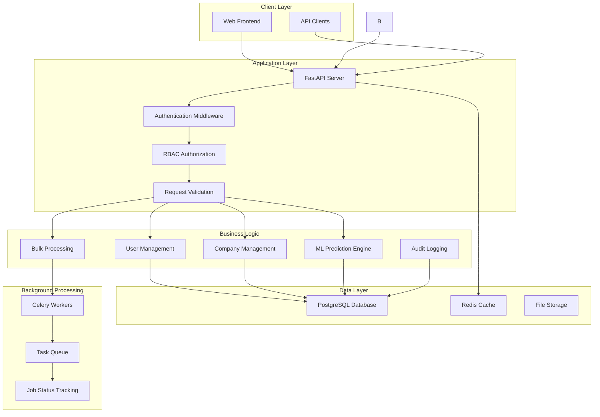
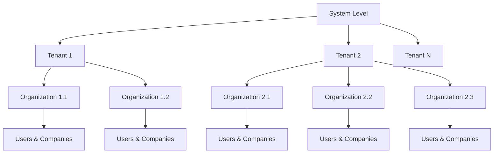
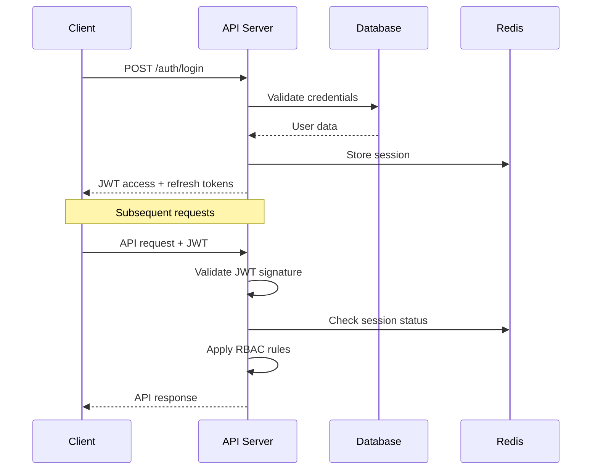
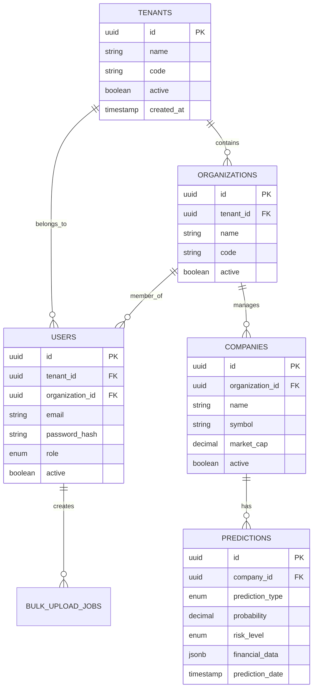
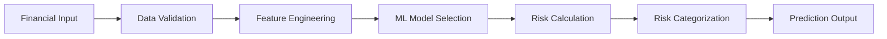
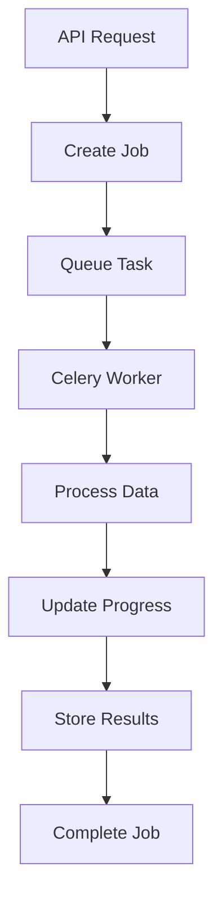

# 🏗️ System Architecture

## 🎯 Overview

The Financial Default Risk Prediction System is a modern, scalable web application built with FastAPI and designed for enterprise use. It provides real-time financial risk assessment capabilities through machine learning models, serving multiple organizations with complete data isolation.

## 🔧 Technology Stack

### Backend Framework
- **FastAPI** (Python 3.13) - High-performance async web framework
- **SQLAlchemy 2.0** - Modern ORM with async support
- **PostgreSQL 15** - Primary database with ACID compliance
- **Redis 7** - Caching and session management
- **Celery** - Background task processing with Redis broker

### Security & Authentication
- **JWT Tokens** with RS256 asymmetric encryption
- **bcrypt** password hashing
- **Role-based access control (RBAC)**
- **Multi-tenant data isolation**

### Development & Deployment
- **Docker** containerization for consistent environments
- **Prometheus** metrics collection
- **Structured logging** with request tracing
- **Async/await** patterns for high concurrency

## 🏛️ High-Level Architecture



## 🏢 Multi-Tenant Architecture

The system implements a **hierarchical multi-tenant model** with complete data isolation:



### Tenant Isolation Implementation

```python
# Database-level tenant isolation
class TenantAwareModel:
    """Base model ensuring tenant-aware queries"""
    
    @declared_attr
    def tenant_id(cls):
        return Column(UUID(as_uuid=True), nullable=False, index=True)
    
    @classmethod
    def filter_by_tenant(cls, query, tenant_id):
        return query.filter(cls.tenant_id == tenant_id)

# Middleware for automatic tenant filtering
class TenantMiddleware:
    async def __call__(self, request: Request, call_next):
        # Extract tenant context from JWT token
        tenant_id = self.get_tenant_from_token(request)
        
        # Set tenant context for the request
        request.state.tenant_id = tenant_id
        
        response = await call_next(request)
        return response
```

## 🔐 Security Architecture

### Authentication Flow



### Role-Based Access Control

The system implements a **5-tier role hierarchy**:

1. **super_admin** - System-wide access
2. **tenant_admin** - Full tenant management
3. **org_admin** - Organization management
4. **org_member** - Organization operations
5. **user** - Limited company access

```python
class RolePermissions:
    ROLE_HIERARCHY = {
        "super_admin": ["system:*"],
        "tenant_admin": ["tenant:*", "org:*", "user:*", "prediction:*"],
        "org_admin": ["org:manage:own", "user:manage:org", "prediction:*"],
        "org_member": ["org:read:own", "prediction:manage", "company:manage"],
        "user": ["company:assigned", "prediction:read"]
    }
    
    def check_permission(self, user_role: str, resource: str, action: str):
        permissions = self.ROLE_HIERARCHY.get(user_role, [])
        
        # Check for wildcard or specific permissions
        return (f"{resource}:*" in permissions or 
                f"{resource}:{action}" in permissions or
                "system:*" in permissions)
```

## 💾 Data Architecture

### Database Schema



### Database Connection Management

```python
from sqlalchemy.ext.asyncio import create_async_engine, AsyncSession

class DatabaseConfig:
    def __init__(self):
        self.engine = create_async_engine(
            DATABASE_URL,
            pool_size=20,
            max_overflow=30,
            pool_pre_ping=True,
            pool_recycle=3600,
            echo=False  # Set to True for SQL debugging
        )
    
    async def get_session(self):
        async with AsyncSession(self.engine) as session:
            try:
                yield session
            finally:
                await session.close()
```

## 🤖 Machine Learning Pipeline

### Prediction Models

The system supports two ML model types:

1. **Annual Model** - Long-term risk assessment using yearly financial data
2. **Quarterly Model** - Short-term risk assessment using quarterly data



### Model Implementation

```python
class PredictionService:
    def __init__(self):
        self.annual_model = self.load_model("annual")
        self.quarterly_model = self.load_model("quarterly")
    
    async def predict_default_risk(
        self, 
        company_data: dict, 
        prediction_type: str
    ) -> dict:
        """Generate default risk prediction"""
        
        # Select appropriate model
        model = (self.annual_model if prediction_type == "annual" 
                else self.quarterly_model)
        
        # Prepare features
        features = self.prepare_features(company_data, prediction_type)
        
        # Generate prediction
        probability = model.predict_proba(features)[0][1]
        
        # Categorize risk
        risk_level = self.categorize_risk(probability)
        
        return {
            "probability": round(probability, 4),
            "risk_level": risk_level,
            "prediction_type": prediction_type,
            "created_at": datetime.utcnow().isoformat()
        }
    
    def categorize_risk(self, probability: float) -> str:
        """Convert probability to risk category"""
        if probability <= 0.2:
            return "LOW"
        elif probability <= 0.5:
            return "MEDIUM"
        else:
            return "HIGH"
```

## ⚙️ Background Processing

### Celery Task Architecture



### Task Implementation

```python
from celery import Celery

# Celery configuration
celery_app = Celery(
    "default_rate_worker",
    broker="redis://localhost:6379/0",
    backend="redis://localhost:6379/0"
)

@celery_app.task(bind=True)
def process_bulk_upload(self, job_id: str, file_data: list):
    """Process bulk upload with progress tracking"""
    
    total_rows = len(file_data)
    processed = 0
    
    for row in file_data:
        try:
            # Process individual company data
            result = process_company_data(row)
            processed += 1
            
            # Update progress
            progress = (processed / total_rows) * 100
            self.update_state(
                state="PROGRESS",
                meta={"current": processed, "total": total_rows}
            )
            
        except Exception as e:
            # Log error and continue
            logger.error(f"Error processing row: {e}")
    
    return {"status": "completed", "processed": processed}
```

## 📊 API Design

### RESTful Endpoints

The API follows REST principles with consistent patterns:

```python
# Resource-based URL structure
/api/v1/tenants/{tenant_id}/organizations
/api/v1/organizations/{org_id}/companies
/api/v1/companies/{company_id}/predictions

# Standard HTTP methods
GET    /companies     # List companies
POST   /companies     # Create company
GET    /companies/123 # Get specific company
PUT    /companies/123 # Update company
DELETE /companies/123 # Delete company
```

### Response Format

```python
# Successful response
{
    "success": true,
    "data": {
        "id": "uuid",
        "name": "Company Name",
        "created_at": "2024-01-01T00:00:00Z"
    },
    "meta": {
        "timestamp": "2024-01-01T00:00:00Z",
        "version": "1.0.0"
    }
}

# Error response
{
    "success": false,
    "error": {
        "code": "VALIDATION_ERROR",
        "message": "Invalid input data",
        "details": {
            "field": "email",
            "reason": "Invalid email format"
        }
    },
    "meta": {
        "timestamp": "2024-01-01T00:00:00Z",
        "request_id": "req_12345"
    }
}
```

## 🚀 Deployment Strategy

### Containerization

```dockerfile
FROM python:3.13-slim

# Install system dependencies
RUN apt-get update && apt-get install -y \
    libpq-dev \
    && rm -rf /var/lib/apt/lists/*

WORKDIR /app

# Install Python dependencies
COPY requirements.txt .
RUN pip install --no-cache-dir -r requirements.txt

# Copy application code
COPY . .

# Create non-root user
RUN useradd -m -u 1000 appuser && chown -R appuser:appuser /app
USER appuser

# Health check
HEALTHCHECK --interval=30s --timeout=10s --start-period=5s --retries=3 \
    CMD curl -f http://localhost:8000/health || exit 1

# Run application
CMD ["uvicorn", "app.main:app", "--host", "0.0.0.0", "--port", "8000"]
```

### Environment Configuration

```python
from pydantic import BaseSettings

class Settings(BaseSettings):
    # Application
    app_name: str = "Default Rate Prediction API"
    debug: bool = False
    
    # Database
    database_url: str
    
    # Redis
    redis_url: str = "redis://localhost:6379"
    
    # Security
    jwt_secret_key: str
    jwt_algorithm: str = "HS256"
    jwt_expire_minutes: int = 30
    
    # ML Models
    model_path: str = "/app/models"
    
    class Config:
        env_file = ".env"

settings = Settings()
```

## 📈 Monitoring & Health Checks

### Health Check Endpoint

```python
@app.get("/health")
async def health_check():
    """Comprehensive health check"""
    
    checks = {
        "database": await check_database(),
        "redis": await check_redis(),
        "celery": await check_celery_workers()
    }
    
    overall_health = all(check["status"] == "healthy" for check in checks.values())
    
    return {
        "status": "healthy" if overall_health else "unhealthy",
        "checks": checks,
        "timestamp": datetime.utcnow().isoformat()
    }
```

### Metrics Collection

```python
from prometheus_client import Counter, Histogram

# Define metrics
REQUEST_COUNT = Counter(
    'http_requests_total', 
    'Total HTTP requests',
    ['method', 'endpoint', 'status']
)

REQUEST_DURATION = Histogram(
    'http_request_duration_seconds',
    'HTTP request duration'
)

# Middleware to collect metrics
@app.middleware("http")
async def metrics_middleware(request: Request, call_next):
    start_time = time.time()
    
    response = await call_next(request)
    
    # Record metrics
    REQUEST_COUNT.labels(
        method=request.method,
        endpoint=request.url.path,
        status=response.status_code
    ).inc()
    
    REQUEST_DURATION.observe(time.time() - start_time)
    
    return response
```

This architecture provides a solid foundation for a scalable, secure, and maintainable financial risk prediction system.
