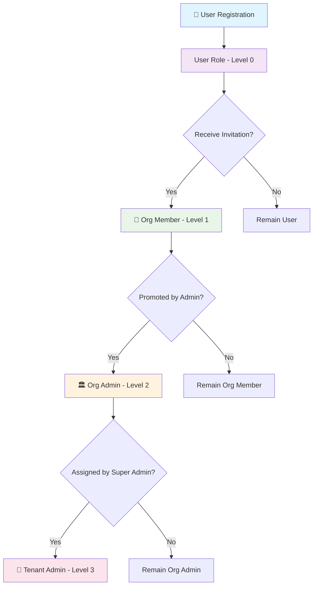

# 👥 User Roles & Permissions

## 🎯 5-Tier Role Hierarchy

The system implements a sophisticated 5-tier role hierarchy designed for enterprise-level access control:

```
┌─────────────────────────────────────────────────────────────────────┐
│                     ROLE HIERARCHY PYRAMID                         │
│                                                                     │
│                         👑 SUPER ADMIN                              │
│                      (System Owner - Level 4)                      │
│                    ┌─────────────────────────┐                     │
│                    │   🏢 TENANT ADMIN       │                     │
│                    │  (Multi-Org - Level 3)  │                     │
│                ┌───┴──────────────────────────┴───┐                 │
│                │      🏛️ ORG ADMIN              │                 │
│                │   (Single Org - Level 2)       │                 │
│            ┌───┴─────────────────────────────────┴───┐             │
│            │         👥 ORG MEMBER                   │             │
│            │      (Team Access - Level 1)           │             │
│        ┌───┴─────────────────────────────────────────┴───┐         │
│        │               👤 USER                           │         │
│        │         (Individual - Level 0)                 │         │
│        └─────────────────────────────────────────────────┘         │
└─────────────────────────────────────────────────────────────────────┘
```

## 🔑 Role Definitions & Capabilities

### 1. 👑 Super Admin (Level 4)
**Scope**: Entire System  
**Database Fields**: `role="super_admin"`, `tenant_id=NULL`, `organization_id=NULL`

#### Capabilities:
- **🌐 Global System Management**
  - Create, update, delete tenants
  - Assign tenant administrators
  - Access all data across all tenants and organizations
  - System configuration and maintenance

- **👥 User Management**
  - Create users with any role
  - Assign users to any tenant or organization
  - Modify user roles and permissions
  - Deactivate/reactivate user accounts

- **📊 Data Access**
  - View all companies, predictions, and financial data

#### Real-World Example:
```
Email: superadmin@defaultrate.com
Role: Super Admin
Access: All banks (HDFC, ICICI, SBI), all fintech companies means complete applications
Use Case: Platform owner managing the entire financial risk system
```

### 2. 🏢 Tenant Admin (Level 3)
**Scope**: Single Tenant + All Organizations within Tenant  
**Database Fields**: `role="tenant_admin"`, `tenant_id=[specific_tenant]`, `organization_id=NULL`

#### Capabilities:
- **🏛️ Organization Management**
  - Create organizations within their tenant
  - Assign organization administrators
  - Configure organization settings and permissions
  - Monitor organization usage and performance

- **👥 Multi-Organization User Management**
  - Invite users to any organization in their tenant
  - Assign users between organizations
  - Set organization-level permissions

- **📊 Tenant-Scoped Data Access**
  - View all data within their tenant

#### Real-World Example:
```
Email: admin@banking-corp.com
Role: Tenant Admin
Tenant: Banking Corporation
Organizations: HDFC Bank, ICICI Bank, SBI Bank
Use Case: Banking group administrator managing multiple bank subsidiaries
```

### 3. 🏛️ Organization Admin (Level 2)
**Scope**: Single Organization  
**Database Fields**: `role="org_admin"`, `organization_id=[specific_org]`, `tenant_id=NULL`

#### Capabilities:
- **👥 Team Management**
  - Invite new members to organization
  - Assign organization member roles
  - Configure organization whitelist
  - Manage organization join tokens

- **🏭 Organization Operations**
  - Create and manage companies within organization
  - Configure organization settings
  - Set global data access permissions
  - Monitor organization usage

- **📊 Organization Data Management**
  - View all organization predictions and companies

#### Real-World Example:
```
Email: admin@hdfc-risk.com
Role: Organization Admin
Organization: HDFC Bank Risk Assessment Division
Team: 25 risk analysts and credit officers
Use Case: Head of Risk Management for HDFC Bank's credit risk division
```

### 4. 👥 Organization Member (Level 1)
**Scope**: Single Organization with Data Access  
**Database Fields**: `role="org_member"`, `organization_id=[specific_org]`, `tenant_id=NULL`

#### Capabilities:
- **📊 Data Access & Analysis**
  - Create and view predictions within organization
  - Access organization companies and financial data
  - Upload bulk prediction data

- **🔍 Limited Company Management**
  - Create companies within organization scope
  - Update company information they created
  - View all organization companies

- **👤 Profile Management**
  - Update personal profile information
  - Change password and security settings
  - View organization membership details
  - Access usage statistics

#### Real-World Example:
```
Email: analyst@hdfc-risk.com
Role: Organization Member
Organization: HDFC Bank Risk Assessment Division
Use Case: Credit risk analyst processing loan applications and generating default risk scores
```

### 5. 👤 User (Level 0)
**Scope**: Individual Account Only  
**Database Fields**: `role="user"`, `organization_id=NULL`, `tenant_id=NULL`

#### Capabilities:
- **👤 Basic Profile Management**
  - Update personal information
  - Change password
  - View account status
  - Request organization invitations

- **🔄 Account Progression**
  - Join organizations via invitation tokens
  - can access the global data created by super admin

#### Real-World Example:
```
Email: john.doe@gmail.com
Role: User
Status: Awaiting organization invitation
Use Case: Independent financial consultant waiting to join client organization
```

## 🛡️ Permission Matrix

| Feature / Role | Super Admin | Tenant Admin | Org Admin | Org Member | User |
|----------------|-------------|--------------|-----------|------------|------|
| **System Management** |
| Create Tenants | ✅ | ❌ | ❌ | ❌ | ❌ |
| Manage All Users | ✅ | 🔶* | 🔶** | ❌ | ❌ |
| System Configuration | ✅ | ❌ | ❌ | ❌ | ❌ |
| **Tenant Operations** |
| Create Organizations | ✅ | ✅ | ❌ | ❌ | ❌ |
| Assign Org Admins | ✅ | ✅ | ❌ | ❌ | ❌ |
| **Organization Management** |
| Invite Members | ✅ | ✅ | ✅ | ❌ | ❌ |
| Manage Org Settings | ✅ | ✅ | ✅ | ❌ | ❌ |
| Configure Whitelist | ✅ | ✅ | ✅ | ❌ | ❌ |
| **Data Operations** |
| Create Companies | ✅ | ✅ | ✅ | ✅ | ❌ |
| Create Predictions | ✅ | ✅ | ✅ | ✅ | ❌ |
| Bulk Upload | ✅ | ✅ | ✅ | ✅ | ❌ |
| **Profile Management** |
| Update Profile | ✅ | ✅ | ✅ | ✅ | ✅ |
| Change Password | ✅ | ✅ | ✅ | ✅ | ✅ |

**Legend:**
- ✅ Full Access
- 🔶* Tenant-scoped access only
- 🔶** Organization-scoped access only
- ❌ No Access

## 📊 Data Access Patterns

### 1. Data Visibility Rules

```python
# Super Admin: Sees everything
SELECT * FROM companies;
SELECT * FROM predictions;

# Tenant Admin: Tenant-scoped data
SELECT * FROM companies c 
JOIN organizations o ON c.organization_id = o.id 
WHERE o.tenant_id = 'user_tenant_id';

# Org Admin/Member: Organization-scoped data
SELECT * FROM companies 
WHERE organization_id = 'user_organization_id' 
   OR is_global = true;  # Plus global companies if allowed

# User: No company/prediction access
SELECT * FROM users WHERE id = 'user_id';  # Profile only
```

### 2. Global Data Access Control

Organizations can configure `allow_global_data_access` to control whether their members can see global/shared data:

```python
# Organization with global access enabled
{
    "allow_global_data_access": True,
    "members_can_see": [
        "own_organization_data",
        "global_companies",  # Companies marked as global
        "shared_predictions"  # Predictions from other orgs if shared
    ]
}

# Organization with restricted access
{
    "allow_global_data_access": False,
    "members_can_see": [
        "own_organization_data_only"
    ]
}
```

## 🔄 Role Transition Workflows

### User Progression Path



### Real-World Scenario: Banking Corporation

```
🏦 Banking Corporation (Tenant)
├── 👑 Super Admin: Platform Owner
├── 🏢 Tenant Admin: Banking Group CTO
├── 🏛️ HDFC Bank (Organization)
│   ├── 🏛️ Org Admin: HDFC Risk Head
│   ├── 👥 Senior Analyst (Org Member)
│   ├── 👥 Junior Analyst (Org Member)
│   └── 👥 Credit Officer (Org Member)
├── 🏛️ ICICI Bank (Organization)
│   ├── 🏛️ Org Admin: ICICI Risk Head
│   └── 👥 Risk Team (Org Members)
└── 🏛️ SBI Bank (Organization)
    ├── 🏛️ Org Admin: SBI Risk Head
    └── 👥 Credit Team (Org Members)
```

## 🛠️ Implementation Examples

### Role Checking in Code

```python
def check_user_permissions(user: User, required_role: str = "org_member"):
    """Check if user has required permissions based on 5-role hierarchy"""
    role_hierarchy = {
        "user": 0,
        "org_member": 1, 
        "org_admin": 2,
        "tenant_admin": 3,
        "super_admin": 4
    }
    
    user_level = role_hierarchy.get(user.role, -1)
    required_level = role_hierarchy.get(required_role, 0)
    
    return user_level >= required_level
```

### Data Filtering by Role

```python
def get_accessible_companies(user: User, db: Session):
    """Get companies accessible to user based on their role"""
    
    if user.role == "super_admin":
        # Super admin sees all companies
        return db.query(Company).all()
    
    elif user.role == "tenant_admin":
        # Tenant admin sees companies in their tenant's organizations
        return db.query(Company).join(Organization).filter(
            Organization.tenant_id == user.tenant_id
        ).all()
    
    elif user.role in ["org_admin", "org_member"]:
        # Organization users see their org companies + global if allowed
        query = db.query(Company).filter(
            or_(
                Company.organization_id == user.organization_id,
                and_(
                    Company.is_global == True,
                    user.assigned_organization.allow_global_data_access == True
                )
            )
        )
        return query.all()
    
    else:
        # Regular users have no company access
        return []
```

---

This role system provides enterprise-grade access control suitable for large financial institutions with complex organizational structures.
