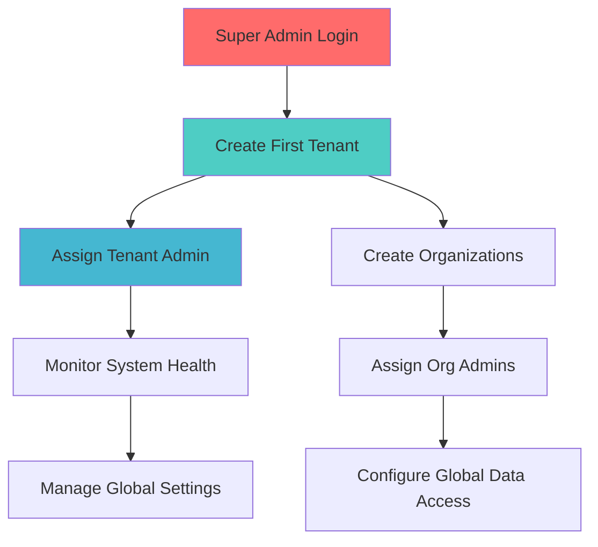
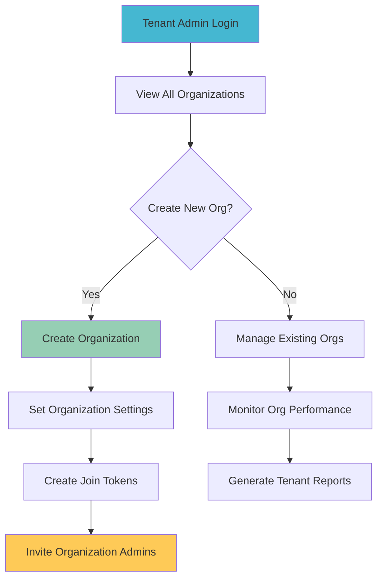
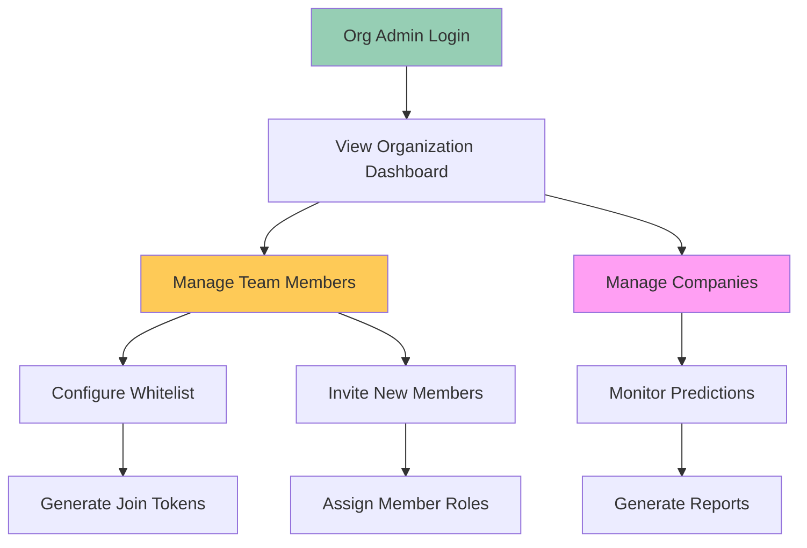
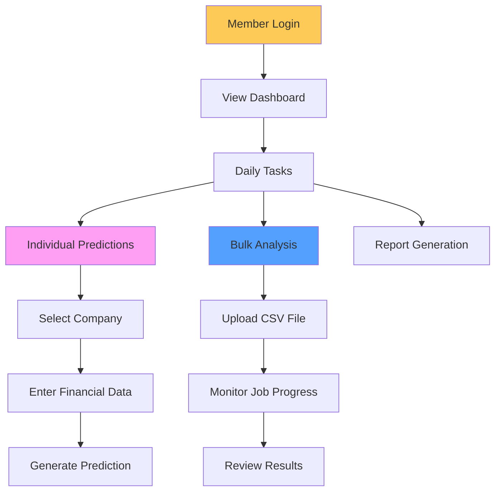
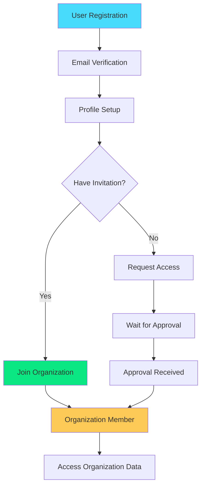

# 🔄 User Flows & Workflows

## 🎯 Complete User Journey Maps

This section details step-by-step workflows for each user type, showing exactly how they interact with the system from registration to advanced operations.

## 👑 Super Admin Workflow

### Initial System Setup



#### Step 1: Initial Login
```bash
# Super admin logs in with system credentials
POST /api/v1/auth/login
{
  "email": "superadmin@defaultrate.com",
  "password": "SuperAdmin123!"
}
```

#### Step 2: Create Banking Corporation Tenant
```bash
# Create a tenant for a banking group
POST /api/v1/tenants
{
  "name": "Banking Corporation",
  "description": "Leading banking group with multiple subsidiaries",
  "domain": "banking-corp.com"
}
```

#### Step 3: Assign Tenant Administrator
```bash
# Create tenant with admin in one operation
POST /api/v1/create-tenant-with-admin
{
  "tenant_name": "Banking Corporation",
  "tenant_description": "Multi-bank financial group",
  "admin_email": "cto@banking-corp.com",
  "admin_password": "TenantAdmin123!",
  "admin_first_name": "Robert",
  "admin_last_name": "Johnson",
  "create_default_org": true,
  "default_org_name": "Central Risk Management"
}
```

#### Step 4: Monitor System Operations
```bash
# Check system health and usage
GET /health
GET /api/v1/tenants/{tenant_id}/stats
```

### Real-World Example: Setting up HDFC Bank Group

**Scenario**: Super admin sets up a complete banking corporation with multiple subsidiaries.

```bash
# 1. Create Banking Corporation tenant
curl -X POST "http://localhost:8000/api/v1/create-tenant-with-admin" \
  -H "Content-Type: application/json" \
  -H "Authorization: Bearer SUPER_ADMIN_TOKEN" \
  -d '{
    "tenant_name": "HDFC Banking Group",
    "tenant_description": "India leading private bank with subsidiaries",
    "admin_email": "group.cto@hdfc.com",
    "admin_password": "HDFCAdmin123!",
    "admin_first_name": "Rajesh",
    "admin_last_name": "Kumar"
  }'

# 2. Assign additional users to specific organizations
curl -X POST "http://localhost:8000/api/v1/assign-user-to-organization" \
  -H "Content-Type: application/json" \
  -H "Authorization: Bearer SUPER_ADMIN_TOKEN" \
  -d '{
    "user_email": "risk.head@hdfc.com",
    "organization_id": "hdfc-risk-uuid",
    "role": "org_admin"
  }'
```

## 🏢 Tenant Admin Workflow

### Multi-Organization Management



#### Step 1: Login and Overview
```bash
# Tenant admin logs in
POST /api/v1/auth/login
{
  "email": "cto@banking-corp.com",
  "password": "TenantAdmin123!"
}

# View all organizations in tenant
GET /api/v1/organizations
```

#### Step 2: Create HDFC Bank Risk Division
```bash
POST /api/v1/organizations
{
  "name": "HDFC Bank Risk Assessment Division",
  "description": "Credit risk analysis and default prediction team",
  "domain": "risk.hdfc.com",
  "default_role": "org_member",
  "max_users": 100,
  "allow_global_data_access": true
}
```

#### Step 3: Create ICICI Bank Division
```bash
POST /api/v1/organizations
{
  "name": "ICICI Bank Credit Analytics Department",
  "description": "Advanced analytics for credit decisions",
  "domain": "analytics.icici.com",
  "default_role": "org_member",
  "max_users": 150,
  "allow_global_data_access": false
}
```

#### Step 4: Assign Organization Administrators
```bash
# Assign HDFC org admin
POST /api/v1/assign-user-to-organization
{
  "user_email": "sarah.williams@hdfc.com",
  "organization_id": "hdfc-risk-uuid",
  "role": "org_admin"
}

# Assign ICICI org admin
POST /api/v1/assign-user-to-organization
{
  "user_email": "david.thompson@icici.com",
  "organization_id": "icici-analytics-uuid",
  "role": "org_admin"
}
```

### Real-World Example: Banking Group Management

**Scenario**: Tenant admin manages a banking group with 3 subsidiary banks.

```javascript
// Frontend dashboard for tenant admin
class TenantAdminDashboard {
  async loadOrganizations() {
    const response = await fetch('/api/v1/organizations', {
      headers: { 'Authorization': `Bearer ${this.token}` }
    });
    return response.json();
  }
  
  async createBankDivision(bankName, description) {
    return fetch('/api/v1/organizations', {
      method: 'POST',
      headers: {
        'Content-Type': 'application/json',
        'Authorization': `Bearer ${this.token}`
      },
      body: JSON.stringify({
        name: `${bankName} Risk Assessment Division`,
        description: description,
        domain: `risk.${bankName.toLowerCase()}.com`,
        allow_global_data_access: true
      })
    });
  }
}
```

## 🏛️ Organization Admin Workflow

### Team and Data Management



#### Step 1: Organization Overview
```bash
# View organization details and stats
GET /api/v1/organizations/{org_id}/details
GET /api/v1/organizations/{org_id}/users
```

#### Step 2: Team Management
```bash
# Add emails to whitelist for pre-approval
POST /api/v1/organizations/{org_id}/whitelist
{
  "email": "analyst1@hdfc.com",
  "role": "org_member"
}

# Generate join token for team invitations
POST /api/v1/organizations/{org_id}/regenerate-token
{
  "role": "org_member",
  "expires_in_hours": 168
}
```

#### Step 3: Company and Data Setup
```bash
# Create companies for analysis
POST /api/v1/companies
{
  "symbol": "RELIANCE",
  "name": "Reliance Industries Limited",
  "market_cap": 15000000000,
  "sector": "Petrochemicals"
}
```

### Real-World Example: HDFC Risk Division Setup

**Scenario**: New org admin sets up HDFC Bank's risk assessment division.

```typescript
interface OrgAdminWorkflow {
  // 1. Initial setup
  setupOrganization(): Promise<void>;
  
  // 2. Team building
  inviteRiskAnalysts(): Promise<void>;
  
  // 3. Data preparation
  importCompanies(): Promise<void>;
  
  // 4. Process establishment
  configureWorkflows(): Promise<void>;
}

class HDFCRiskDivisionSetup implements OrgAdminWorkflow {
  async setupOrganization() {
    // Configure organization settings
    await this.updateOrgSettings({
      allow_global_data_access: true,
      max_users: 50,
      default_role: "org_member"
    });
  }
  
  async inviteRiskAnalysts() {
    const analysts = [
      "senior.analyst1@hdfc.com",
      "junior.analyst1@hdfc.com", 
      "credit.officer1@hdfc.com"
    ];
    
    for (const email of analysts) {
      await this.addToWhitelist(email, "org_member");
    }
    
    // Generate and share join token
    const token = await this.generateJoinToken();
    await this.sendInvitationEmails(analysts, token);
  }
  
  async importCompanies() {
    // Bulk import companies for analysis
    const csvFile = new File([companiesData], "hdfc_portfolio.csv");
    await this.uploadBulkCompanies(csvFile);
  }
}
```

## 👥 Organization Member Workflow

### Daily Operations for Risk Analysts



#### Daily Workflow: Credit Risk Analyst

**Scenario**: Risk analyst processes loan applications and generates default predictions.

#### Step 1: Morning Dashboard Review
```bash
# Check recent predictions and pending work
GET /api/v1/predictions/annual?limit=10&sort=created_at
GET /api/v1/predictions/jobs?status=processing
```

#### Step 2: Individual Company Analysis
```bash
# Analyze a loan applicant company
POST /api/v1/predictions/annual
{
  "company_id": "applicant-company-uuid",
  "reporting_year": "2024",
  "financial_metrics": {
    "long_term_debt_to_total_capital": 0.42,
    "total_debt_to_ebitda": 3.2,
    "net_income_margin": 0.08,
    "ebit_to_interest_expense": 4.1,
    "return_on_assets": 0.06
  }
}
```

**Response Analysis**:
```json
{
  "prediction_results": {
    "probability": 0.2156,
    "risk_level": "MEDIUM",
    "confidence": 0.87
  },
  "recommendation": "Proceed with caution - implement enhanced monitoring"
}
```

#### Step 3: Bulk Portfolio Analysis
```bash
# Upload quarterly portfolio review
curl -X POST "/api/v1/predictions/quarterly/bulk-upload-async" \
  -F "file=@quarterly_portfolio_Q1_2024.csv" \
  -H "Authorization: Bearer ANALYST_TOKEN"
```

#### Step 4: Monitor Bulk Job Progress
```bash
# Check processing status
GET /api/v1/predictions/jobs/{job_id}/status
```

### Real-World Example: Bank Credit Officer Workflow

```python
# Python integration for credit officers
class CreditOfficerWorkflow:
    def __init__(self, api_token):
        self.token = api_token
        self.base_url = "http://localhost:8000/api/v1"
    
    def process_loan_application(self, applicant_data):
        """Process individual loan application"""
        
        # 1. Create company if not exists
        company = self.create_or_get_company(applicant_data)
        
        # 2. Generate default risk prediction
        prediction = self.generate_prediction(
            company_id=company['id'],
            financial_data=applicant_data['financials']
        )
        
        # 3. Make credit decision
        decision = self.make_credit_decision(prediction)
        
        return {
            'applicant': applicant_data['name'],
            'risk_score': prediction['probability'],
            'risk_level': prediction['risk_level'],
            'recommendation': decision,
            'confidence': prediction['confidence']
        }
    
    def weekly_portfolio_review(self, portfolio_file):
        """Weekly bulk analysis of entire portfolio"""
        
        # Upload portfolio for bulk analysis
        job = self.upload_bulk_analysis(portfolio_file)
        
        # Monitor progress
        while job['status'] != 'completed':
            time.sleep(30)
            job = self.check_job_status(job['id'])
            print(f"Progress: {job['progress']['percentage']}%")
        
        # Download results
        return self.download_results(job['id'])
```

## 👤 Regular User Workflow

### Account Creation and Organization Joining



#### Step 1: User Registration
```bash
POST /api/v1/auth/register
{
  "email": "john.doe@gmail.com",
  "username": "johndoe",
  "password": "SecurePass123",
  "full_name": "John Doe"
}
```

#### Step 2: Join Organization via Token
```bash
# User receives invitation token from org admin
POST /api/v1/auth/join
{
  "join_token": "abc123xyz789"
}
```

#### Step 3: Start Working as Organization Member
```bash
# Now user can access organization data
GET /api/v1/companies
GET /api/v1/predictions/annual
```

## 🔄 Common Integration Patterns

### Frontend React Component Examples

#### 1. Prediction Dashboard Component
```jsx
import React, { useState, useEffect } from 'react';

const PredictionDashboard = () => {
  const [predictions, setPredictions] = useState([]);
  const [loading, setLoading] = useState(true);
  
  useEffect(() => {
    loadPredictions();
  }, []);
  
  const loadPredictions = async () => {
    try {
      const response = await fetch('/api/v1/predictions/annual', {
        headers: {
          'Authorization': `Bearer ${localStorage.getItem('token')}`
        }
      });
      const data = await response.json();
      setPredictions(data.predictions);
    } catch (error) {
      console.error('Failed to load predictions:', error);
    } finally {
      setLoading(false);
    }
  };
  
  const createPrediction = async (companyId, financialData) => {
    const response = await fetch('/api/v1/predictions/annual', {
      method: 'POST',
      headers: {
        'Content-Type': 'application/json',
        'Authorization': `Bearer ${localStorage.getItem('token')}`
      },
      body: JSON.stringify({
        company_id: companyId,
        reporting_year: "2024",
        financial_metrics: financialData
      })
    });
    
    if (response.ok) {
      loadPredictions(); // Refresh list
    }
  };
  
  return (
    <div className="prediction-dashboard">
      <h2>Risk Predictions</h2>
      {loading ? (
        <div>Loading...</div>
      ) : (
        <div className="predictions-grid">
          {predictions.map(prediction => (
            <PredictionCard 
              key={prediction.id} 
              prediction={prediction}
              onUpdate={loadPredictions}
            />
          ))}
        </div>
      )}
    </div>
  );
};
```

#### 2. Bulk Upload Component
```jsx
const BulkUploadComponent = () => {
  const [file, setFile] = useState(null);
  const [jobId, setJobId] = useState(null);
  const [progress, setProgress] = useState(null);
  
  const handleUpload = async () => {
    const formData = new FormData();
    formData.append('file', file);
    
    const response = await fetch('/api/v1/predictions/annual/bulk-upload-async', {
      method: 'POST',
      headers: {
        'Authorization': `Bearer ${localStorage.getItem('token')}`
      },
      body: formData
    });
    
    const result = await response.json();
    setJobId(result.job_id);
    
    // Start polling for progress
    pollJobStatus(result.job_id);
  };
  
  const pollJobStatus = async (jobId) => {
    const interval = setInterval(async () => {
      const response = await fetch(`/api/v1/predictions/jobs/${jobId}/status`, {
        headers: {
          'Authorization': `Bearer ${localStorage.getItem('token')}`
        }
      });
      
      const status = await response.json();
      setProgress(status.job.progress);
      
      if (status.job.status === 'completed' || status.job.status === 'failed') {
        clearInterval(interval);
      }
    }, 2000);
  };
  
  return (
    <div className="bulk-upload">
      <input 
        type="file" 
        accept=".csv"
        onChange={(e) => setFile(e.target.files[0])}
      />
      <button onClick={handleUpload} disabled={!file}>
        Upload Predictions
      </button>
      
      {progress && (
        <div className="progress-bar">
          <div 
            className="progress-fill"
            style={{ width: `${progress.percentage}%` }}
          />
          <span>{progress.percentage}% complete</span>
        </div>
      )}
    </div>
  );
};
```

## 📱 Mobile App Integration

### React Native Example
```javascript
// Mobile app service for field officers
class MobileRiskAssessment {
  constructor(apiUrl, token) {
    this.apiUrl = apiUrl;
    this.token = token;
  }
  
  async quickRiskCheck(companySymbol, financials) {
    // For field officers doing quick company assessments
    try {
      // 1. Search for company
      const company = await this.searchCompany(companySymbol);
      
      // 2. Generate prediction
      const prediction = await fetch(`${this.apiUrl}/predictions/annual`, {
        method: 'POST',
        headers: {
          'Content-Type': 'application/json',
          'Authorization': `Bearer ${this.token}`
        },
        body: JSON.stringify({
          company_id: company.id,
          reporting_year: new Date().getFullYear().toString(),
          financial_metrics: financials
        })
      });
      
      return prediction.json();
    } catch (error) {
      console.error('Quick risk check failed:', error);
      throw error;
    }
  }
}
```

---

These workflows cover all user types from super admin to regular users, showing complete real-world scenarios for banking and financial services.
