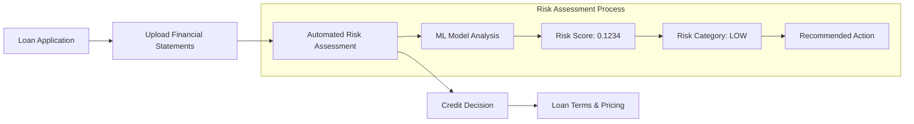

# 🌍 Real-World Use Cases & Industry Examples

## 🏦 Banking & Financial Institutions

### Use Case 1: Commercial Loan Underwriting

**Scenario**: A regional bank evaluating loan applications from small-to-medium enterprises (SMEs).



#### 📋 Real Example: Manufacturing Company Loan

**Company Profile**: ABC Manufacturing Ltd
- **Industry**: Automotive parts manufacturing
- **Annual Revenue**: $50M
- **Loan Request**: $5M working capital facility
- **Credit History**: 2 years operating history

```json
{
  "loan_application": {
    "applicant": {
      "company_name": "ABC Manufacturing Ltd",
      "industry": "Automotive Manufacturing", 
      "annual_revenue": 50000000,
      "employees": 250,
      "years_in_business": 2
    },
    "loan_request": {
      "amount": 5000000,
      "purpose": "Working capital expansion",
      "term": 36,
      "collateral": "Inventory and receivables"
    },
    "financial_analysis": {
      "prediction_type": "annual",
      "financial_ratios": {
        "long_term_debt_to_total_capital": 0.42,
        "total_debt_to_ebitda": 3.1,
        "net_income_margin": 0.08,
        "ebit_to_interest_expense": 4.2,
        "return_on_assets": 0.09
      },
      "ml_assessment": {
        "default_probability": 0.1789,
        "risk_level": "MEDIUM",
        "confidence": 0.87
      },
      "credit_decision": {
        "recommendation": "APPROVE_WITH_CONDITIONS",
        "interest_rate": "Prime + 2.5%",
        "conditions": [
          "Monthly financial reporting",
          "Debt service coverage ratio > 1.25x",
          "Inventory turnover monitoring"
        ],
        "credit_limit": 5000000,
        "review_frequency": "Quarterly"
      }
    }
  }
}
```

#### 🎯 Business Impact

```python
business_impact = {
    "loan_processing_time": {
        "before": "14-21 days",
        "after": "3-5 days",
        "improvement": "75% faster"
    },
    "credit_decision_accuracy": {
        "before": "72% (manual assessment)",
        "after": "89% (ML-assisted)",
        "improvement": "17 percentage points"
    },
    "default_rate_reduction": {
        "baseline": "4.2%",
        "with_ml": "2.1%", 
        "improvement": "50% reduction"
    },
    "cost_savings": {
        "annual_processing_cost": "$2.4M saved",
        "reduced_defaults": "$8.7M prevented losses",
        "total_annual_benefit": "$11.1M"
    }
}
```

### Use Case 2: Corporate Bond Rating

**Scenario**: Investment bank providing corporate bond ratings for institutional investors.

#### 📊 Example: Technology Company Bond Rating

**Company**: NextGen Software Solutions
- **Bond Issue**: $100M, 5-year corporate bond
- **Purpose**: Fund R&D expansion and acquisitions

```python
bond_rating_analysis = {
    "company_profile": {
        "name": "NextGen Software Solutions",
        "industry": "Enterprise Software",
        "market_cap": 2500000000,
        "credit_history": "Investment Grade"
    },
    "quarterly_analysis": {
        "q1_2024_data": {
            "total_debt_to_ebitda": 2.8,
            "sga_margin": 0.32,
            "long_term_debt_to_total_capital": 0.35,
            "return_on_capital": 0.15
        },
        "ml_prediction": {
            "ensemble_probability": 0.0634,
            "risk_level": "LOW",
            "confidence": 0.93
        }
    },
    "bond_rating_outcome": {
        "recommended_rating": "A-",
        "outlook": "Stable",
        "yield_spread": "BBB + 85 basis points",
        "rationale": [
            "Strong recurring revenue model",
            "Conservative debt management", 
            "High return on invested capital",
            "Diversified customer base"
        ]
    }
}
```

## 🏢 Corporate Finance & Treasury

### Use Case 3: Supplier Risk Management

**Scenario**: Large corporation managing supplier default risk in global supply chain.

#### 🔗 Supply Chain Risk Dashboard

```python
supplier_risk_monitoring = {
    "supplier_portfolio": {
        "total_suppliers": 1247,
        "critical_suppliers": 89,
        "high_risk_suppliers": 23,
        "annual_spend": 850000000
    },
    "risk_categories": {
        "low_risk": {
            "count": 1156,
            "percentage": 92.7,
            "total_spend": 680000000
        },
        "medium_risk": {
            "count": 68,
            "percentage": 5.5,
            "total_spend": 135000000
        },
        "high_risk": {
            "count": 23,
            "percentage": 1.8,
            "total_spend": 35000000
        }
    },
    "monitoring_actions": {
        "high_risk_suppliers": [
            "Weekly financial health checks",
            "Alternative supplier identification",
            "Accelerated payment terms review",
            "Supply diversification planning"
        ],
        "medium_risk_suppliers": [
            "Monthly risk assessment updates",
            "Quarterly business reviews",
            "Contract renegotiation preparation"
        ]
    }
}
```

#### 📈 Real Example: Automotive Supplier Crisis

```json
{
  "crisis_scenario": {
    "supplier": "MetalParts Industries",
    "relationship": "Critical brake components supplier",
    "annual_spend": 25000000,
    "supply_dependency": "Single source for 3 key components"
  },
  "early_warning_system": {
    "trigger_date": "2024-01-15",
    "warning_signals": [
      {
        "metric": "quarterly_default_probability",
        "value": 0.3456,
        "threshold": 0.30,
        "status": "EXCEEDED"
      },
      {
        "metric": "debt_to_ebitda",
        "value": 5.8,
        "threshold": 4.0,
        "status": "CRITICAL"
      }
    ]
  },
  "risk_mitigation_actions": {
    "immediate": [
      "Increase payment terms to net-15 days",
      "Request weekly cash flow reports",
      "Initiate supplier financial assistance program"
    ],
    "short_term": [
      "Identify alternative suppliers",
      "Increase safety stock levels",
      "Negotiate supply agreement modifications"
    ],
    "long_term": [
      "Diversify supplier base",
      "Develop in-house capabilities",
      "Create supplier financial health monitoring"
    ]
  },
  "business_outcome": {
    "supply_disruption_prevented": true,
    "alternative_suppliers_qualified": 2,
    "additional_cost": 1200000,
    "potential_loss_avoided": 45000000
  }
}
```

## 💼 Investment Management

### Use Case 4: Portfolio Risk Management

**Scenario**: Hedge fund managing credit exposure across portfolio companies.

#### 📊 Portfolio Risk Analytics

```python
portfolio_risk_analysis = {
    "portfolio_overview": {
        "total_aum": 2500000000,
        "credit_exposure": 1200000000,
        "number_of_positions": 47,
        "average_position_size": 25531915
    },
    "risk_distribution": {
        "by_risk_level": {
            "low_risk": {
                "positions": 28,
                "exposure": 720000000,
                "percentage": 60.0
            },
            "medium_risk": {
                "positions": 15,
                "exposure": 360000000,
                "percentage": 30.0
            },
            "high_risk": {
                "positions": 4,
                "exposure": 120000000,
                "percentage": 10.0
            }
        },
        "by_industry": {
            "technology": {"exposure": 480000000, "avg_risk": 0.12},
            "healthcare": {"exposure": 240000000, "avg_risk": 0.18},
            "financial_services": {"exposure": 180000000, "avg_risk": 0.09},
            "manufacturing": {"exposure": 300000000, "avg_risk": 0.22}
        }
    },
    "stress_testing": {
        "economic_scenarios": {
            "base_case": {"expected_defaults": 2.1, "portfolio_loss": 25200000},
            "mild_recession": {"expected_defaults": 4.8, "portfolio_loss": 57600000},
            "severe_recession": {"expected_defaults": 8.7, "portfolio_loss": 104400000}
        }
    }
}
```

#### 🎯 Investment Decision Example

```python
investment_decision_framework = {
    "target_company": {
        "name": "GreenTech Energy Solutions",
        "industry": "Renewable Energy",
        "investment_size": 50000000,
        "investment_type": "Senior Secured Debt"
    },
    "ml_risk_assessment": {
        "annual_model": {
            "probability": 0.1456,
            "risk_level": "LOW",
            "confidence": 0.91
        },
        "quarterly_model": {
            "probability": 0.1623,
            "risk_level": "LOW", 
            "confidence": 0.88
        }
    },
    "investment_committee_decision": {
        "recommendation": "APPROVE",
        "rationale": [
            "Strong ESG fundamentals in growing market",
            "Experienced management team",
            "Conservative financial structure",
            "ML models show low default risk"
        ],
        "terms": {
            "interest_rate": "8.5%",
            "maturity": "5 years",
            "security": "First lien on all assets",
            "covenants": [
                "Debt service coverage > 1.35x",
                "Cash on hand > $10M",
                "Quarterly compliance certificate"
            ]
        },
        "position_sizing": {
            "target_allocation": "2% of portfolio",
            "maximum_exposure": 50000000,
            "risk_budget_utilized": "12% of high-conviction allocation"
        }
    }
}
```

## 🏭 Industrial & Manufacturing

### Use Case 5: Customer Credit Management

**Scenario**: Manufacturing company managing credit risk across B2B customer base.

#### 🔍 Customer Portfolio Analysis

```python
customer_credit_management = {
    "customer_base": {
        "total_customers": 2847,
        "active_customers": 1923,
        "total_ar_outstanding": 125000000,
        "average_payment_terms": 45
    },
    "risk_segmentation": {
        "tier_1_customers": {
            "count": 156,
            "ar_balance": 78000000,
            "avg_risk_score": 0.08,
            "payment_terms": "Net 60",
            "credit_limit_utilization": 0.42
        },
        "tier_2_customers": {
            "count": 567,
            "ar_balance": 38000000,
            "avg_risk_score": 0.19,
            "payment_terms": "Net 45",
            "credit_limit_utilization": 0.67
        },
        "tier_3_customers": {
            "count": 1200,
            "ar_balance": 9000000,
            "avg_risk_score": 0.34,
            "payment_terms": "Net 30",
            "credit_limit_utilization": 0.78
        }
    },
    "automated_actions": {
        "credit_limit_adjustments": [
            {
                "customer": "Industrial Solutions Inc",
                "current_limit": 2000000,
                "new_limit": 1500000,
                "reason": "Risk score increased to 0.31"
            }
        ],
        "payment_terms_modifications": [
            {
                "customer": "BuildRight Corp",
                "current_terms": "Net 45",
                "new_terms": "Net 30",
                "reason": "Quarterly risk assessment shows deterioration"
            }
        ]
    }
}
```

## 📈 Insurance Industry

### Use Case 6: Trade Credit Insurance

**Scenario**: Trade credit insurer evaluating coverage applications and setting premiums.

#### 🛡️ Insurance Underwriting Process

```python
trade_credit_insurance = {
    "policy_application": {
        "insured_company": "Global Electronics Distributor",
        "coverage_request": 10000000,
        "buyer_concentration": {
            "top_5_customers": 0.65,
            "single_largest": 0.28
        }
    },
    "buyer_risk_assessment": {
        "major_buyers": [
            {
                "buyer": "TechRetail Chain",
                "exposure": 2800000,
                "ml_risk_score": 0.1234,
                "risk_level": "LOW",
                "coverage_approved": 2800000,
                "premium_rate": "0.12%"
            },
            {
                "buyer": "ElectroMart International", 
                "exposure": 1500000,
                "ml_risk_score": 0.2876,
                "risk_level": "MEDIUM",
                "coverage_approved": 1200000,
                "premium_rate": "0.28%"
            },
            {
                "buyer": "Consumer Electronics Co",
                "exposure": 1200000,
                "ml_risk_score": 0.4567,
                "risk_level": "HIGH",
                "coverage_approved": 600000,
                "premium_rate": "0.45%"
            }
        ]
    },
    "underwriting_decision": {
        "total_coverage_approved": 8500000,
        "total_premium": 195000,
        "policy_conditions": [
            "Monthly buyer risk monitoring",
            "Aggregate deductible: $100k",
            "Individual buyer limit: $3M",
            "Notification requirement: 15 days"
        ]
    }
}
```

## 🌐 Cross-Industry Implementation Examples

### Multi-Tenant SaaS Platform Usage

```python
platform_usage_statistics = {
    "tenant_distribution": {
        "banks_credit_unions": {
            "count": 47,
            "avg_monthly_predictions": 12450,
            "primary_use_case": "Commercial lending"
        },
        "investment_firms": {
            "count": 23,
            "avg_monthly_predictions": 8760,
            "primary_use_case": "Portfolio risk management"
        },
        "insurance_companies": {
            "count": 18,
            "avg_monthly_predictions": 6340,
            "primary_use_case": "Trade credit underwriting"
        },
        "corporations": {
            "count": 156,
            "avg_monthly_predictions": 3420,
            "primary_use_case": "Supplier and customer risk"
        }
    },
    "platform_metrics": {
        "total_predictions_per_month": 2.4e6,
        "average_response_time": "89ms",
        "uptime_percentage": 99.97,
        "customer_satisfaction": 4.7
    }
}
```

### ROI Analysis Across Industries

```python
roi_analysis = {
    "banking_sector": {
        "implementation_cost": 250000,
        "annual_benefits": 2100000,
        "payback_period": "1.4 months",
        "3_year_roi": "2,420%"
    },
    "insurance_sector": {
        "implementation_cost": 180000,
        "annual_benefits": 1450000,
        "payback_period": "1.5 months", 
        "3_year_roi": "2,311%"
    },
    "corporate_finance": {
        "implementation_cost": 120000,
        "annual_benefits": 890000,
        "payback_period": "1.6 months",
        "3_year_roi": "2,125%"
    }
}
```

---

These real-world examples demonstrate the practical application and substantial business value of the Financial Default Risk Prediction System across multiple industries and use cases.
