# 🔒 Security & Compliance

## 🛡️ Security Architecture Overview

The Financial Default Risk Prediction System implements enterprise-grade security with multi-layered protection, compliance with financial regulations, and zero-trust architecture principles.

```mermaid
graph TB
    subgraph "Security Layers"
        A[🌐 API Gateway] --> B[🔐 Authentication Layer]
        B --> C[🎫 Authorization Layer]
        C --> D[🔍 Data Validation Layer]
        D --> E[🗃️ Database Security Layer]
        E --> F[🔒 Encryption at Rest]
    end
    
    subgraph "Monitoring & Compliance"
        G[📊 Security Monitoring]
        H[📋 Audit Logging]
        I[🚨 Intrusion Detection]
        J[📜 Compliance Reporting]
    end
    
    A -.-> G
    B -.-> H
    C -.-> I
    D -.-> J
```



## 🔐 Authentication & Authorization

### JWT Token Security

```python
class SecurityConfig:
    """
    Enterprise-grade security configuration
    """
    
    JWT_CONFIG = {
        "algorithm": "RS256",  # Asymmetric encryption
        "access_token_expire_minutes": 15,
        "refresh_token_expire_days": 7,
        "issuer": "default-rate-prediction-api",
        "audience": ["api-users", "admin-panel"],
        "key_rotation_interval_days": 30
    }
    
    PASSWORD_POLICY = {
        "min_length": 12,
        "require_uppercase": True,
        "require_lowercase": True,
        "require_numbers": True,
        "require_special_chars": True,
        "prevent_common_passwords": True,
        "password_history_limit": 12,
        "max_age_days": 90
    }
    
    SESSION_SECURITY = {
        "secure_cookies": True,
        "http_only": True,
        "same_site": "strict",
        "session_timeout_minutes": 30,
        "concurrent_session_limit": 3
    }
```

### Multi-Factor Authentication (MFA)

```python
class MFAService:
    """
    Multi-factor authentication implementation
    """
    
    def __init__(self):
        self.totp_issuer = "Default Risk Prediction"
        self.backup_codes_count = 10
        self.sms_provider = "twilio"
    
    async def setup_mfa(self, user_id: str, method: str):
        """
        Setup MFA for user account
        
        Supported methods:
        - TOTP (Time-based One-Time Password)
        - SMS
        - Email
        - Hardware token (FIDO2/WebAuthn)
        """
        
        if method == "TOTP":
            secret = pyotp.random_base32()
            qr_code = self.generate_qr_code(user_id, secret)
            backup_codes = self.generate_backup_codes()
            
            await self.store_mfa_config(user_id, {
                "method": "TOTP",
                "secret": self.encrypt_secret(secret),
                "backup_codes": [self.hash_code(code) for code in backup_codes],
                "created_at": datetime.utcnow()
            })
            
            return {
                "qr_code": qr_code,
                "manual_entry_key": secret,
                "backup_codes": backup_codes
            }
    
    async def verify_mfa(self, user_id: str, token: str):
        """
        Verify MFA token during authentication
        """
        
        mfa_config = await self.get_mfa_config(user_id)
        
        if mfa_config["method"] == "TOTP":
            secret = self.decrypt_secret(mfa_config["secret"])
            totp = pyotp.TOTP(secret)
            
            # Verify current token (with 30-second window tolerance)
            if totp.verify(token, valid_window=1):
                return {"valid": True, "method": "TOTP"}
            
            # Check if it's a backup code
            if self.verify_backup_code(user_id, token):
                await self.invalidate_backup_code(user_id, token)
                return {"valid": True, "method": "backup_code"}
        
        return {"valid": False}
```

### Role-Based Access Control (RBAC)

```python
class RBACEnforcement:
    """
    Fine-grained role-based access control
    """
    
    PERMISSION_MATRIX = {
        "super_admin": [
            "system:*",
            "tenant:*", 
            "user:*",
            "prediction:*",
            "audit:read"
        ],
        "tenant_admin": [
            "tenant:read:own",
            "tenant:update:own",
            "organization:*:own_tenant",
            "user:*:own_tenant",
            "prediction:*:own_tenant"
        ],
        "org_admin": [
            "organization:read:own",
            "organization:update:own",
            "user:create:own_org",
            "user:read:own_org",
            "user:update:own_org",
            "prediction:*:own_org"
        ],
        "org_member": [
            "organization:read:own",
            "user:read:own_org",
            "prediction:create:own_org",
            "prediction:read:own_org"
        ],
        "user": [
            "prediction:create:assigned_companies",
            "prediction:read:assigned_companies"
        ]
    }
    
    def check_permission(self, user_role: str, resource: str, action: str, context: dict):
        """
        Check if user has permission for specific action
        
        Args:
            user_role: User's role (e.g., "org_admin")
            resource: Resource type (e.g., "prediction")
            action: Action being performed (e.g., "create")
            context: Request context (tenant_id, org_id, etc.)
        """
        
        user_permissions = self.PERMISSION_MATRIX.get(user_role, [])
        
        # Check for wildcard permissions
        if f"{resource}:*" in user_permissions:
            return True
        
        if f"{resource}:*:own_tenant" in user_permissions:
            return self.verify_tenant_ownership(context)
        
        if f"{resource}:*:own_org" in user_permissions:
            return self.verify_org_ownership(context)
        
        # Check specific permission
        permission = f"{resource}:{action}"
        if permission in user_permissions:
            return True
        
        # Check scoped permissions
        scoped_permissions = [p for p in user_permissions if p.startswith(f"{resource}:{action}:")]
        for perm in scoped_permissions:
            if self.verify_scope(perm, context):
                return True
        
        return False
```

## 🔒 Data Protection & Encryption

### Encryption at Rest

```python
class DataEncryption:
    """
    Advanced encryption for sensitive financial data
    """
    
    def __init__(self):
        # AES-256-GCM for symmetric encryption
        self.cipher_suite = Fernet(self.load_encryption_key())
        
        # Field-level encryption configuration
        self.encrypted_fields = {
            "financial_data": ["revenue", "ebitda", "total_debt", "net_income"],
            "company_info": ["tax_id", "bank_account"],
            "user_data": ["email", "phone_number"]
        }
    
    def encrypt_financial_data(self, data: dict):
        """
        Encrypt sensitive financial data before database storage
        """
        
        encrypted_data = data.copy()
        
        for field in self.encrypted_fields["financial_data"]:
            if field in data and data[field] is not None:
                # Convert to string, encrypt, then base64 encode
                plaintext = str(data[field]).encode()
                encrypted_value = self.cipher_suite.encrypt(plaintext)
                encrypted_data[field] = base64.b64encode(encrypted_value).decode()
        
        return encrypted_data
    
    def decrypt_financial_data(self, encrypted_data: dict):
        """
        Decrypt financial data for processing
        """
        
        decrypted_data = encrypted_data.copy()
        
        for field in self.encrypted_fields["financial_data"]:
            if field in encrypted_data and encrypted_data[field] is not None:
                try:
                    # Base64 decode, decrypt, then convert back to number
                    encrypted_value = base64.b64decode(encrypted_data[field])
                    decrypted_bytes = self.cipher_suite.decrypt(encrypted_value)
                    decrypted_data[field] = float(decrypted_bytes.decode())
                except Exception as e:
                    logger.error(f"Decryption failed for field {field}: {e}")
                    decrypted_data[field] = None
        
        return decrypted_data
```

### Database Security

```python
class DatabaseSecurity:
    """
    Database-level security controls
    """
    
    def __init__(self):
        self.connection_pool_config = {
            "ssl_mode": "require",
            "ssl_cert": "/etc/ssl/certs/client-cert.pem", 
            "ssl_key": "/etc/ssl/private/client-key.pem",
            "ssl_ca": "/etc/ssl/certs/ca-cert.pem",
            "application_name": "default-rate-api",
            "connect_timeout": 10,
            "command_timeout": 30
        }
    
    def create_secure_connection(self):
        """
        Create database connection with security controls
        """
        
        # Connection string with SSL and authentication
        connection_string = (
            f"postgresql://{DB_USER}:{DB_PASSWORD}@{DB_HOST}:{DB_PORT}/{DB_NAME}"
            f"?sslmode=require&application_name=default-rate-api"
        )
        
        # Create connection pool with security settings
        engine = create_async_engine(
            connection_string,
            pool_size=20,
            max_overflow=30,
            pool_pre_ping=True,
            pool_recycle=3600,  # Recycle connections every hour
            echo=False  # Never log SQL in production
        )
        
        return engine
    
    def setup_row_level_security(self):
        """
        Configure PostgreSQL Row Level Security (RLS)
        """
        
        rls_policies = [
            # Tenant data isolation
            """
            CREATE POLICY tenant_isolation ON predictions
            FOR ALL TO api_user
            USING (tenant_id = current_setting('app.current_tenant_id')::uuid);
            """,
            
            # Organization data isolation  
            """
            CREATE POLICY org_isolation ON companies
            FOR ALL TO api_user
            USING (organization_id = current_setting('app.current_org_id')::uuid);
            """,
            
            # User data access control
            """
            CREATE POLICY user_data_access ON users
            FOR SELECT TO api_user
            USING (
                id = current_setting('app.current_user_id')::uuid OR
                tenant_id = current_setting('app.current_tenant_id')::uuid
            );
            """
        ]
        
        return rls_policies
```

## 🚨 Security Monitoring & Incident Response

### Real-time Security Monitoring

```python
class SecurityMonitoring:
    """
    Comprehensive security monitoring and alerting
    """
    
    def __init__(self):
        self.threat_detection_rules = {
            "failed_login_attempts": {
                "threshold": 5,
                "time_window_minutes": 15,
                "action": "temporarily_lock_account"
            },
            "api_rate_limit_exceeded": {
                "threshold": 1000,
                "time_window_minutes": 1,
                "action": "rate_limit_ip"
            },
            "unusual_prediction_volume": {
                "threshold": 500,  # % increase over baseline
                "time_window_minutes": 60,
                "action": "alert_admin"
            },
            "privilege_escalation_attempt": {
                "indicators": ["role_change", "permission_bypass"],
                "action": "immediate_alert_and_lock"
            }
        }
    
    async def monitor_authentication_events(self, event: dict):
        """
        Monitor and analyze authentication events for threats
        """
        
        if event["event_type"] == "login_failed":
            await self.track_failed_login(event["user_id"], event["ip_address"])
        
        elif event["event_type"] == "login_success":
            await self.check_anomalous_login(event)
        
        elif event["event_type"] == "mfa_failed":
            await self.track_mfa_failure(event["user_id"])
    
    async def track_failed_login(self, user_id: str, ip_address: str):
        """
        Track failed login attempts and trigger security actions
        """
        
        # Count recent failed attempts
        failed_attempts = await self.count_recent_failures(user_id, minutes=15)
        
        if failed_attempts >= 5:
            await self.lock_account_temporarily(user_id, duration_minutes=30)
            await self.alert_security_team({
                "alert_type": "account_lockout",
                "user_id": user_id,
                "ip_address": ip_address,
                "failed_attempts": failed_attempts
            })
        
        # Check for distributed brute force attack
        ip_failures = await self.count_ip_failures(ip_address, minutes=15)
        if ip_failures >= 20:
            await self.block_ip_temporarily(ip_address, duration_minutes=60)
    
    async def detect_data_exfiltration(self, user_id: str, api_calls: list):
        """
        Detect potential data exfiltration attempts
        """
        
        # Analyze API call patterns
        bulk_download_indicators = {
            "high_volume_requests": len(api_calls) > 100,
            "rapid_succession": self.check_rapid_requests(api_calls),
            "diverse_data_access": self.check_diverse_endpoints(api_calls),
            "off_hours_activity": self.check_off_hours(api_calls)
        }
        
        risk_score = sum(bulk_download_indicators.values())
        
        if risk_score >= 3:
            await self.trigger_data_protection_alert({
                "user_id": user_id,
                "risk_score": risk_score,
                "indicators": bulk_download_indicators,
                "api_calls": len(api_calls)
            })
```

### Audit Logging & Compliance

```python
class AuditLogging:
    """
    Comprehensive audit logging for compliance and security
    """
    
    def __init__(self):
        self.audit_levels = {
            "CRITICAL": ["auth_failure", "privilege_escalation", "data_breach"],
            "HIGH": ["login", "logout", "role_change", "data_export"],
            "MEDIUM": ["api_access", "prediction_request", "user_creation"],
            "LOW": ["data_query", "report_generation"]
        }
    
    async def log_security_event(self, event: dict):
        """
        Log security events with structured format for compliance
        """
        
        audit_record = {
            "timestamp": datetime.utcnow().isoformat(),
            "event_id": str(uuid.uuid4()),
            "event_type": event["type"],
            "severity": self.determine_severity(event["type"]),
            "user_id": event.get("user_id"),
            "tenant_id": event.get("tenant_id"),
            "organization_id": event.get("organization_id"),
            "ip_address": event.get("ip_address"),
            "user_agent": event.get("user_agent"),
            "resource_accessed": event.get("resource"),
            "action_performed": event.get("action"),
            "result": event.get("result", "success"),
            "additional_data": event.get("metadata", {}),
            "compliance_flags": self.check_compliance_requirements(event)
        }
        
        # Store in secure audit database
        await self.store_audit_record(audit_record)
        
        # Forward to SIEM system
        await self.forward_to_siem(audit_record)
        
        # Check for real-time alerts
        if audit_record["severity"] in ["CRITICAL", "HIGH"]:
            await self.trigger_security_alert(audit_record)
    
    def generate_compliance_report(self, start_date: date, end_date: date):
        """
        Generate compliance reports for regulatory requirements
        """
        
        compliance_metrics = {
            "user_access_events": self.count_events_by_type("user_access"),
            "data_access_events": self.count_events_by_type("data_access"),
            "authentication_events": self.count_events_by_type("authentication"),
            "administrative_events": self.count_events_by_type("administrative"),
            "security_incidents": self.count_security_incidents(),
            "policy_violations": self.count_policy_violations()
        }
        
        return {
            "report_period": f"{start_date} to {end_date}",
            "metrics": compliance_metrics,
            "compliance_status": self.assess_compliance_status(),
            "recommendations": self.generate_recommendations()
        }
```

## 📋 Regulatory Compliance

### Financial Services Compliance

```python
class FinancialComplianceFramework:
    """
    Compliance framework for financial services regulations
    """
    
    COMPLIANCE_FRAMEWORKS = {
        "GDPR": {
            "scope": "EU data protection",
            "requirements": [
                "explicit_consent",
                "data_minimization", 
                "right_to_deletion",
                "data_portability",
                "breach_notification"
            ]
        },
        "SOX": {
            "scope": "US financial reporting",
            "requirements": [
                "audit_trails",
                "access_controls",
                "change_management",
                "data_integrity"
            ]
        },
        "PCI_DSS": {
            "scope": "Payment card data",
            "requirements": [
                "network_security",
                "data_encryption",
                "access_controls",
                "monitoring",
                "testing"
            ]
        },
        "ISO_27001": {
            "scope": "Information security management",
            "requirements": [
                "risk_management",
                "security_policies",
                "incident_response",
                "business_continuity"
            ]
        }
    }
    
    def assess_gdpr_compliance(self):
        """
        Assess GDPR compliance status
        """
        
        gdpr_controls = {
            "data_processing_lawfulness": {
                "status": "compliant",
                "evidence": "Explicit consent for prediction services"
            },
            "data_minimization": {
                "status": "compliant", 
                "evidence": "Only financial ratios collected, no personal data"
            },
            "data_subject_rights": {
                "status": "compliant",
                "evidence": "Data export and deletion APIs implemented"
            },
            "breach_notification": {
                "status": "compliant",
                "evidence": "72-hour notification process established"
            },
            "data_protection_officer": {
                "status": "compliant",
                "evidence": "DPO appointed and contact details published"
            }
        }
        
        compliance_score = sum(1 for control in gdpr_controls.values() 
                             if control["status"] == "compliant")
        
        return {
            "overall_score": f"{compliance_score}/{len(gdpr_controls)}",
            "compliance_percentage": (compliance_score / len(gdpr_controls)) * 100,
            "controls": gdpr_controls,
            "next_assessment_due": (datetime.now() + timedelta(days=90)).date()
        }
    
    def sox_compliance_checklist(self):
        """
        SOX compliance checklist for financial systems
        """
        
        sox_requirements = {
            "section_302": {
                "requirement": "Financial reporting controls certification",
                "implementation": [
                    "Automated audit logging of all financial data access",
                    "Monthly access reviews by tenant administrators",
                    "Quarterly compliance attestation process"
                ],
                "status": "implemented"
            },
            "section_404": {
                "requirement": "Internal controls over financial reporting",
                "implementation": [
                    "Role-based access controls",
                    "Segregation of duties enforcement",
                    "Change management controls"
                ],
                "status": "implemented"
            },
            "section_409": {
                "requirement": "Real-time disclosure",
                "implementation": [
                    "Automated incident notification",
                    "Real-time audit trail generation"
                ],
                "status": "implemented"
            }
        }
        
        return sox_requirements
```

### Data Retention & Privacy

```python
class DataRetentionPolicy:
    """
    Data retention and privacy policy implementation
    """
    
    RETENTION_PERIODS = {
        "user_accounts": {
            "active": "indefinite",
            "inactive": "7_years",
            "deleted": "immediate_purge"
        },
        "financial_predictions": {
            "current": "5_years",
            "archived": "additional_2_years",
            "deleted": "secure_wipe"
        },
        "audit_logs": {
            "security_events": "7_years",
            "access_logs": "3_years",
            "system_logs": "1_year"
        },
        "backup_data": {
            "daily_backups": "30_days",
            "monthly_backups": "12_months",
            "yearly_backups": "7_years"
        }
    }
    
    async def enforce_data_retention(self):
        """
        Automated data retention policy enforcement
        """
        
        # Identify data eligible for deletion
        expired_data = await self.identify_expired_data()
        
        # Secure deletion process
        for data_category, records in expired_data.items():
            await self.secure_delete(data_category, records)
            await self.log_retention_action(data_category, len(records))
        
        # Generate retention compliance report
        return await self.generate_retention_report()
    
    async def handle_data_subject_request(self, request_type: str, user_id: str):
        """
        Handle GDPR data subject rights requests
        """
        
        if request_type == "access":
            # Export all user data
            user_data = await self.export_user_data(user_id)
            return self.format_data_export(user_data)
        
        elif request_type == "deletion":
            # Right to be forgotten
            await self.anonymize_user_data(user_id)
            await self.log_deletion_request(user_id)
            return {"status": "completed", "deletion_date": datetime.utcnow()}
        
        elif request_type == "portability":
            # Data portability
            portable_data = await self.export_portable_data(user_id)
            return self.format_portable_export(portable_data)
```

---

This comprehensive security framework ensures the Financial Default Risk Prediction System meets enterprise security standards and regulatory compliance requirements for financial services.
