# 🚀 Performance & Scalability

## ⚡ Performance Architecture Overview

The Financial Default Risk Prediction System is designed for high-performance, low-latency operations with horizontal scalability to handle enterprise-level workloads.

```mermaid
graph TB
    subgraph "Load Balancing Layer"
        A[🌐 Load Balancer] --> B[🖥️ API Server 1]
        A --> C[🖥️ API Server 2] 
        A --> D[🖥️ API Server N]
    end
    
    subgraph "Caching Layer"
        E[⚡ Redis Cluster]
        F[📊 Application Cache]
        G[🔍 Query Cache]
    end
    
    subgraph "Database Layer"
        H[🗄️ Primary DB]
        I[📖 Read Replica 1]
        J[📖 Read Replica N]
        K[📦 Connection Pool]
    end
    
    subgraph "Background Processing"
        L[⚙️ Celery Workers]
        M[📋 Task Queue]
        N[🤖 ML Model Cache]
    end
    
    B --> E
    C --> F
    D --> G
    
    B --> K
    C --> K
    D --> K
    
    K --> H
    K --> I
    K --> J
    
    L --> M
    L --> N
```



## 📊 Performance Benchmarks

### API Response Times

```python
performance_benchmarks = {
    "authentication_endpoints": {
        "login": {"p50": "45ms", "p95": "120ms", "p99": "250ms"},
        "token_refresh": {"p50": "12ms", "p95": "35ms", "p99": "80ms"},
        "logout": {"p50": "8ms", "p95": "25ms", "p99": "60ms"}
    },
    "prediction_endpoints": {
        "single_prediction": {"p50": "89ms", "p95": "220ms", "p99": "450ms"},
        "batch_prediction": {"p50": "1.2s", "p95": "3.5s", "p99": "8.2s"},
        "prediction_history": {"p50": "156ms", "p95": "380ms", "p99": "750ms"}
    },
    "data_management": {
        "company_creation": {"p50": "78ms", "p95": "185ms", "p99": "320ms"},
        "bulk_upload": {"p50": "2.8s", "p95": "8.1s", "p99": "15.6s"},
        "data_export": {"p50": "1.1s", "p95": "4.2s", "p99": "9.8s"}
    },
    "admin_operations": {
        "user_management": {"p50": "65ms", "p95": "150ms", "p99": "280ms"},
        "tenant_operations": {"p50": "98ms", "p95": "230ms", "p99": "420ms"},
        "system_monitoring": {"p50": "234ms", "p95": "560ms", "p99": "1.1s"}
    }
}
```

### Throughput Metrics

```python
throughput_metrics = {
    "api_requests": {
        "peak_rps": 2500,  # Requests per second
        "sustained_rps": 1800,
        "concurrent_users": 5000,
        "daily_requests": 12500000
    },
    "predictions": {
        "predictions_per_hour": 450000,
        "batch_processing_capacity": 100000,
        "ml_model_throughput": 850  # predictions/second
    },
    "database_operations": {
        "read_qps": 3500,  # Queries per second
        "write_qps": 800,
        "connection_pool_utilization": "65%",
        "query_cache_hit_rate": "94%"
    }
}
```

## 🔧 Caching Strategy

### Multi-Layer Caching Architecture

```python
class CachingStrategy:
    """
    Comprehensive caching implementation for optimal performance
    """
    
    def __init__(self):
        self.redis_client = redis.Redis(
            host="redis-cluster.internal",
            port=6379,
            db=0,
            decode_responses=True,
            health_check_interval=30
        )
        
        self.cache_strategies = {
            "prediction_results": {
                "ttl": 3600,  # 1 hour
                "invalidation": "model_version_change"
            },
            "financial_ratios": {
                "ttl": 1800,  # 30 minutes
                "invalidation": "data_update"
            },
            "user_sessions": {
                "ttl": 900,   # 15 minutes
                "invalidation": "logout"
            },
            "company_metadata": {
                "ttl": 7200,  # 2 hours
                "invalidation": "manual"
            }
        }
    
    async def cache_prediction_result(self, input_hash: str, prediction: dict):
        """
        Cache ML prediction results with intelligent invalidation
        """
        
        cache_key = f"prediction:{input_hash}"
        cache_data = {
            "prediction": prediction,
            "model_version": self.get_current_model_version(),
            "cached_at": datetime.utcnow().isoformat(),
            "cache_hits": 0
        }
        
        await self.redis_client.setex(
            cache_key,
            self.cache_strategies["prediction_results"]["ttl"],
            json.dumps(cache_data)
        )
    
    async def get_cached_prediction(self, input_hash: str):
        """
        Retrieve cached prediction with hit tracking
        """
        
        cache_key = f"prediction:{input_hash}"
        cached_data = await self.redis_client.get(cache_key)
        
        if cached_data:
            data = json.loads(cached_data)
            
            # Check if cache is still valid (model version)
            if data["model_version"] == self.get_current_model_version():
                # Increment hit counter
                data["cache_hits"] += 1
                await self.redis_client.setex(
                    cache_key,
                    self.cache_strategies["prediction_results"]["ttl"],
                    json.dumps(data)
                )
                
                return data["prediction"]
        
        return None
    
    async def invalidate_cache_by_pattern(self, pattern: str):
        """
        Invalidate cache entries matching pattern
        """
        
        keys = await self.redis_client.keys(pattern)
        if keys:
            await self.redis_client.delete(*keys)
            return len(keys)
        return 0
```

### Application-Level Caching

```python
class ApplicationCache:
    """
    In-memory application caching for frequently accessed data
    """
    
    def __init__(self):
        self.cache = TTLCache(maxsize=10000, ttl=1800)  # 30 minutes TTL
        self.cache_stats = {
            "hits": 0,
            "misses": 0,
            "evictions": 0
        }
    
    @lru_cache(maxsize=1000)
    def get_user_permissions(self, user_id: str, role: str):
        """
        Cache user permissions for authorization checks
        """
        
        # Expensive permission calculation
        permissions = self.calculate_user_permissions(user_id, role)
        
        self.cache_stats["hits"] += 1
        return permissions
    
    def cache_financial_ratios(self, company_id: str, ratios: dict):
        """
        Cache calculated financial ratios
        """
        
        cache_key = f"ratios:{company_id}"
        self.cache[cache_key] = {
            "ratios": ratios,
            "calculated_at": datetime.utcnow(),
            "version": 1
        }
    
    def get_cache_statistics(self):
        """
        Return cache performance statistics
        """
        
        total_requests = self.cache_stats["hits"] + self.cache_stats["misses"]
        hit_rate = (self.cache_stats["hits"] / total_requests * 100) if total_requests > 0 else 0
        
        return {
            "hit_rate_percentage": round(hit_rate, 2),
            "total_hits": self.cache_stats["hits"],
            "total_misses": self.cache_stats["misses"],
            "cache_size": len(self.cache),
            "max_size": self.cache.maxsize
        }
```

## 🗄️ Database Optimization

### Connection Pooling & Query Optimization

```python
class DatabaseOptimization:
    """
    Advanced database optimization and connection management
    """
    
    def __init__(self):
        self.connection_pool_config = {
            "pool_size": 20,           # Base connections
            "max_overflow": 30,        # Additional connections under load
            "pool_timeout": 30,        # Timeout for getting connection
            "pool_recycle": 3600,      # Recycle connections every hour
            "pool_pre_ping": True,     # Validate connections before use
            "echo": False              # Disable SQL logging in production
        }
        
        self.query_optimization_rules = {
            "use_indexes": True,
            "limit_result_sets": 1000,
            "prefer_prepared_statements": True,
            "batch_operations": True
        }
    
    def create_optimized_engine(self):
        """
        Create database engine with performance optimizations
        """
        
        engine = create_async_engine(
            self.get_database_url(),
            **self.connection_pool_config,
            # Performance tuning
            isolation_level="READ_COMMITTED",
            query_cache_size=1000,
            statement_cache_size=1000
        )
        
        return engine
    
    async def optimize_prediction_queries(self):
        """
        Optimize queries for prediction operations
        """
        
        # Create specialized indexes for prediction queries
        optimization_queries = [
            # Index for company lookups by symbol
            """
            CREATE INDEX CONCURRENTLY idx_companies_symbol_tenant 
            ON companies(symbol, tenant_id) 
            WHERE active = true;
            """,
            
            # Index for prediction history queries
            """
            CREATE INDEX CONCURRENTLY idx_predictions_company_date
            ON predictions(company_id, prediction_date DESC)
            INCLUDE (probability, risk_level);
            """,
            
            # Index for bulk upload job queries
            """
            CREATE INDEX CONCURRENTLY idx_bulk_jobs_status_tenant
            ON bulk_upload_jobs(tenant_id, status, created_at DESC)
            WHERE status IN ('pending', 'processing');
            """,
            
            # Composite index for user role queries
            """
            CREATE INDEX CONCURRENTLY idx_users_tenant_org_role
            ON users(tenant_id, organization_id, role)
            WHERE active = true;
            """
        ]
        
        return optimization_queries
    
    async def analyze_query_performance(self):
        """
        Analyze and report on query performance
        """
        
        performance_analysis = {
            "slow_queries": await self.identify_slow_queries(),
            "index_usage": await self.analyze_index_usage(),
            "connection_pool_stats": await self.get_pool_statistics(),
            "cache_hit_ratios": await self.get_cache_statistics()
        }
        
        return performance_analysis
```

### Read Replica Configuration

```python
class ReadReplicaManager:
    """
    Manage read replicas for scalable database operations
    """
    
    def __init__(self):
        self.primary_db = self.create_primary_connection()
        self.read_replicas = [
            self.create_read_replica_connection("replica-1"),
            self.create_read_replica_connection("replica-2"),
            self.create_read_replica_connection("replica-3")
        ]
        
        self.read_strategies = {
            "prediction_history": "round_robin",
            "company_search": "least_connections",
            "reporting_queries": "dedicated_replica",
            "analytics": "dedicated_replica"
        }
    
    async def route_read_query(self, query_type: str, query: str):
        """
        Route read queries to appropriate replica based on strategy
        """
        
        strategy = self.read_strategies.get(query_type, "round_robin")
        
        if strategy == "round_robin":
            replica = self.get_next_replica_round_robin()
        elif strategy == "least_connections":
            replica = await self.get_least_busy_replica()
        elif strategy == "dedicated_replica":
            replica = self.read_replicas[-1]  # Use last replica for analytics
        else:
            replica = self.read_replicas[0]   # Default to first replica
        
        return await replica.execute(query)
    
    async def monitor_replica_lag(self):
        """
        Monitor replication lag across read replicas
        """
        
        lag_metrics = {}
        
        for i, replica in enumerate(self.read_replicas):
            lag_info = await replica.execute(
                "SELECT EXTRACT(EPOCH FROM (now() - pg_last_xact_replay_timestamp()));"
            )
            
            lag_metrics[f"replica_{i+1}"] = {
                "lag_seconds": float(lag_info.scalar() or 0),
                "status": "healthy" if lag_info.scalar() < 10 else "lagging"
            }
        
        return lag_metrics
```

## 🔄 Background Job Processing

### Celery Performance Optimization

```python
class CeleryOptimization:
    """
    Optimize Celery workers for high-performance background processing
    """
    
    def __init__(self):
        self.worker_config = {
            "concurrency": 4,              # Workers per process
            "prefetch_multiplier": 1,      # Tasks per worker
            "task_acks_late": True,        # Acknowledge after completion
            "worker_prefetch_multiplier": 1,
            "task_reject_on_worker_lost": True,
            "worker_disable_rate_limits": False,
            "worker_pool": "solo",         # For macOS compatibility
        }
        
        self.task_routing = {
            "app.workers.tasks.process_bulk_upload": {
                "queue": "bulk_processing",
                "routing_key": "bulk.upload"
            },
            "app.workers.tasks.generate_prediction": {
                "queue": "predictions", 
                "routing_key": "ml.predict"
            },
            "app.workers.tasks.send_notification": {
                "queue": "notifications",
                "routing_key": "notify.email"
            }
        }
    
    async def optimize_bulk_processing(self, job_id: str, data: list):
        """
        Optimized bulk processing with chunking and parallel execution
        """
        
        chunk_size = 100  # Process 100 records per chunk
        chunks = [data[i:i + chunk_size] for i in range(0, len(data), chunk_size)]
        
        # Process chunks in parallel
        tasks = []
        for i, chunk in enumerate(chunks):
            task = process_chunk.delay(job_id, i, chunk)
            tasks.append(task)
        
        # Monitor progress
        completed = 0
        total = len(chunks)
        
        while completed < total:
            completed_tasks = [task for task in tasks if task.ready()]
            completed = len(completed_tasks)
            
            # Update job progress
            progress = (completed / total) * 100
            await self.update_job_progress(job_id, progress)
            
            await asyncio.sleep(1)  # Check every second
        
        return {"status": "completed", "chunks_processed": total}
    
    def monitor_worker_performance(self):
        """
        Monitor Celery worker performance metrics
        """
        
        from celery import current_app
        inspect = current_app.control.inspect()
        
        worker_stats = {
            "active_workers": len(inspect.active_queues() or {}),
            "queued_tasks": self.count_queued_tasks(),
            "worker_memory_usage": self.get_worker_memory_usage(),
            "task_processing_rates": self.calculate_processing_rates(),
            "failed_task_rate": self.calculate_failure_rate()
        }
        
        return worker_stats
```

### Task Queue Management

```python
class TaskQueueManager:
    """
    Advanced task queue management for optimal throughput
    """
    
    def __init__(self):
        self.queue_priorities = {
            "critical": 9,    # System alerts, security events
            "high": 7,        # User-facing operations
            "normal": 5,      # Bulk processing, reports
            "low": 3,         # Cleanup, maintenance
            "batch": 1        # Large batch operations
        }
        
        self.queue_configs = {
            "predictions": {
                "max_length": 10000,
                "message_ttl": 3600,  # 1 hour
                "delivery_mode": 2     # Persistent
            },
            "bulk_processing": {
                "max_length": 1000,
                "message_ttl": 7200,  # 2 hours
                "delivery_mode": 2
            },
            "notifications": {
                "max_length": 50000,
                "message_ttl": 900,   # 15 minutes
                "delivery_mode": 1    # Transient
            }
        }
    
    async def intelligent_task_routing(self, task_type: str, priority: str, payload: dict):
        """
        Route tasks to appropriate queues based on type and priority
        """
        
        # Determine target queue
        if task_type == "prediction":
            if priority == "critical":
                queue = "predictions_priority"
            else:
                queue = "predictions"
        elif task_type == "bulk_upload":
            queue = "bulk_processing"
        elif task_type == "notification":
            queue = "notifications"
        else:
            queue = "default"
        
        # Add priority and routing metadata
        task_metadata = {
            "priority": self.queue_priorities[priority],
            "routing_key": f"{queue}.{priority}",
            "expires": datetime.utcnow() + timedelta(seconds=self.queue_configs[queue]["message_ttl"]),
            "retry_policy": {
                "max_retries": 3,
                "interval_start": 0,
                "interval_step": 0.2,
                "interval_max": 2
            }
        }
        
        return queue, task_metadata
    
    async def monitor_queue_health(self):
        """
        Monitor queue health and performance
        """
        
        queue_metrics = {}
        
        for queue_name in self.queue_configs.keys():
            metrics = await self.get_queue_metrics(queue_name)
            
            queue_metrics[queue_name] = {
                "length": metrics["length"],
                "consumers": metrics["consumers"],
                "processing_rate": metrics["processing_rate"],
                "avg_processing_time": metrics["avg_processing_time"],
                "health_status": self.assess_queue_health(metrics)
            }
        
        return queue_metrics
```

## 📈 Auto-Scaling & Load Management

### Horizontal Scaling Strategy

```python
class AutoScalingManager:
    """
    Intelligent auto-scaling based on real-time metrics
    """
    
    def __init__(self):
        self.scaling_thresholds = {
            "cpu_utilization": {
                "scale_up": 70,     # Scale up at 70% CPU
                "scale_down": 30,   # Scale down at 30% CPU
                "evaluation_period": 300  # 5 minutes
            },
            "memory_utilization": {
                "scale_up": 80,
                "scale_down": 40,
                "evaluation_period": 300
            },
            "request_rate": {
                "scale_up": 1500,   # Requests per second
                "scale_down": 500,
                "evaluation_period": 180  # 3 minutes
            },
            "queue_length": {
                "scale_up": 1000,   # Tasks in queue
                "scale_down": 100,
                "evaluation_period": 120  # 2 minutes
            }
        }
        
        self.scaling_policies = {
            "api_servers": {
                "min_instances": 2,
                "max_instances": 20,
                "scale_up_cooldown": 300,   # 5 minutes
                "scale_down_cooldown": 900  # 15 minutes
            },
            "celery_workers": {
                "min_instances": 3,
                "max_instances": 50,
                "scale_up_cooldown": 180,   # 3 minutes
                "scale_down_cooldown": 600  # 10 minutes
            }
        }
    
    async def evaluate_scaling_decision(self, service: str):
        """
        Evaluate whether to scale up or down based on metrics
        """
        
        current_metrics = await self.collect_current_metrics(service)
        historical_metrics = await self.get_historical_metrics(service, minutes=30)
        
        # Analyze trends
        cpu_trend = self.calculate_trend(historical_metrics["cpu"])
        memory_trend = self.calculate_trend(historical_metrics["memory"])
        request_trend = self.calculate_trend(historical_metrics["requests"])
        
        # Scaling decision logic
        scaling_signals = {
            "cpu_high": current_metrics["cpu"] > self.scaling_thresholds["cpu_utilization"]["scale_up"],
            "memory_high": current_metrics["memory"] > self.scaling_thresholds["memory_utilization"]["scale_up"],
            "requests_high": current_metrics["request_rate"] > self.scaling_thresholds["request_rate"]["scale_up"],
            "trending_up": cpu_trend > 0 and request_trend > 0
        }
        
        scale_up_signals = sum(scaling_signals.values())
        
        if scale_up_signals >= 2:  # Multiple signals indicate need to scale up
            return {"action": "scale_up", "confidence": scale_up_signals / 4}
        elif all(current_metrics[metric] < self.scaling_thresholds[f"{metric}_utilization"]["scale_down"] 
                for metric in ["cpu", "memory"]):
            return {"action": "scale_down", "confidence": 0.8}
        else:
            return {"action": "maintain", "confidence": 0.9}
    
    async def execute_scaling_action(self, service: str, action: str):
        """
        Execute scaling action with proper coordination
        """
        
        if action == "scale_up":
            await self.scale_up_service(service)
        elif action == "scale_down":
            await self.scale_down_service(service)
        
        # Log scaling action
        await self.log_scaling_event(service, action)
        
        # Update monitoring
        await self.update_scaling_metrics(service, action)
```

### Load Balancing Optimization

```python
class LoadBalancerOptimization:
    """
    Optimize load balancing for maximum performance
    """
    
    def __init__(self):
        self.balancing_algorithms = {
            "api_traffic": "least_connections",
            "bulk_uploads": "weighted_round_robin",
            "real_time_predictions": "ip_hash",
            "admin_operations": "round_robin"
        }
        
        self.health_check_config = {
            "interval": 30,           # Seconds between checks
            "timeout": 5,             # Health check timeout
            "unhealthy_threshold": 3, # Failed checks before marking unhealthy
            "healthy_threshold": 2    # Successful checks before marking healthy
        }
    
    async def optimize_traffic_distribution(self):
        """
        Optimize traffic distribution across server instances
        """
        
        # Collect server metrics
        server_metrics = await self.collect_server_metrics()
        
        # Calculate optimal weights
        optimal_weights = {}
        for server, metrics in server_metrics.items():
            # Weight based on inverse of response time and CPU utilization
            response_weight = 1000 / metrics["avg_response_time"]
            cpu_weight = (100 - metrics["cpu_utilization"]) / 100
            memory_weight = (100 - metrics["memory_utilization"]) / 100
            
            optimal_weights[server] = int(response_weight * cpu_weight * memory_weight * 100)
        
        # Update load balancer configuration
        await self.update_load_balancer_weights(optimal_weights)
        
        return optimal_weights
    
    async def implement_circuit_breaker(self, service: str):
        """
        Implement circuit breaker pattern for fault tolerance
        """
        
        circuit_breaker_config = {
            "failure_threshold": 5,    # Open circuit after 5 failures
            "recovery_timeout": 60,    # Try to close after 60 seconds
            "expected_failure_rate": 0.1  # 10% failure rate threshold
        }
        
        current_failure_rate = await self.calculate_failure_rate(service)
        
        if current_failure_rate > circuit_breaker_config["expected_failure_rate"]:
            await self.open_circuit_breaker(service)
            return {"status": "circuit_open", "reason": "high_failure_rate"}
        else:
            await self.close_circuit_breaker(service)
            return {"status": "circuit_closed", "reason": "healthy"}
```

---

This performance and scalability framework ensures the Financial Default Risk Prediction System can handle enterprise-scale workloads with optimal response times and resource utilization.
