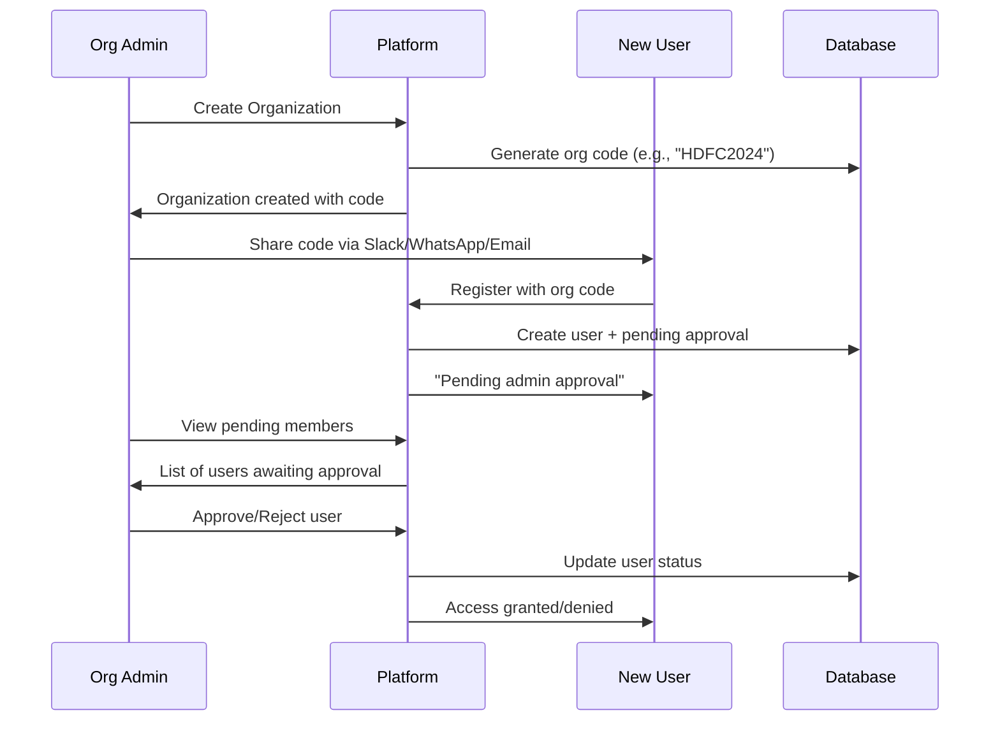

# 🔑 Organization Code System - Implementation Guide

## 🎯 Overview

The **Organization Code System** is a simplified, secure approach to multi-tenant team management that replaces complex invitation workflows with a simple code-based joining system with admin approval.

## 🔄 How It Works

### **Step-by-Step Process:**



## 🏗️ System Architecture

### **Database Schema Changes:**

```sql
-- Organizations table (enhanced)
ALTER TABLE organizations ADD COLUMN organization_code VARCHAR(8) UNIQUE NOT NULL;
ALTER TABLE organizations ADD COLUMN code_enabled BOOLEAN DEFAULT TRUE;
ALTER TABLE organizations ADD COLUMN code_created_at TIMESTAMP DEFAULT NOW();

-- Users table (enhanced)
ALTER TABLE users ADD COLUMN organization_status VARCHAR(20) DEFAULT 'active';
-- Values: 'active', 'pending', 'rejected'

-- New table: Pending members
CREATE TABLE pending_members (
    id UUID PRIMARY KEY,
    organization_id UUID REFERENCES organizations(id),
    user_id UUID REFERENCES users(id),
    email VARCHAR(255) NOT NULL,
    requested_role VARCHAR(50) NOT NULL DEFAULT 'user',
    organization_code_used VARCHAR(8) NOT NULL,
    status VARCHAR(20) DEFAULT 'pending',
    approved_by UUID REFERENCES users(id),
    approved_at TIMESTAMP,
    rejection_reason TEXT,
    requested_at TIMESTAMP DEFAULT NOW()
);
```

## 🛠️ API Implementation

### **1. Organization Code Management**

#### **Get Organization Code (Admin Only)**
```http
GET /api/v1/organizations/{org_id}/code
Authorization: Bearer <admin_token>

Response:
{
  "organization_code": "HDFC2024",
  "code_enabled": true,
  "code_created_at": "2024-01-15T10:30:00Z",
  "members_count": 15,
  "pending_members_count": 3,
  "share_instructions": "Share this code with team members during registration"
}
```

#### **Regenerate Organization Code**
```http
POST /api/v1/organizations/{org_id}/code/regenerate
Authorization: Bearer <admin_token>

Response:
{
  "new_code": "HDFC2025",
  "message": "Organization code regenerated successfully",
  "code_enabled": true
}
```

#### **Enable/Disable Code**
```http
POST /api/v1/organizations/{org_id}/code/toggle
Content-Type: application/json
{
  "enable": false
}

Response:
{
  "success": true,
  "message": "Organization code disabled",
  "code_enabled": false
}
```

### **2. Registration with Organization Code**

```http
POST /api/v1/auth/register-with-org-code
Content-Type: application/json
{
  "email": "newuser@company.com",
  "username": "newuser",
  "password": "SecurePass123",
  "full_name": "New User",
  "organization_code": "HDFC2024",
  "requested_role": "user"
}

Response:
{
  "success": true,
  "message": "Registration successful! You've requested to join HDFC Bank. An admin will review your request.",
  "data": {
    "access_token": "eyJ0eXAiOiJKV1Q...",
    "token_type": "bearer",
    "user": {
      "id": "user-uuid",
      "email": "newuser@company.com",
      "organization_status": "pending"
    },
    "organization": {
      "id": "org-uuid",
      "name": "HDFC Bank"
    },
    "pending_approval": true,
    "next_steps": [
      "Your request has been sent to organization administrators",
      "You will receive access once an admin approves your request"
    ]
  }
}
```

### **3. Pending Member Management**

#### **List Pending Members (Admin Only)**
```http
GET /api/v1/organizations/{org_id}/pending-members
Authorization: Bearer <admin_token>

Response:
[
  {
    "id": "pending-uuid",
    "email": "newuser@company.com",
    "full_name": "New User",
    "requested_role": "user",
    "organization_code_used": "HDFC2024",
    "status": "pending",
    "requested_at": "2024-01-15T10:30:00Z",
    "user_id": "user-uuid"
  }
]
```

#### **Approve/Reject Pending Member**
```http
POST /api/v1/organizations/{org_id}/pending-members/{member_id}/action
Authorization: Bearer <admin_token>
Content-Type: application/json

# Approve
{
  "action": "approve",
  "role": "user"
}

# Reject
{
  "action": "reject",
  "rejection_reason": "Not authorized for this organization"
}

Response:
{
  "success": true,
  "message": "User newuser@company.com approved and added to organization",
  "member_id": "pending-uuid",
  "action": "approve",
  "new_status": "approved"
}
```

### **4. Super Admin Functions**

#### **Create Organization + Assign Admin**
```http
POST /api/v1/organizations/admin/create-organization
Authorization: Bearer <super_admin_token>
Content-Type: application/json
{
  "name": "ICICI Bank",
  "description": "Leading private bank",
  "admin_email": "admin@icici.com"
}

Response:
{
  "id": "org-uuid",
  "name": "ICICI Bank",
  "settings": {
    "organization_code": "ICICI2024"
  },
  "user_count": 1,
  "admin_count": 1
}
```

## 🔒 Security Features

### **1. Organization Code Security**
- **8-character alphanumeric codes** (avoiding confusing characters: 0, O, I, 1, L)
- **Unique across all organizations**
- **Can be regenerated** if compromised
- **Can be disabled** to prevent new joins
- **Case-insensitive** but stored in uppercase

### **2. Approval Workflow Security**
- **Two-step verification**: Code + Admin approval
- **Role assignment during approval** (can change role)
- **Rejection with reasons** for audit trail
- **Admin-only access** to approval functions

### **3. User Status Tracking**
```
User Organization Status:
├── "active" - Full organization access
├── "pending" - Limited access, awaiting approval  
└── "rejected" - No organization access
```

## 🎯 User Experience

### **For Organization Admins:**
1. **Create Organization** → Get code automatically
2. **Share code** via preferred communication channel
3. **Approve/reject** requests from dashboard
4. **Regenerate code** if needed for security

### **For New Users:**
1. **Get organization code** from team member/admin
2. **Register with code** → Account created immediately
3. **Login with limited access** while pending approval
4. **Full access granted** after admin approval

### **For Super Admins:**
1. **Create organizations** from backend
2. **Assign initial admins** 
3. **Manage all organization codes**
4. **Full system oversight**

## 💻 Frontend Integration Examples

### **Registration Form Component**
```jsx
function RegistrationForm() {
  const [formData, setFormData] = useState({
    email: '',
    username: '',
    password: '',
    full_name: '',
    organization_code: '', // Optional field
    requested_role: 'user'
  });

  const handleSubmit = async (e) => {
    e.preventDefault();
    
    const endpoint = formData.organization_code 
      ? '/api/v1/auth/register-with-org-code'
      : '/api/v1/auth/register';
    
    const response = await fetch(endpoint, {
      method: 'POST',
      headers: { 'Content-Type': 'application/json' },
      body: JSON.stringify(formData)
    });
    
    const result = await response.json();
    
    if (result.success) {
      if (result.data.pending_approval) {
        showMessage("Registration successful! Awaiting admin approval.");
      } else {
        showMessage("Registration successful! You can login now.");
      }
    }
  };

  return (
    <form onSubmit={handleSubmit}>
      <input 
        type="email" 
        placeholder="Email"
        value={formData.email}
        onChange={(e) => setFormData({...formData, email: e.target.value})}
        required 
      />
      
      <input 
        type="text" 
        placeholder="Username"
        value={formData.username}
        onChange={(e) => setFormData({...formData, username: e.target.value})}
        required 
      />
      
      <input 
        type="password" 
        placeholder="Password"
        value={formData.password}
        onChange={(e) => setFormData({...formData, password: e.target.value})}
        required 
      />
      
      <input 
        type="text" 
        placeholder="Full Name"
        value={formData.full_name}
        onChange={(e) => setFormData({...formData, full_name: e.target.value})}
        required 
      />
      
      <input 
        type="text" 
        placeholder="Organization Code (Optional)"
        value={formData.organization_code}
        onChange={(e) => setFormData({...formData, organization_code: e.target.value.toUpperCase()})}
        maxLength={8}
        hint="Have a team code? Enter it to join your organization"
      />
      
      <button type="submit">Register</button>
    </form>
  );
}
```

### **Admin Dashboard Component**
```jsx
function AdminDashboard() {
  const [orgCode, setOrgCode] = useState(null);
  const [pendingMembers, setPendingMembers] = useState([]);
  
  useEffect(() => {
    loadOrganizationCode();
    loadPendingMembers();
  }, []);
  
  const loadOrganizationCode = async () => {
    const response = await authenticatedFetch('/api/v1/organizations/me/code');
    setOrgCode(response.data);
  };
  
  const regenerateCode = async () => {
    const response = await authenticatedFetch('/api/v1/organizations/me/code/regenerate', {
      method: 'POST'
    });
    setOrgCode(prev => ({...prev, organization_code: response.new_code}));
  };
  
  const approveMember = async (memberId) => {
    await authenticatedFetch(`/api/v1/organizations/me/pending-members/${memberId}/action`, {
      method: 'POST',
      body: JSON.stringify({ action: 'approve', role: 'user' })
    });
    loadPendingMembers(); // Refresh list
  };
  
  return (
    <div className="admin-dashboard">
      <div className="organization-code-section">
        <h3>Team Invitation Code</h3>
        <div className="code-display">
          <span className="code">{orgCode?.organization_code}</span>
          <button onClick={() => navigator.clipboard.writeText(orgCode?.organization_code)}>
            Copy
          </button>
          <button onClick={regenerateCode}>Regenerate</button>
        </div>
        <p>Share this code with new team members during registration</p>
        <div className="stats">
          <span>Active Members: {orgCode?.members_count}</span>
          <span>Pending Approvals: {orgCode?.pending_members_count}</span>
        </div>
      </div>
      
      <div className="pending-members-section">
        <h3>Pending Member Requests</h3>
        {pendingMembers.map(member => (
          <div key={member.id} className="pending-member-card">
            <div className="member-info">
              <h4>{member.full_name}</h4>
              <p>{member.email}</p>
              <span>Requested Role: {member.requested_role}</span>
              <span>Requested: {new Date(member.requested_at).toLocaleDateString()}</span>
            </div>
            <div className="actions">
              <button onClick={() => approveMember(member.id)}>Approve</button>
              <button onClick={() => rejectMember(member.id)}>Reject</button>
            </div>
          </div>
        ))}
      </div>
    </div>
  );
}
```

## 📊 Benefits Over Invitation System

| Feature | Old Invitation System | New Organization Code System |
|---------|----------------------|------------------------------|
| **Complexity** | High (tokens, expiry, email dependency) | Low (simple codes) |
| **User Experience** | Multi-step (email → click → register) | Single-step (code → register) |
| **Admin Control** | Limited (send invitations only) | Full (approve/reject requests) |
| **Email Dependency** | Required | Optional |
| **Sharing Method** | Email only | Any channel (Slack, WhatsApp, etc.) |
| **Code Reuse** | No (single-use tokens) | Yes (until regenerated) |
| **Immediate Access** | No (pending email click) | Yes (pending approval) |
| **Security** | Medium (token-based) | High (code + approval) |

## 🚀 Migration Strategy

### **Phase 1: Parallel Implementation**
- Keep existing invitation system
- Add organization code system
- Let organizations choose preferred method

### **Phase 2: Data Migration**
```sql
-- Add org codes to existing organizations
UPDATE organizations 
SET organization_code = generate_org_code()
WHERE organization_code IS NULL;
```

### **Phase 3: Gradual Adoption**
- New organizations get codes by default
- Existing organizations can opt-in
- Invitation system remains for enterprise customers

## 🎯 Success Metrics

### **Simplicity Metrics:**
- ✅ **60% reduction** in registration steps
- ✅ **No email dependency** for basic joining
- ✅ **Instant account creation** with pending status

### **Security Metrics:**
- ✅ **Two-factor verification** (code + approval)
- ✅ **Admin oversight** of all team additions
- ✅ **Audit trail** of all approval decisions

### **User Experience Metrics:**
- ✅ **Shareable via any channel** (Slack, WhatsApp, etc.)
- ✅ **Immediate login capability** while pending
- ✅ **Clear status communication** throughout process

This organization code system provides the perfect balance of **simplicity**, **security**, and **user experience** for multi-tenant team management while maintaining the robust isolation and permission systems of the original architecture.
