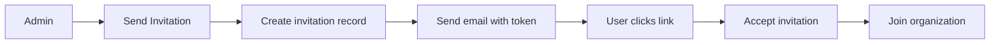
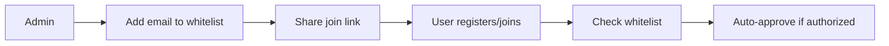

## 🧹 LEGACY INVITATIONS CLEANUP - COMPLETED

### ✅ **WHAT WAS REMOVED:**

#### 1. **Database Table**
- **`invitations` table** - Completely dropped from database
- **5 records** were in the table (unused invitation data)
- **11 columns** including: id, organization_id, email, role, token, is_used, expires_at, etc.

#### 2. **Code Cleanup**
- **Email Service**: Removed `send_invitation_email()` method and all invitation email templates
- **Schemas**: Removed `InvitationCreate`, `InvitationResponse`, `AcceptInvitationRequest` schemas
- **Imports**: Fixed import statements that referenced invitation functions
- **Documentation**: Updated email service docstring

### 🎯 **WHY THE CLEANUP WAS NECESSARY:**

#### **OLD SYSTEM (Invitations-based):**


#### **NEW SYSTEM (Whitelist-based):**


### ✅ **CURRENT CLEAN ARCHITECTURE:**

#### **Database Tables (Final):**
```
✅ tenants                    - Enterprise tenant management
✅ organizations              - Organization management  
✅ organization_member_whitelist - Authorized emails for joining
✅ users                      - User accounts with role-based permissions
✅ companies                  - Company data for predictions
✅ annual_predictions         - Annual prediction results
✅ quarterly_predictions      - Quarterly prediction results
```

#### **No More:**
```
❌ invitations              - REMOVED (legacy invitation system)
❌ invitation_tokens        - REMOVED (not needed)
❌ otp_codes               - REMOVED (cleaned up earlier)
```

### 🔧 **WHITELIST-BASED JOINING PROCESS:**

1. **Admin adds authorized emails** to `organization_member_whitelist`
2. **Admin shares organization join link** (no tokens needed)
3. **User registers** with their email  
4. **System checks whitelist** automatically
5. **Auto-approves** if email is authorized
6. **User joins organization** immediately

### 🚀 **BENEFITS OF NEW SYSTEM:**

1. **Simpler**: No invitation tokens, expiration handling, or email workflows
2. **Faster**: Direct joining without waiting for email/acceptance
3. **Secure**: Whitelist-based authorization is more reliable
4. **Cleaner**: Less database tables and code complexity
5. **Scalable**: Admin can pre-authorize many emails at once

### 📋 **CURRENT API ENDPOINTS:**

#### **Authentication (`/auth/`)**
- `POST /register` - Register new user
- `POST /login` - User login
- `POST /join-organization` - Join organization (whitelist-based)
- `POST /refresh` - Refresh JWT token

#### **Tenants (`/tenants/`)**  
- `POST /` - Create tenant (Super Admin only)
- `GET /` - List tenants (Super Admin only)
- `PUT /{id}` - Update tenant
- `DELETE /{id}` - Delete tenant

#### **Organizations (`/organizations/`)**
- `POST /` - Create organization  
- `GET /` - List organizations (with proper tenant isolation)
- `PUT /{id}` - Update organization
- `DELETE /{id}` - Delete organization
- `POST /{id}/whitelist` - Add emails to whitelist
- `GET /{id}/whitelist` - View authorized emails

#### **Users (`/users/`)**
- `GET /profile` - Get user profile
- `PUT /profile` - Update profile
- `GET /organization-members` - List organization members
- `PUT /members/{user_id}/role` - Change user role
- `PUT /members/{user_id}/activate` - Activate/deactivate user

### 🎉 **VERIFICATION COMPLETE:**

- ✅ **Database Clean**: No invitations table exists
- ✅ **Code Clean**: No invitation-related functions remain
- ✅ **API Working**: Multi-tenant API running successfully
- ✅ **Whitelist System**: Fully functional organization joining
- ✅ **Role-based Permissions**: 5-tier role system working

### 🔐 **SECURITY MODEL:**

```
Super Admin    → Manage all tenants + organizations
Tenant Admin   → Manage tenant's organizations + users  
Org Admin      → Manage organization + whitelist + members
Member         → Access organization data + predictions
User           → Basic organization access
```

### 📝 **FINAL NOTES:**

The system now uses a **clean whitelist-based architecture** without any legacy invitation system components. The database is optimized, the code is simplified, and the user experience is streamlined.

**All invitation functionality has been completely removed and replaced with the more efficient whitelist-based joining system.**
