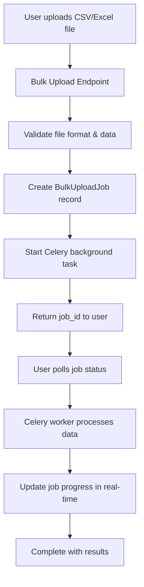

# 🚀 Bulk Upload Async System Architecture

This document explains the **Bulk Upload Async System** for the Financial Default Risk Prediction API, which consists of **3 main components** that work together to process large CSV/Excel files asynchronously.

## 📋 System Overview

The async bulk upload system handles processing of 1-10,000 company records from CSV/Excel files without blocking the API or causing timeouts. It uses **Celery workers** for background processing and provides real-time job tracking.

## 🏗️ Architecture Components

### 1. **Bulk Upload Endpoints** (API Layer)
### 2. **Job Status & Management Endpoints** (Monitoring Layer)  
### 3. **Celery Background Tasks** (Processing Layer)

---

## 🔄 Complete Workflow



---

## 📡 Component 1: Bulk Upload Endpoints

These endpoints initiate the async processing by accepting file uploads and creating background jobs.

### **Annual Bulk Upload Async**
```http
POST /api/v1/predictions/annual/bulk-upload-async
```

**Features:**
- Accepts CSV/Excel files with annual financial data
- Validates file format and required columns
- Creates job tracking record
- Starts Celery background processing
- Returns immediately with job ID

**Required Columns:**
- `company_symbol`, `company_name`, `market_cap`, `sector`
- `reporting_year`
- `long_term_debt_to_total_capital`, `total_debt_to_ebitda`
- `net_income_margin`, `ebit_to_interest_expense`, `return_on_assets`

**Response:**
```json
{
  "success": true,
  "message": "Bulk upload job started successfully using Celery workers",
  "job_id": "550e8400-e29b-41d4-a716-446655440000",
  "task_id": "celery-task-uuid",
  "total_rows": 1000,
  "estimated_time_minutes": 10
}
```

### **Quarterly Bulk Upload Async**
```http
POST /api/v1/predictions/quarterly/bulk-upload-async
```

**Features:**
- Accepts CSV/Excel files with quarterly financial data
- Same workflow as annual but with quarterly-specific validation
- Requires additional `reporting_quarter` field

**Additional Required Columns:**
- `reporting_quarter`
- `total_debt_to_ebitda`, `sga_margin`
- `long_term_debt_to_total_capital`, `return_on_capital`

---

## 📊 Component 2: Job Status & Management Endpoints

These endpoints provide real-time monitoring and management of bulk upload jobs.

### **Get Job Status**
```http
GET /api/v1/predictions/jobs/{job_id}/status
```

**Features:**
- Real-time progress tracking
- Error details for failed jobs
- Processing statistics
- Celery task status integration

**Response Example:**
```json
{
  "success": true,
  "job": {
    "id": "550e8400-e29b-41d4-a716-446655440000",
    "status": "processing",
    "job_type": "annual",
    "original_filename": "annual_data.csv",
    "total_rows": 1000,
    "processed_rows": 350,
    "successful_rows": 340,
    "failed_rows": 10,
    "progress_percentage": 35.0,
    "created_at": "2024-01-15T10:30:00Z",
    "started_at": "2024-01-15T10:30:05Z",
    "completed_at": null,
    "error_message": null,
    "error_details": null,
    "celery_task_id": "celery-task-uuid",
    "celery_status": "PROGRESS",
    "celery_meta": {
      "current": 350,
      "total": 1000,
      "status": "Processing row 350 of 1000..."
    }
  }
}
```

**Job Status Values:**
- `pending` - Job created, waiting for processing
- `queued` - Sent to Celery, waiting for worker
- `processing` - Currently being processed
- `completed` - Successfully finished
- `failed` - Processing failed with errors

### **List All Jobs**
```http
GET /api/v1/predictions/jobs?status=processing&limit=20&offset=0
```

**Features:**
- Paginated job listing
- Filter by status
- Organization-scoped for multi-tenant support
- Sorted by creation date (newest first)

**Response:**
```json
{
  "success": true,
  "jobs": [
    {
      "id": "job-uuid-1",
      "status": "completed",
      "job_type": "annual",
      "original_filename": "data1.csv",
      "total_rows": 500,
      "processed_rows": 500,
      "successful_rows": 495,
      "failed_rows": 5,
      "progress_percentage": 100.0,
      "created_at": "2024-01-15T09:00:00Z",
      "completed_at": "2024-01-15T09:15:00Z"
    }
  ],
  "pagination": {
    "total": 25,
    "limit": 20,
    "offset": 0,
    "has_more": true
  }
}
```

---

## ⚙️ Component 3: Celery Background Tasks

These are the actual worker processes that handle the heavy lifting of data processing.

### **Annual Processing Task**
```python
@celery_app.task(bind=True, name="app.workers.tasks.process_annual_bulk_upload_task")
def process_annual_bulk_upload_task(self, job_id, data, user_id, organization_id)
```

**Processing Flow:**
1. **Initialization**
   - Update job status to 'processing'
   - Initialize progress tracking
   - Set up database session

2. **Row-by-Row Processing**
   - Create or get company record
   - Check for existing predictions
   - Prepare financial data for ML model
   - Generate ML prediction using trained model
   - Save prediction to database
   - Update progress every row

3. **Real-time Updates**
   ```python
   self.update_state(
       state="PROGRESS",
       meta={
           "status": f"Processed {i + 1}/{total_rows} rows",
           "current": i + 1,
           "total": total_rows,
           "successful": successful_rows,
           "failed": failed_rows,
           "job_id": job_id
       }
   )
   ```

4. **Completion**
   - Update job status to 'completed' or 'failed'
   - Calculate processing statistics
   - Return final results

### **Quarterly Processing Task**
```python
@celery_app.task(bind=True, name="app.workers.tasks.process_quarterly_bulk_upload_task")
def process_quarterly_bulk_upload_task(self, job_id, data, user_id, organization_id)
```

**Same workflow as annual** but uses:
- Quarterly ML model service
- QuarterlyPrediction database model
- Quarterly-specific financial data validation

### **Error Handling**
- **Row-level errors**: Continue processing, log error details
- **Critical errors**: Fail entire job with detailed error message
- **Progress preservation**: Failed jobs show how much was completed
- **Error details**: First 100 errors saved for debugging

---

## 🔗 How the 3 Components Work Together

### **1. Job Initiation Flow**
```
Client Request → Upload Endpoint → File Validation → Job Creation → Celery Task → Immediate Response
```

### **2. Background Processing Flow**
```
Celery Worker → Process Data → Update Database → Real-time Progress → ML Predictions → Final Results
```

### **3. Status Monitoring Flow**
```
Client Poll → Status Endpoint → Database Query → Celery Status → Combined Response
```

---

## 📊 Database Schema

The system uses the `BulkUploadJob` model to track job state:

```sql
CREATE TABLE bulk_upload_jobs (
    id UUID PRIMARY KEY,
    organization_id UUID REFERENCES organizations(id),
    user_id UUID NOT NULL REFERENCES users(id),
    
    -- Job Details
    job_type VARCHAR(50) NOT NULL,  -- 'annual' or 'quarterly'
    status VARCHAR(20) DEFAULT 'pending',  -- pending, processing, completed, failed
    
    -- File Information
    original_filename VARCHAR(255) NOT NULL,
    file_size INTEGER,
    total_rows INTEGER,
    
    -- Progress Tracking
    processed_rows INTEGER DEFAULT 0,
    successful_rows INTEGER DEFAULT 0,
    failed_rows INTEGER DEFAULT 0,
    
    -- Results
    error_message TEXT,
    error_details TEXT,  -- JSON string with detailed errors
    
    -- Timestamps
    created_at TIMESTAMP DEFAULT NOW(),
    started_at TIMESTAMP,
    completed_at TIMESTAMP,
    updated_at TIMESTAMP DEFAULT NOW()
);
```

---

## 🚦 API Usage Examples

### **Complete Upload Workflow**

#### 1. Start Upload Job
```bash
curl -X POST "https://api.example.com/api/v1/predictions/annual/bulk-upload-async" \
  -H "Authorization: Bearer $TOKEN" \
  -F "file=@annual_data.csv"
```

Response:
```json
{
  "success": true,
  "job_id": "550e8400-e29b-41d4-a716-446655440000",
  "message": "Bulk upload job started successfully"
}
```

#### 2. Monitor Progress
```bash
curl -X GET "https://api.example.com/api/v1/predictions/jobs/550e8400-e29b-41d4-a716-446655440000/status" \
  -H "Authorization: Bearer $TOKEN"
```

Response (In Progress):
```json
{
  "success": true,
  "job": {
    "status": "processing",
    "progress_percentage": 45.5,
    "processed_rows": 455,
    "total_rows": 1000,
    "successful_rows": 440,
    "failed_rows": 15
  }
}
```

#### 3. Check Completion
Response (Completed):
```json
{
  "success": true,
  "job": {
    "status": "completed",
    "progress_percentage": 100.0,
    "total_rows": 1000,
    "successful_rows": 985,
    "failed_rows": 15,
    "processing_time_seconds": 120.5,
    "completed_at": "2024-01-15T10:32:00Z"
  }
}
```

---

## ⚡ Performance & Scalability

### **Processing Capacity**
- **Small files** (1-100 rows): ~2-4 seconds per row
- **Medium files** (100-1000 rows): ~1.5-3 seconds per row  
- **Large files** (1000-10000 rows): ~1-2 seconds per row

### **Concurrency**
- Multiple Celery workers can process different jobs simultaneously
- Each worker handles one job at a time for data consistency
- Queue system prevents worker overload

### **Resource Usage**
- Each job creates one database connection
- Memory usage scales with file size (CSV loaded into memory)
- Progress updates every row processed

### **Error Recovery**
- Jobs can be restarted manually if needed
- Partial completion data is preserved
- Duplicate prevention through database constraints

---

## 🛡️ Security & Access Control

### **Authentication**
- All endpoints require valid JWT token
- User permissions checked before job creation/access

### **Authorization Levels**
- **Users**: Can upload and view their own jobs
- **Org Members**: Can view organization jobs  
- **Admins**: Can view all jobs in their organization
- **Super Admins**: Can view all jobs globally

### **Data Isolation**
- Jobs are scoped to user's organization
- Predictions created with proper organization context
- Cross-organization access prevented

---

## 📈 Monitoring & Observability

### **Job Metrics Available**
- Total jobs created
- Success/failure rates
- Average processing time
- Queue depth and worker utilization
- Error categorization

### **Real-time Status Updates**
- Progress percentage calculation
- Row-by-row processing status
- Error count and details
- Estimated completion time

### **Logging Integration**
- Detailed logs for each processing step
- Error stack traces for debugging
- Performance timing information
- User action audit trail

---

## 🔧 Configuration

### **Celery Configuration**
```python
# Queue routing
task_routes = {
    "app.workers.tasks.process_annual_bulk_upload_task": {"queue": "bulk_predictions"},
    "app.workers.tasks.process_quarterly_bulk_upload_task": {"queue": "bulk_predictions"}
}

# Worker settings
worker_concurrency = 1 if sys.platform == "darwin" else None
broker_connection_retry_on_startup = True
```

### **File Limits**
- **Maximum file size**: Not explicitly limited (handled by upload timeout)
- **Maximum rows**: 10,000 per file
- **Supported formats**: CSV, Excel (.xlsx, .xls)
- **Timeout protection**: Background processing prevents API timeouts

---

## 🔍 Troubleshooting

### **Common Issues**

#### **Job Stuck in 'Processing'**
- Check Celery worker logs
- Restart Celery workers if needed
- Verify database connectivity

#### **High Failure Rate**
- Check data format and required columns
- Verify ML model availability
- Review error_details in job status

#### **Performance Issues**
- Monitor worker queue depth
- Scale Celery workers horizontally
- Optimize database connection pooling

### **Status Endpoint Diagnostics**
The status endpoint provides both database job status and Celery task status for complete visibility:

```json
{
  "celery_task_id": "task-uuid",
  "celery_status": "PROGRESS|SUCCESS|FAILURE|PENDING", 
  "celery_meta": {
    "current": 500,
    "total": 1000,
    "status": "Processing..."
  }
}
```

This comprehensive system ensures reliable, scalable, and observable bulk processing of financial predictions with real-time monitoring capabilities.
